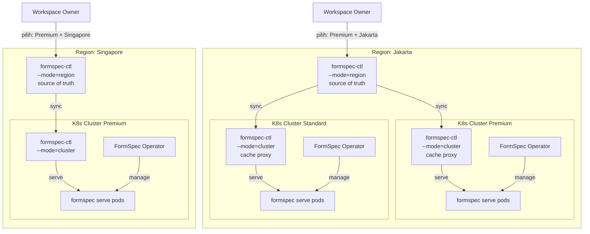

# FormSpec Architecture Overview

**Version:** 1.0
**Status:** Draft
**License:** Creative Commons CC0
**Governed by:** FormSpec Overview · FormSpec Reference

> Dokumen ini menjelaskan arsitektur deployment FormSpec secara end-to-end: topology multi-region, tiga level kontrol, admin surfaces, deployment tiers, security model, dan semua keputusan desain arsitektur (D-ARCH-1 s/d D-ARCH-31).

---

## 1. Multi-Region Topology

FormSpec Cloud berjalan di **multiple region independen**. Setiap region memiliki formspec-ctl sendiri sebagai source of truth. Region tidak saling komunikasi (independent clusters policy).



**Prinsip kunci:**
- **Satu `formspec-ctl --mode=region` per region** — source of truth untuk artifact, policy, signing, deployment routing
- **Banyak K8s cluster per region** — tiap cluster punya ClusterClass (premium/standard/economy)
- **Cluster tidak saling komunikasi** — independen, failure domain terpisah
- **Workspace owner pilih region + ClusterClass** — tidak perlu tahu cluster fisik (kecuali enterprise dedicated)

---

## 2. Component Inventory

FormSpec terdiri dari **1 engine binary** (`formspec`) + **1 control binary** (`formspec-ctl`) + **1 infrastructure binary** + **thin client SDKs**:

| Komponen | Tipe | Fungsi | Lisensi |
|---|---|---|---|
| `formspec` | **Binary** — engine tunggal | **Satu binary untuk semua bahasa.** Mode `dev` (development server) dan `serve` (production server). Entity engine, state machine, REST API generator, admin panel, ctx.* primitives, permission enforcement, tenant isolation — semuanya di sini. App code dalam bahasa apapun berjalan sebagai child process, berkomunikasi via Unix socket. | FSL |
| `formspec-ctl` | **Binary** — `--mode=region` | Region Control Plane — source of truth: artifact store, policy, signing, deployment routing | FSL |
| | `--mode=cluster` | Cluster cache proxy — artifact cache, snapshot proxy, evidence relay | FSL |
| | `--mode=standalone` | All-in-one region+cluster untuk dev/small deployment | FSL |
| `lib-formspec-*` | **Thin SDK per bahasa** ([go/](../../sdk/go/), [php/](../../sdk/php/), [python/](../../sdk/python/), [typescript/](../../sdk/typescript/), [java/](../../sdk/java/), [dotnet/](../../sdk/dotnet/), [ruby/](../../sdk/ruby/), [rust/](../../sdk/rust/)) | HTTP listener di Unix socket, registrasi handler business logic, proxy ctx.* calls ke engine. **Tidak ada engine logic di sini** — hanya serialisasi/deserialisasi wire protocol. | FSL |
| `formspec-operator` | **Binary** (K8s pod) | CRD controller — Workspace, Datastore, ResourceClaim reconciliation | **Closed source** |
| `formspec-sidecar` | **Binary** (legacy) | ⚠️ **Deprecated.** Digantikan oleh `formspec dev` / `formspec serve`. | FSL |

**Catatan:**
- **`formspec` adalah satu-satunya engine binary.** Satu binary untuk semua bahasa — Go, PHP, Python, Ruby, Java, .NET, TypeScript, Rust — semuanya diperlakukan sama. App code (via `lib-formspec-*`) adalah child process yang dipanggil saat action `impl: {type: sidecar}` dieksekusi.
- **`formspec-resource`** (`resource/formspec.go`) adalah Go library yang menjadi engine di dalam `formspec` binary — **bukan untuk di-import app developer**. App developer menggunakan `sdk/go/client.go` (sama tipisnya dengan SDK bahasa lain).
- **`formspec-sidecar` sudah deprecated.** Fungsinya (ctx listener untuk non-Go runtimes) sudah terintegrasi ke `formspec dev` / `formspec serve`.
- **Tidak ada binary terpisah untuk dev/prod.** `formspec dev` = development mode, `formspec serve` = production mode — binary yang sama.
- **Hanya `formspec-operator` yang closed source.** Semua komponen lain FSL open source.

### Deployment Model — Unified untuk Semua Bahasa

Semua bahasa menggunakan pola yang sama persis — `lib-formspec-*` thin client berkomunikasi dengan `formspec` engine via Unix socket:

```
All Languages (unified)
───────────────────────
┌────────────────────────────────────────────┐
│ Pod                                        │
│                                            │
│ ┌────────────────────────────────────────┐ │
│ │ formspec dev / formspec serve (engine)      │ │
│ │                                        │ │
│ │ • Entity engine, state machine        │ │
│ │ • Permission enforcement              │ │
│ │ • Tenant isolation                    │ │
│ │ • REST API + Admin panel              │ │
│ │ • ctx.* primitives                    │ │
│ │ • Unix socket listener                │ │
│ └──────────────────┬─────────────────────┘ │
│                    │ POST /invoke/...       │
│                    │ ctx.* calls            │
│ ┌──────────────────▼─────────────────────┐ │
│ │ app code (any language)                │ │
│ │  — via lib-formspec-{lang} thin SDK      │ │
│ │  — business logic only                │ │
│ │  — Go, PHP, Python, Ruby, Java,       │ │
│ │    .NET, TypeScript, Rust             │ │
│ └────────────────────────────────────────┘ │
└────────────────────────────────────────────┘
```

**Tidak ada perbedaan antara Go dan non-Go.** Semua app code adalah child process dari `formspec` engine. Engine mengurus entity engine, permission, tenant isolation — app code hanya berisi business logic.

> **Dev vs Prod:** `formspec dev` untuk development (dengan watch/reload auto-detection), `formspec serve` untuk production — binary yang sama, mode yang berbeda.
```

### Struktur `cmd/`

```
cmd/
  formspec-ctl/           # Binary: region, cluster, standalone (3 mode) + emergency CLI
  formspec-operator/      # Binary: CRD controller (closed source, repo terpisah)
  formspec-sidecar/       # Binary: ⚠️ legacy — digantikan oleh `formspec dev`
  formspec/               # Binary utama (CLI + dev server):
  │                    #   apply, generate, dev (subcommands)
  │                    #   SPA embedded via //go:embed dist/*
  │                    #   Config auto-discover (formspec-app.yaml)
  └── dev.go           #   Development server (ex-sidecar logic)
  └── dev_config.go    #   Config file loader
  └── dev_runtime.go   #   Runtime auto-detect
  └── dev_vite.go      #   App process management (all runtimes)
  # Engine library (resource/formspec.go) di-embedded ke dalam binary formspec,
  # bukan untuk di-import app developer. App developer menggunakan
  # sdk/go/client.go (sama tipisnya dengan SDK bahasa lain).
```

> **Catatan:** `formspec dev` / `formspec serve` adalah satu-satunya cara menjalankan engine. Semua bahasa (termasuk Go) menggunakan thin client SDK (`lib-formspec-*`) sebagai child process. Tidak ada `import resource` untuk app developer.

### Command Matrix

```bash
# Production — Region Control
formspec-ctl serve --mode=region --port=8443 --db=postgres://...

# Production — Cluster Control (K8s pod)
formspec-ctl serve --mode=cluster --region-url=https://control.jakarta.formspec.dev

# Production — Operator (K8s pod, closed source)
formspec-operator --control-url=http://control-cluster:8443

# Production — Engine (K8s pod, satu untuk semua bahasa)
formspec serve --db=postgres://... --app-dir=./app

# Development — Engine + app (auto-detect runtime dari app/)
formspec dev --app-dir=./app

# Emergency (Cloud Owner, same formspec-ctl binary — see docs/cli-tools/04-formspec-ctl.md)
formspec-ctl freeze --reason "..."
```

**Catatan:** Tidak ada lagi `./myapp --control-url` atau `formspec-sidecar --handler`. Semua app code adalah child process dari `formspec dev` / `formspec serve` — termasuk Go. App developer hanya menulis business logic di `app/*` menggunakan `lib-formspec-*` SDK.

---

## 3. Deployment Model — Satu Pipeline, Generic Image

Semua app di-deploy melalui **satu pipeline saja: `formspec apply`**. Tidak ada Docker image untuk app. Tidak ada dual channel.

### 3.1 Artifact Pipeline (Satu-satunya Cara)

```bash
# Developer:
formspec apply -f myapp/
```

Artifact berisi semua yang diperlukan app:

| Isi artifact | Contoh | Untuk impl type |
|---|---|---|
| **YAML specs** | `invoice.yaml`, `order.yaml`, `menu.yaml` | Semua |
| **Starlark scripts** | `invoice.star`, `order.star` | `script` |
| **Source code** | `app.go`, `app.php`, `app.py`, `App.java`, `app.rb`, `app.ts`, `Program.cs`, `main.rs` | `sidecar` |
| **Assets** | `style.css`, `logo.svg` | Semua |

### 3.2 Generic Image — Semua Pod Pakai Image Sama

Semua pod di cluster menggunakan **satu generic image** `formahub/formspec-resource` (dibuat oleh tim FormSpec). Di production image **di-pin ke versi/digest** — bukan `:latest` — supaya deployment reproducible dan konsisten dengan artifact yang di-hash & signed:

```yaml
# Ini image infrastructure, BUKAN image app
# 1 image untuk SEMUA app di SEMUA workspace
# Di-pin per versi (digest pinning direkomendasikan untuk prod)
image: formahub/formspec-resource:1.4.2
# image: formahub/formspec-resource@sha256:e3b0c442...   # digest pinning
```

Pod startup flow:

```
Pod start (generic image)
  → formspec serve start (engine — satu untuk semua bahasa)
  → Download artifact dari Cluster Control
  → Extract: YAML specs, scripts, source code, assets
  → Load YAML specs ke engine
  → Start Unix socket listener untuk komunikasi dengan app child process
  → Spawn app child process (app code + language runtime + lib-formspec-*)
  → Start serving: REST API + Admin panel
```

> Engine (`formspec serve`) adalah satu-satunya yang berkomunikasi dengan Cluster Control. App child process hanya berkomunikasi dengan engine via Unix socket — tidak tahu keberadaan Cluster Control. Permission enforcement dan tenant isolation sepenuhnya di engine, bukan di app code.

### 3.3 Update Behavior

| Yang berubah | Tindakan | Developer cukup |
|---|---|---|
| **YAML spec** (field, form, permission) | Atomic swap — reload | `formspec apply` |
| **Starlark script** | Atomic swap — reload | `formspec apply` |
| **Source code** (app.go, app.php, dll) | Rolling restart oleh Operator — pod baru mulai dengan source code baru | `formspec apply` |

### 3.4 Impl Type — Hanya `script` dan `sidecar`

Tidak ada `native` (Go binary dengan embedded engine). Semua bahasa non-Starlark menggunakan `sidecar` — termasuk Go.

```yaml
# Pure script — business logic dalam Starlark, jalan di dalam engine
spec:
  impl:
    type: script
    handler: invoice.star

# Sidecar — business logic dalam bahasa apapun, child process dari engine
spec:
  impl:
    type: sidecar
    handler: ./app.php
    runtime: php:8.3
```

> **`script`** = Starlark, jalan di dalam engine process, sandboxed, bisa di-edit via admin panel.
> **`sidecar`** = bahasa apapun (Go, PHP, Python, Ruby, Java, .NET, TypeScript, Rust), jalan sebagai child process terpisah, komunikasi via Unix socket menggunakan `lib-formspec-*` SDK.

### 3.5 Tidak Ada Docker Image untuk App

| Yang benar | Yang salah |
|---|---|
| `formahub/formspec-resource:1.4.2` (generic, 1 untuk semua) | `registry/myapp:v2` (custom per app) |
| Semua pod pakai image yang sama | Setiap app punya image sendiri |
| Source code handler di-upload dalam artifact | Source code handler di-push ke container registry |
| `formspec apply` cukup untuk deploy | Butuh `docker build && docker push` juga |

**Kenapa cukup:**
- Generic image sudah contain `formspec` engine lengkap
- Spec, script, source code handler semua di artifact — tidak perlu build time
- Developer tidak perlu urus packaging Docker — cukup `formspec apply`

---

## 4. Three Control Levels

Arsitektur FormSpec memiliki **tiga level kontrol** dengan tanggung jawab yang berbeda:

```
Level 1: Region ─── formspec-ctl --mode=region (FULL Control Plane)
                      │  sync (periodik, bulk)
Level 2: Cluster ─── formspec-ctl --mode=cluster (CACHE PROXY)
                      │  serve (local, <1ms)
Level 3: Pod ─────── formspec serve + app child process (BUSINESS LOGIC)
```

### 4.1 Region Control — Source of Truth

| Komponen | Fungsi |
|---|---|
| **Artifact store** | Database authoritatif semua YAML manifest, script, asset |
| **Policy engine (OPA)** | Evaluasi deployment policy, approval chain, trust tier |
| **Signing & keys** | Tanda tangan artifact (ed25519), key management (HSM/KMS) |
| **Deployment routing** | Tentukan workspace → cluster berdasarkan ClusterClass + kapasitas |
| **Transparency log** | Merkle append-only audit, published checkpoints |
| **Evidence collection** | Terima deploy_status, health, metering dari cluster control |

**Beban:** Ringan — hanya melayani N cluster control (bukan N×500 resource pod).

### 4.2 Cluster Control — Cache Proxy

| Komponen | Fungsi |
|---|---|
| **Artifact cache** | Cache lokal artifact dari region control (on-disk/in-memory) |
| **Snapshot proxy** | Proxy `GET /v1/snapshot` dengan ETag cache |
| **Evidence batch** | Kumpulkan evidence dari resource pods, batch relay ke region |

**Bukan full Control Plane.** Cluster Control tidak punya:
- ❌ Database sendiri
- ❌ Policy engine (OPA)
- ❌ Signing capability
- ❌ Transparency log

**Kenapa diperlukan:** Operational cost efficiency. Tanpa cluster control, 500 pod menarik artifact langsung dari region control → 3000 request/menit. Dengan cluster control: 1 sync request/30 detik. Resource pods tarik dari cache lokal (<1ms latency).

### 4.3 Resource Pods — Business Logic

Setiap pod K8s berisi **satu proses `formspec serve`** (engine) + **satu child process** (app code dalam bahasa apapun). Engine dan app berkomunikasi via Unix socket menggunakan protocol `lib-formspec-*`.

```
Pod
┌────────────────────────────────────┐
│ formspec serve (engine)               │
│  • Entity engine, state machine    │
│  • Permission enforcement          │
│  • Tenant isolation                │
│  • REST API + WebSocket            │
│  • Admin panel (/_admin)           │
│  • ctx.* primitive server          │
│  • Artifact pull dari CC           │
│              │                     │
│              ▼ Unix socket         │
│  app child process (lib-formspec-*)   │
│  • Business logic only             │
│  • Go / PHP / Python / Ruby /      │
│    Java / .NET / TypeScript / Rust │
└────────────────────────────────────┘
```

**Karakteristik kunci:**
- Engine (`formspec serve`) adalah satu-satunya yang punya akses ke datastore — app code tidak pernah connect langsung ke DB/cache/lock
- Permission enforcement dan tenant isolation di-enforce di engine, tidak bisa di-bypass oleh app code
- Engine menarik artifact dan snapshot dari cluster control — app child process hanya menerima invoke dari engine
- Semua bahasa diperlakukan sama — tidak ada embed vs sidecar distinction

---

## 5. Admin Surfaces

Tiga admin UI dengan pemilik berbeda. Detail lengkap di [`02-admin-surfaces.md`](./02-admin-surfaces.md).

| Admin UI | Pemilik | Lisensi | Akses |
|---|---|---|---|
| **formspec/ops** | Cloud Owner | Closed source | `formspec/ops.{region}.formspec.dev` |
| **formspec/console** | Workspace Owner | Closed source | `console.{region}.formspec.dev` |
| **Business Admin** (`/_admin`) | App Owner (end-user) | Open source (auto-generated) | `{workspace}.formspec.dev/_admin` |

> **Batas tegas:** `docs/spec/frontend/` (khususnya `06-page-kinds.md`, `07-component-kinds.md`) adalah spec untuk UI aplikasi bisnis (Page, Form, Table, dll) — **bukan** spec untuk formspec/ops atau formspec/console. Admin UI plane memiliki spec terpisah di `02-admin-surfaces.md`.

---

## 6. Deployment Tiers

| Tier | Orchestration | HA | Scaling | Lisensi | Target |
|---|---|---|---|---|---|
| **Dev** | Standalone mode | ❌ | Manual | FSL (free) | Local development |
| **Small Prod** | Standalone mode | ❌ | Manual | FSL (free/paid) | Small business |
| **Production** | K8s cluster | ✅ K8s native | ✅ HPA | FSL + Operator (paid) | Enterprise, SaaS |

**Production (K8s):**
- `formspec-operator` (closed source) — CRD controller, pod lifecycle, Secret injection
- `formspec-ctl` (FSL, `--mode=region` + `--mode=cluster`)
- `formspec` engine (FSL, `formspec serve` dalam pod)

**Standalone (non-K8s):**
- `formspec-ctl --mode=standalone` + `formspec dev` dalam satu mesin
- Tanpa Operator, tanpa auto-scaling, tanpa auto-failover
- CLI-based management (`formspec` CLI)

---

## 7. Security Model

### 7.1 Chain of Trust

```
Cloud Owner Private Key (HSM/KMS)
        │
        ├──► Sign server token ──► Server registration
        ├──► Sign datastore token ──► DB/Valkey registration
        └──► Sign artifact envelope ──► Deployment pipeline
```

### 7.2 Three-Factor Verification

Server harus membuktikan **tiga hal** sebelum diterima:

| Faktor | Mekanisme |
|---|---|
| **Something you have** | Token signed oleh Cloud Owner (ed25519) |
| **Something you are** | mTLS dengan private key sendiri |
| **Someone approved** | Cloud Owner approve via formspec/ops |

Token saja tidak cukup. mTLS saja tidak cukup. Harus ketiganya.

### 7.3 Tenant Data Isolation

| Lapis | Mekanisme |
|---|---|
| **DB credentials** | Tiap pod hanya punya kredensial untuk workspace-nya (injected via K8s Secret) |
| **FormSpec tenant isolation** | `ctx.db` semua query di-scope ke tenant pod. Cross-tenant → 404 |
| **K8s RBAC** | Pod ServiceAccount hanya bisa baca Secret di namespace-nya sendiri |
| **ResourceClaim CRD** | Datastore hanya bisa diakses workspace yang diizinkan (enforced by Operator) |

### 7.4 Trust Model untuk Sidecar Code

Impl type `sidecar` berarti platform mengeksekusi kode arbitrer (Go/PHP/Python/dll) yang di-upload developer. Signature artifact menjamin **integritas dan asal** kode — bukan bahwa kode-nya aman. Lapisan pengaman saat eksekusi:

| Lapis | Mekanisme |
|---|---|
| **Container isolation** | App child process berjalan di dalam pod workspace-nya sendiri — non-root, read-only root filesystem, seccomp/AppArmor profile default |
| **Blast radius** | App child process tidak punya akses langsung ke datastore — semua ctx.* calls di-proxy dan di-enforce oleh engine. Binary jahat hanya bisa merusak data yang sudah diizinkan oleh permission system |
| **Network policy** | Pod hanya boleh egress ke Cluster Control dan datastore yang di-claim (K8s NetworkPolicy). App child process tidak boleh egress sama sekali — hanya ke Unix socket engine |
| **Tier restriction** | Cloud Owner dapat membatasi impl type `sidecar` per ClusterClass via policy (mis. shared tier hanya `script`) |

Untuk multi-tenant shared cluster, `script` (Starlark, sandboxed) adalah default yang lebih aman; `sidecar` adalah opt-in yang dikontrol policy. Karena semua akses datastore di-proxy melalui engine, sidecar code tidak bisa melakukan operasi di luar permission yang sudah ditentukan di manifest.

---

## 8. Responsibility Boundary

| Apa | Siapa yang handle |
|---|---|
| Pod restart kalau crash | **K8s** (liveness probe) |
| Node failover | **K8s** (reschedule pod ke node lain) |
| Auto-scaling | **K8s** (HPA) |
| Service discovery | **K8s** (DNS) |
| Secret management | **K8s** (Secrets) |
| Rolling update | **K8s** (Deployment strategy) |
| Workspace → pod creation | **FormSpec Operator** (CRD controller) |
| DB credential injection | **FormSpec Operator** (via K8s Secret) |
| Resource permission enforcement | **FormSpec Operator** (ResourceClaim CRD) |
| Artifact pipeline | **formspec-ctl** (register → sign → store → deploy) |
| Policy evaluation | **formspec-ctl** (OPA/Rego) |
| Entity engine, state machine | **`formspec serve` engine** (resource/formspec.go — satu untuk semua bahasa) |
| Admin panel rendering | **`formspec serve` engine** (manifest-driven renderer) |

---

## 9. ClusterClass Model

Workspace owner **tidak perlu tahu cluster fisik**. Mereka memilih **ClusterClass** — yang mendefinisikan SLA, spesifikasi, dan harga.

```yaml
# Cloud Owner definisikan ClusterClass
apiVersion: formspec.dev/v1alpha1
kind: ClusterClass
metadata:
  name: premium
  region: jakarta
spec:
  sla: "99.99"
  availability: multi-az
  nodeType: dedicated
  storage: nvme-ssd
  maxWorkspaces: 50
  features:
    - auto-scaling
    - cross-az-failover
  scaling:
    minReplicas: 2        # premium: selalu multi-replica + anti-affinity
    scaleToZero: false    # economy: minReplicas 0, scaleToZero true
  pricing:
    baseMonthly: 5000000
    perWorkspace: 500000
```

```yaml
# Workspace Owner pilih class + region
apiVersion: formspec.dev/v1alpha1
kind: Workspace
metadata:
  name: bank-mandiri-prod
spec:
  region: jakarta
  clusterClass: premium    # ← ini yang dipilih
  # cluster tidak perlu disebut — FormSpec yang tentukan
```

**Enterprise exception:** Workspace dengan dedicated cluster bisa memilih cluster spesifik (bypass ClusterClass).

---

## 10. Development Topology

Untuk development dan small deployment, FormSpec berjalan dalam **standalone mode** — tanpa K8s, tanpa Operator.

```
┌──────────────────────────────────────────────────────────┐
│           Single Machine                                 │
│                                                          │
│  ┌──────────────────────┐  ┌───────────────────────────┐ │
│  │ formspec-ctl            │  │ formspec dev (engine)        │ │
│  │ --mode=standalone    │  │  --app-dir=./app          │ │
│  │ --port=8443          │  │  --db=sqlite:.formspec/data  │ │
│  │                      │◄─│                           │ │
│  │ • SQLite             │  │ ┌───────────────────────┐ │ │
│  │ • Self-signed        │  │ │ app child process     │ │ │
│  └──────────────────────┘  │ │ (Go/PHP/Python/dll)   │ │ │
│                            │ └───────────────────────┘ │ │
│                            └───────────────────────────┘ │
│                                                          │
│  formspec apply ──► register YAML                           │
│  formspec dev ────► start engine + app process              │
└──────────────────────────────────────────────────────────┘
```

**Standalone mode = single machine, no K8s, no Operator.** Cocok untuk development, small business, dan self-hosted deployment tanpa kebutuhan HA. `formspec dev` adalah engine + dev server — app code berjalan sebagai child process. Tidak ada binary `formspec-resource` terpisah, tidak ada `import resource/` untuk app developer. Semua bahasa menggunakan `lib-formspec-*` SDK.

---

## 11. Key Design Principles

1. **Don't fight K8s.** K8s handles pod restart, node failover, scaling, service discovery. FormSpec handles what K8s doesn't: artifact pipeline, workspace scheduling, permission enforcement, metering.

2. **Class-aware transparency.** Workspace owner pilih SLA + harga (ClusterClass), bukan infrastruktur fisik.

3. **Cache at the edge.** Cluster Control sebagai cache proxy — operational cost efficiency tanpa menambah kompleksitas berlebihan.

4. **Independent regions.** Satu region down tidak mempengaruhi region lain. Tidak ada shared state antar region.

5. **Three-factor security.** Token + mTLS + approval — tidak bisa bypass dengan satu faktor saja.

6. **Open core, closed operator only.** `formspec` (unified engine binary), `formspec-ctl` (Control Plane), `lib-formspec-*` (thin SDKs), dan CLI tools FSL open source. Hanya `formspec-operator` yang closed source (enterprise paid). Pihak ketiga boleh membuat operator alternatif open source yang kompatibel — FormSpec tidak memonopoli orchestration layer.

---

## 12. Architecture Decisions

| # | Topik | Keputusan |
|---|---|---|
| D-ARCH-1 | Control Plane nature | API-only, tidak punya UI sendiri kecuali `formspec/ops` (first-party) |
| D-ARCH-2 | Resource Plane nature | API + serves admin panel (`/_admin`) + business app UI (`/app`) + `formspec/console` |
| D-ARCH-3 | Frontend spec scope | `spec/frontend/01-visual-hierarchy.md` = spec UI aplikasi bisnis (Page, Form, Table...), BUKAN admin UI plane |
| D-ARCH-4 | Component model | **1 unified engine binary + 1 Control Plane binary + 1 K8s operator + thin SDKs.** Engine: `formspec` (`dev`/`serve` modes — satu binary untuk semua bahasa, permission enforcement, tenant isolation). Control Plane: `formspec-ctl` (3 mode + emergency CLI). K8s: `formspec-operator` (closed source). SDK: `lib-formspec-*` per bahasa (thin client, no engine logic). `formspec-sidecar` deprecated. `formspec-resource` adalah Go library yang di-embedded ke `formspec` binary, bukan untuk di-import app developer |
| D-ARCH-5 | Deployment model | **Satu pipeline: `formspec apply`.** Tidak ada Docker image untuk app. Semua pod pakai generic image `formahub/formspec-resource` (version/digest-pinned di prod). Spec, script, source code handler, asset semua dalam satu artifact. Lima jenis `impl` didukung (`native`, `compiled`, `script`, `script_ref`, `sidecar` — [`docs/spec/backend/01-core-basic.md`](../spec/backend/01-core-basic.md) §5), digerbangi trust tier saat instalasi ([`docs/spec/platform/07-marketplace.md`](../spec/platform/07-marketplace.md) §2) |
| D-ARCH-6 | Resource ownership | Tidak perlu persona baru. Pemilik = Cloud Owner (shared infra) atau Workspace Owner (dedicated infra) |
| D-ARCH-7 | K8s node join mechanism | Token signed dari Cloud Owner → register → pending → approval via formspec/ops → active. Node K8s dengan label `formspec.dev/*` |
| D-ARCH-8 | Resource registration | Sama seperti K8s node: token signed + approval. DB, Valkey, Redis semua resource yang diregistrasi |
| D-ARCH-9 | Workspace→Cluster assignment | Policy-based default (OPA/Rego evaluasi env, tier, region, capacity), explicit override untuk dedicated |
| D-ARCH-10 | Failover strategy | Automatic (K8s native) untuk workspace dengan shared resources. Workspace dengan dedicated DB/SQLite lokal memerlukan intervensi Cloud Owner (lihat `05-failover.md` §3.5) |
| D-ARCH-11 | In-flight transactions | Idempotency-key based — pod/replica baru safely re-execute |
| D-ARCH-12 | Pod recovery | Pod di-recreate K8s di bawah Deployment workspace yang sama — `formspec serve` engine restart dan spawn ulang app child process. Identity workspace melekat pada Deployment, bukan pod. Tidak ada reassignment workspace antar pod |
| D-ARCH-13 | Production orchestration | K8s-native via FormSpec Operator (closed source). Tidak membangun scheduler/HA sendiri |
| D-ARCH-14 | Dev/small deployment | Standalone mode (`--mode=standalone`) tanpa K8s, tanpa HA, manual scaling. Dev vs prod ditentukan oleh Environment, bukan binary mode |
| D-ARCH-15 | Lisensi `formspec-operator` | **Satu-satunya closed source.** CRD controller untuk K8s orchestration |
| D-ARCH-16 | Lisensi core | `formspec` (unified engine), `formspec-ctl` (Control Plane), `lib-formspec-*` (thin SDKs), CLI tools — FSL open source. Pihak ketiga boleh buat operator alternatif open source |
| D-ARCH-17 | Admin UI lisensi | `formspec/ops` + `formspec/console` closed source, first-party FormSpec. Bukan bagian dari binary core |
| D-ARCH-18 | Controller design | CRD-based controller — watch CRD → reconcile ke K8s resources (Deployment, Service, Secret, ConfigMap) |
| D-ARCH-19 | Tag/label scope | Hanya untuk server/node (environment, tier, region, capacity). DB/Valkey binding via CRD langsung ke workspace |
| D-ARCH-20 | Cluster topology | Independent clusters. Satu region = satu `formspec-ctl --mode=region`. Cluster tidak saling komunikasi |
| D-ARCH-21 | formspec-ctl placement | Per region (Jakarta/Singapore/Tokyo/dll), bukan satu global |
| D-ARCH-22 | Owner cluster awareness | Class-aware transparency. Workspace owner pilih ClusterClass + region. Enterprise bisa pilih cluster langsung |
| D-ARCH-23 | Cross-region mesh | Future optional, untuk enterprise. Bukan bagian dari spec awal |
| D-ARCH-24 | Global registry | Roadmap: auto-register app/module ke semua region |
| D-ARCH-25 | Architecture levels | 3 level: Region Control (`--mode=region`) → Cluster Control (`--mode=cluster`) → FormSpec Operator + `formspec serve` pods |
| D-ARCH-26 | Cluster Control nature | Cache proxy, bukan full Control Plane. Tidak punya DB, policy engine, signing |
| D-ARCH-27 | Cluster failure | Insiden infrastruktur. Region Control tidak auto-recover cluster. Cloud Owner handle via formspec/ops |
| D-ARCH-28 | Availability guarantee | Di level cluster (K8s: pod restart, node failover). Bukan di level region |
| D-ARCH-29 | ClusterClass model | Cloud Owner definisikan ClusterClass (SLA, spesifikasi, harga). Workspace owner pilih class + region |
| D-ARCH-30 | Metering model | Per resource sebagai dasar, diagregasi per workspace untuk billing |
| D-ARCH-31 | Workspace↔pod model | **1 workspace = 1 Deployment** (dedicated). Failover/scaling = K8s native. Tenant murah/gratis dilayani dengan scale-to-zero + resource request kecil per ClusterClass — bukan pool pod multi-workspace |

---

## 13. References

| Dokumen | Isi |
|---|---|
| `docs/spec/platform/01-overview.md` §3–§4 | Arsitektur dua plane, persona |
| `docs/spec/platform/04-control-plane.md` | Spec Environment, Policy, Datastore |
| `docs/spec/frontend/06-page-kinds.md` | Spec UI kinds (Page, Form, Table...) |
| `docs/spec/platform/05-plane-protocol.md` | YAML registration pipeline |
| `docs/spec/platform/03-kind-system.md` §4 | Kind → Plane mapping |
| `docs/spec/platform/06-datastore.md` | Datastore kind spec |
| `docs/architecture/02-admin-surfaces.md` | First-party apps (formspec/console, formspec/ops, formspec/studio) |
