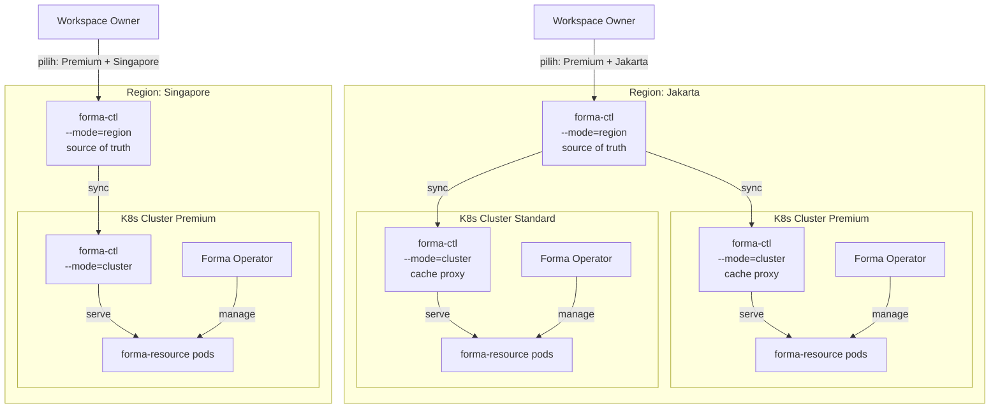

# Forma Architecture Overview

**Version:** 1.0
**Status:** Draft
**License:** Creative Commons CC0
**Governed by:** Forma Overview · Forma Reference

> Dokumen ini menjelaskan arsitektur deployment Forma secara end-to-end: topology multi-region, tiga level kontrol, admin surfaces, deployment tiers, security model, dan semua keputusan desain arsitektur (D-ARCH-1 s/d D-ARCH-31).

---

## 1. Multi-Region Topology

Forma Cloud berjalan di **multiple region independen**. Setiap region memiliki forma-ctl sendiri sebagai source of truth. Region tidak saling komunikasi (independent clusters policy).



**Prinsip kunci:**
- **Satu `forma-ctl --mode=region` per region** — source of truth untuk artifact, policy, signing, deployment routing
- **Banyak K8s cluster per region** — tiap cluster punya ClusterClass (premium/standard/economy)
- **Cluster tidak saling komunikasi** — independen, failure domain terpisah
- **Workspace owner pilih region + ClusterClass** — tidak perlu tahu cluster fisik (kecuali enterprise dedicated)

---

## 2. Component Inventory

Forma terdiri dari **1 unified binary** (`forma`) + **1 Go library** (`forma-resource`) + **2 infrastructure binaries**:

| Komponen | Tipe | Fungsi | Lisensi |
|---|---|---|---|
| `forma` | **Binary** (unified CLI) | Satu binary untuk semua persona: `dev` (development server), `apply` (Control Plane registration), `generate` (codegen), dan subcommand lainnya | FSL |
| `forma-ctl` | **Binary** — `--mode=region` | Region Control Plane — source of truth: artifact store, policy, signing, deployment routing | FSL |
| | `--mode=cluster` | Cluster cache proxy — artifact cache, snapshot proxy, evidence relay | FSL |
| | `--mode=standalone` | All-in-one region+cluster untuk dev/small deployment | FSL |
| `forma-resource` | **Go library** (`github.com/primadi/forma/resource`) | Business logic runtime: entity engine, state machine, API, admin panel. **Di-compile menjadi satu binary dengan app Go.** | FSL |
| `forma-operator` | **Binary** (K8s pod) | CRD controller — Workspace, Datastore, ResourceClaim reconciliation | **Closed source** |
| `forma-sidecar` | **Binary** (legacy) | ⚠️ **Deprecated.** Digantikan oleh `forma dev --listen local_http`. Masih ada untuk backward compat | FSL |

**Catatan:**
- **`forma` adalah satu-satunya binary utama.** Backend API + SPA frontend + CLI dalam satu binary. SPA di-embed via `//go:embed web/dist/*`.
- **`forma-sidecar` sudah deprecated.** Fungsinya (ctx listener untuk non-Go runtimes) sudah terintegrasi ke `forma dev --listen local_http`.
- **Tidak ada binary terpisah untuk dev/prod.** Dev vs prod ditentukan oleh infrastructure (Environment).
- **Hanya `forma-operator` yang closed source.** Semua komponen lain FSL open source.

### Deployment Models

```
Go App (single binary)              Non-Go App (via forma dev)
──────────────────────              ─────────────────────────────
┌──────────────────┐                ┌────────────────────────┐
│ myapp (Go binary)│                │ Pod                     │
│                  │                │                         │
│ import "github.  │                │ ┌─────────────────────┐ │
│ com/forma/forma" │                │ │ app.php (lib-       │ │
│                  │                │ │ forma-php)          │ │
│ • Business logic │                │ │ + PHP runtime       │ │
│ • Entity engine  │                │ └────────┬────────────┘ │
│ • State machine  │                │          │ ctx.* calls  │
│ • REST API       │                │ ┌────────▼────────────┐ │
│ • Admin panel    │                │ │ forma dev            │ │
│ • ctx.* primitives│               │ │ (--listen local_http)│ │
└──────────────────┘                │ └─────────────────────┘ │
                                    └────────────────────────┘
```

### Struktur `cmd/`

```
cmd/
  forma-ctl/           # Binary: region, cluster, standalone (3 mode) + emergency CLI
  forma-operator/      # Binary: CRD controller (closed source, repo terpisah)
  forma-sidecar/       # Binary: ⚠️ legacy — digantikan oleh `forma dev`
  forma/               # Binary utama (CLI + dev server):
  │                    #   apply, generate, dev (subcommands)
  │                    #   SPA embedded via //go:embed dist/*
  │                    #   Config auto-discover (forma-sidecar.yaml)
  └── dev.go           #   Development server (ex-sidecar logic)
  └── dev_config.go    #   Config file loader
  └── dev_runtime.go   #   Runtime auto-detect
  └── dev_vite.go      #   Vite process management
  # forma-resource TIDAK ADA di cmd/ — ini Go library (resource/forma.go),
  # bukan binary. examples/reference-app mendemonstrasikan cara import-nya.
```

> **Catatan:** `forma dev` adalah pengganti `forma-sidecar` untuk development. Untuk production, Go library `forma-resource` di-embed ke binary sendiri, atau gunakan `forma dev --listen local_http` sebagai sidecar untuk non-Go runtimes.

### Command Matrix

```bash
# Production — Region Control
forma-ctl serve --mode=region --port=8443 --db=postgres://...

# Production — Cluster Control (K8s pod)
forma-ctl serve --mode=cluster --region-url=https://control.jakarta.forma.dev

# Production — Operator (K8s pod, closed source)
forma-operator --control-url=http://control-cluster:8443

# Development — All-in-one (Go app)
forma-ctl serve --mode=standalone --port=8443
# Go app sudah include forma-resource via import "github.com/primadi/forma/resource"
./myapp --control-url=http://localhost:8443 --db=sqlite:data.db

# Sidecar — Non-Go app (language-agnostic wrapper)
forma-sidecar --listen=unix:///tmp/forma/sidecar.sock --handler=./app.php
# Language library (lib-forma-php) handles Forma type serialization inside app.php

# Emergency (Cloud Owner, same forma-ctl binary — see docs/cli-tools/02-forma-ctl.md)
forma-ctl freeze --reason "..."
```

---

## 3. Deployment Model — Satu Pipeline, Generic Image

Semua app di-deploy melalui **satu pipeline saja: `forma apply`**. Tidak ada Docker image untuk app. Tidak ada dual channel.

### 3.1 Artifact Pipeline (Satu-satunya Cara)

```bash
# Developer:
forma apply -f myapp/
```

Artifact berisi semua yang diperlukan app:

| Isi artifact | Contoh | Untuk impl type |
|---|---|---|
| **YAML specs** | `invoice.yaml`, `order.yaml`, `menu.yaml` | Semua |
| **Starlark scripts** | `invoice.star`, `order.star` | `script` |
| **Go binary** | `myapp` (hasil `go build`) | `native` |
| **Source code** | `app.php`, `app.py` | `sidecar` |
| **Assets** | `style.css`, `logo.svg` | Semua |

### 3.2 Generic Image — Semua Pod Pakai Image Sama

Semua pod di cluster menggunakan **satu generic image** `formahub/forma-resource` (dibuat oleh tim Forma). Di production image **di-pin ke versi/digest** — bukan `:latest` — supaya deployment reproducible dan konsisten dengan artifact yang di-hash & signed:

```yaml
# Ini image infrastructure, BUKAN image app
# 1 image untuk SEMUA app di SEMUA workspace
# Di-pin per versi (digest pinning direkomendasikan untuk prod)
image: formahub/forma-resource:1.4.2
# image: formahub/forma-resource@sha256:e3b0c442...   # digest pinning
```

Pod startup flow:

```
Pod start (generic image)
  → Download artifact dari Cluster Control
  → Extract: YAML specs, scripts, binary handler, assets
  → Load artifact:
      type: script    → compile & execute .star
      type: native    → jalankan binary handler
      type: sidecar   → start sidecar + forward ke app code
  → Start serving: REST API + Admin panel
```

> **Kompatibilitas versi engine:** untuk impl type `native`, binary app membawa engine `forma-resource` versinya sendiri (ter-compile via `import`), sementara generic image membawa engine untuk type `script`/`sidecar`. Keduanya berbicara dengan Cluster Control lewat plane protocol yang sama — kompatibilitas dijaga di level protocol version (lihat `docs/spec/06-plane-protocol.md`), bukan dengan menyamakan versi library. Upgrade generic image di-roll out oleh Cloud Owner per cluster; tidak mempengaruhi binary app yang sudah ter-compile.

### 3.3 Update Behavior

| Yang berubah | Tindakan | Developer cukup |
|---|---|---|
| **YAML spec** (field, form, permission) | Atomic swap — reload | `forma apply` |
| **Starlark script** | Atomic swap — reload | `forma apply` |
| **Go binary handler** | Rolling restart oleh Operator — pod baru extract binary baru (lihat `06-k8s-operator.md` §5) | `go build && forma apply` |
| **Sidecar source code** | Rolling restart oleh Operator | `forma apply` |

### 3.4 Impl Type — Spec Menunjuk Handler

```yaml
# Pure script — tidak ada binary handler
spec:
  impl:
    type: script
    handler: invoice.star

# Native Go — binary ada di artifact
spec:
  impl:
    type: native
    handler: ./myapp

# Sidecar — source code ada di artifact, runtime di sidecar image
spec:
  impl:
    type: sidecar
    handler: ./app.php
    runtime: php:8.3
```

### 3.5 Tidak Ada Docker Image untuk App

| Yang benar | Yang salah |
|---|---|
| `formahub/forma-resource:1.4.2` (generic, 1 untuk semua) | `registry/myapp:v2` (custom per app) |
| Semua pod pakai image yang sama | Setiap app punya image sendiri |
| Binary handler di-upload dalam artifact | Binary handler di-push ke container registry |
| `forma apply` cukup untuk deploy | Butuh `docker build && docker push` juga |

**Kenapa cukup:**
- Generic image sudah contain `forma-resource` engine (Go library compiled in)
- Spec, script, binary handler semua di artifact — tidak perlu build time
- Developer tidak perlu urus packaging Docker — cukup `forma apply`

---

## 4. Three Control Levels

Arsitektur Forma memiliki **tiga level kontrol** dengan tanggung jawab yang berbeda:

```
Level 1: Region ─── forma-ctl --mode=region (FULL Control Plane)
                      │  sync (periodik, bulk)
Level 2: Cluster ─── forma-ctl --mode=cluster (CACHE PROXY)
                      │  serve (local, <1ms)
Level 3: Pod ─────── Go app binary / sidecar (BUSINESS LOGIC)
```

### 4.1 Region Control — Source of Truth

| Komponen | Fungsi |
|---|---|
| **Artifact store** | Database authoritatif semua YAML manifest, script, asset |
| **Policy engine (OPA)** | Evaluasi deployment policy, approval chain, trust tier |
| **Signing & keys** | Tanda tangan artifact (ed25519), key management (HSM/KMS) |
| **Deployment routing** | Tentukan workspace → cluster berdasarkan ClusterClass + kapasitas |
| **Transparency log** | Merkle append-only audit, published checkpoints |
| **Evidence collection** | Terima deploy_status, health, metering dari cluster control |

**Beban:** Ringan — hanya melayani N cluster control (bukan N×500 resource pod).

### 4.2 Cluster Control — Cache Proxy

| Komponen | Fungsi |
|---|---|
| **Artifact cache** | Cache lokal artifact dari region control (on-disk/in-memory) |
| **Snapshot proxy** | Proxy `GET /v1/snapshot` dengan ETag cache |
| **Evidence batch** | Kumpulkan evidence dari resource pods, batch relay ke region |

**Bukan full Control Plane.** Cluster Control tidak punya:
- ❌ Database sendiri
- ❌ Policy engine (OPA)
- ❌ Signing capability
- ❌ Transparency log

**Kenapa diperlukan:** Operational cost efficiency. Tanpa cluster control, 500 pod menarik artifact langsung dari region control → 3000 request/menit. Dengan cluster control: 1 sync request/30 detik. Resource pods tarik dari cache lokal (<1ms latency).

### 4.3 Resource Pods — Business Logic

`forma-resource` bukan binary — ia adalah **Go library** (`github.com/primadi/forma/resource`) yang di-compile menjadi satu binary dengan aplikasi Go. Dalam pod K8s, yang berjalan adalah binary aplikasi itu sendiri (bukan binary `forma-resource` terpisah).

Untuk aplikasi non-Go, pod berisi: `forma-sidecar` + language runtime + app code.

Fungsinya **tidak berubah** dari spec yang ada:
- Entity engine (CRUD, state machine)
- Permission enforcement
- REST API + WebSocket
- Admin panel auto-generated (`/_admin`)

Resource pods **menarik artifact dan snapshot dari cluster control** (lokal, cepat), **bukan langsung dari region control**.

---

## 5. Admin Surfaces

Tiga admin UI dengan pemilik berbeda. Detail lengkap di [`02-admin-surfaces.md`](./02-admin-surfaces.md).

| Admin UI | Pemilik | Lisensi | Akses |
|---|---|---|---|
| **forma/ops** | Cloud Owner | Closed source | `forma/ops.{region}.forma.dev` |
| **forma/console** | Workspace Owner | Closed source | `console.{region}.forma.dev` |
| **Business Admin** (`/_admin`) | App Owner (end-user) | Open source (auto-generated) | `{workspace}.forma.dev/_admin` |

> **Batas tegas:** `docs/spec/05-frontend.md` adalah spec untuk UI aplikasi bisnis (Page, Form, Table, dll) — **bukan** spec untuk forma/ops atau forma/console. Admin UI plane memiliki spec terpisah di `02-admin-surfaces.md`.

---

## 6. Deployment Tiers

| Tier | Orchestration | HA | Scaling | Lisensi | Target |
|---|---|---|---|---|---|
| **Dev** | Standalone mode | ❌ | Manual | FSL (free) | Local development |
| **Small Prod** | Standalone mode | ❌ | Manual | FSL (free/paid) | Small business |
| **Production** | K8s cluster | ✅ K8s native | ✅ HPA | FSL + Operator (paid) | Enterprise, SaaS |

**Production (K8s):**
- `forma-operator` (closed source) — CRD controller, pod lifecycle, Secret injection
- `forma-ctl` (FSL, `--mode=region` + `--mode=cluster`)
- `forma-resource` (FSL, Go library — di-compile ke dalam app binary)

**Standalone (non-K8s):**
- `forma-ctl` + `forma-resource` dalam satu mesin atau proses manual
- Tanpa Operator, tanpa auto-scaling, tanpa auto-failover
- CLI-based management (`forma` CLI)

---

## 7. Security Model

### 7.1 Chain of Trust

```
Cloud Owner Private Key (HSM/KMS)
        │
        ├──► Sign server token ──► Server registration
        ├──► Sign datastore token ──► DB/Valkey registration
        └──► Sign artifact envelope ──► Deployment pipeline
```

### 7.2 Three-Factor Verification

Server harus membuktikan **tiga hal** sebelum diterima:

| Faktor | Mekanisme |
|---|---|
| **Something you have** | Token signed oleh Cloud Owner (ed25519) |
| **Something you are** | mTLS dengan private key sendiri |
| **Someone approved** | Cloud Owner approve via forma/ops |

Token saja tidak cukup. mTLS saja tidak cukup. Harus ketiganya.

### 7.3 Tenant Data Isolation

| Lapis | Mekanisme |
|---|---|
| **DB credentials** | Tiap pod hanya punya kredensial untuk workspace-nya (injected via K8s Secret) |
| **Forma tenant isolation** | `ctx.db` semua query di-scope ke tenant pod. Cross-tenant → 404 |
| **K8s RBAC** | Pod ServiceAccount hanya bisa baca Secret di namespace-nya sendiri |
| **ResourceClaim CRD** | Datastore hanya bisa diakses workspace yang diizinkan (enforced by Operator) |

### 7.4 Trust Model untuk Binary Native

Impl type `native` berarti platform mengeksekusi binary arbitrer yang di-upload developer. Signature artifact menjamin **integritas dan asal** binary — bukan bahwa binary-nya aman. Lapisan pengaman saat eksekusi:

| Lapis | Mekanisme |
|---|---|
| **Container isolation** | Binary berjalan di dalam pod workspace-nya sendiri — non-root, read-only root filesystem, seccomp/AppArmor profile default |
| **Blast radius** | 1 workspace = 1 Deployment — binary jahat hanya bisa merusak workspace-nya sendiri; kredensial DB yang ter-inject hanya milik workspace itu |
| **Network policy** | Pod hanya boleh egress ke Cluster Control dan datastore yang di-claim (K8s NetworkPolicy) |
| **Tier restriction** | Cloud Owner dapat membatasi impl type `native` per ClusterClass via policy (mis. hanya untuk tier dedicated/enterprise; shared tier hanya `script`) |

Untuk multi-tenant shared cluster, `script` (Starlark, sandboxed) adalah default yang lebih aman; `native` adalah opt-in yang dikontrol policy.

---

## 8. Responsibility Boundary

| Apa | Siapa yang handle |
|---|---|
| Pod restart kalau crash | **K8s** (liveness probe) |
| Node failover | **K8s** (reschedule pod ke node lain) |
| Auto-scaling | **K8s** (HPA) |
| Service discovery | **K8s** (DNS) |
| Secret management | **K8s** (Secrets) |
| Rolling update | **K8s** (Deployment strategy) |
| Workspace → pod creation | **Forma Operator** (CRD controller) |
| DB credential injection | **Forma Operator** (via K8s Secret) |
| Resource permission enforcement | **Forma Operator** (ResourceClaim CRD) |
| Artifact pipeline | **forma-ctl** (register → sign → store → deploy) |
| Policy evaluation | **forma-ctl** (OPA/Rego) |
| Entity engine, state machine | **Go app binary** (via `forma-resource` library) |
| Admin panel rendering | **Go app binary** (via `forma-resource` library — manifest-driven renderer) |

---

## 9. ClusterClass Model

Workspace owner **tidak perlu tahu cluster fisik**. Mereka memilih **ClusterClass** — yang mendefinisikan SLA, spesifikasi, dan harga.

```yaml
# Cloud Owner definisikan ClusterClass
apiVersion: forma.dev/v1alpha1
kind: ClusterClass
metadata:
  name: premium
  region: jakarta
spec:
  sla: "99.99"
  availability: multi-az
  nodeType: dedicated
  storage: nvme-ssd
  maxWorkspaces: 50
  features:
    - auto-scaling
    - cross-az-failover
  scaling:
    minReplicas: 2        # premium: selalu multi-replica + anti-affinity
    scaleToZero: false    # economy: minReplicas 0, scaleToZero true
  pricing:
    baseMonthly: 5000000
    perWorkspace: 500000
```

```yaml
# Workspace Owner pilih class + region
apiVersion: forma.dev/v1alpha1
kind: Workspace
metadata:
  name: bank-mandiri-prod
spec:
  region: jakarta
  clusterClass: premium    # ← ini yang dipilih
  # cluster tidak perlu disebut — Forma yang tentukan
```

**Enterprise exception:** Workspace dengan dedicated cluster bisa memilih cluster spesifik (bypass ClusterClass).

---

## 10. Development Topology

Untuk development dan small deployment, Forma berjalan dalam **standalone mode** — tanpa K8s, tanpa Operator.

```
┌──────────────────────────────────────────────────────────┐
│           Single Machine                                 │
│                                                          │
│  ┌──────────────────────┐  ┌───────────────────────────┐ │
│  │ forma-ctl            │  │ ./myapp (Go binary)       │ │
│  │ --mode=standalone    │  │ (include forma-resource)  │ │
│  │ --port=8443          │  │ --port=8080               │ │
│  │                      │◄─│ --db=sqlite:data.db       │ │
│  │ • SQLite             │  │                           │ │
│  │ • Self-signed        │  │ • SQLite                  │ │
│  └──────────────────────┘  └───────────────────────────┘ │
│                                                          │
│  forma apply ──► register YAML                           │
│  forma dev ────► start both processes                    │
└──────────────────────────────────────────────────────────┘
```

**Standalone mode = single machine, no K8s, no Operator.** Cocok untuk development, small business, dan self-hosted deployment tanpa kebutuhan HA. Aplikasi Go tinggal import `github.com/primadi/forma/resource` — tidak ada binary `forma-resource` terpisah.

---

## 11. Key Design Principles

1. **Don't fight K8s.** K8s handles pod restart, node failover, scaling, service discovery. Forma handles what K8s doesn't: artifact pipeline, workspace scheduling, permission enforcement, metering.

2. **Class-aware transparency.** Workspace owner pilih SLA + harga (ClusterClass), bukan infrastruktur fisik.

3. **Cache at the edge.** Cluster Control sebagai cache proxy — operational cost efficiency tanpa menambah kompleksitas berlebihan.

4. **Independent regions.** Satu region down tidak mempengaruhi region lain. Tidak ada shared state antar region.

5. **Three-factor security.** Token + mTLS + approval — tidak bisa bypass dengan satu faktor saja.

6. **Open core, closed operator only.** `forma-ctl` (binary), `forma-resource` (Go library), `forma-sidecar` (binary), dan CLI tools FSL open source. Hanya `forma-operator` yang closed source (enterprise paid). Pihak ketiga boleh membuat operator alternatif open source yang kompatibel — Forma tidak memonopoli orchestration layer.

---

## 12. Architecture Decisions

| # | Topik | Keputusan |
|---|---|---|
| D-ARCH-1 | Control Plane nature | API-only, tidak punya UI sendiri kecuali `forma/ops` (first-party) |
| D-ARCH-2 | Resource Plane nature | API + serves admin panel (`/_admin`) + business app UI (`/app`) + `forma/console` |
| D-ARCH-3 | Frontend spec scope | `05-frontend.md` = spec UI aplikasi bisnis (Page, Form, Table...), BUKAN admin UI plane |
| D-ARCH-4 | Component model | **3 binary runtime + 1 Go library + CLI tools.** Binary: `forma-ctl` (3 mode + emergency CLI), `forma-operator` (closed source), `forma-sidecar` (language-agnostic). Library: `forma-resource` (compile jadi satu dengan Go app — `import "github.com/primadi/forma/resource"`). CLI: `forma` (`apply` implemented, other verbs roadmap). `forma-server` dihilangkan |
| D-ARCH-5 | Deployment model | **Satu pipeline: `forma apply`.** Tidak ada Docker image untuk app. Semua pod pakai generic image `formahub/forma-resource` (version/digest-pinned di prod). Binary, spec, script, asset semua dalam satu artifact |
| D-ARCH-6 | Resource ownership | Tidak perlu persona baru. Pemilik = Cloud Owner (shared infra) atau Workspace Owner (dedicated infra) |
| D-ARCH-7 | K8s node join mechanism | Token signed dari Cloud Owner → register → pending → approval via forma/ops → active. Node K8s dengan label `forma.dev/*` |
| D-ARCH-8 | Resource registration | Sama seperti K8s node: token signed + approval. DB, Valkey, Redis semua resource yang diregistrasi |
| D-ARCH-9 | Workspace→Cluster assignment | Policy-based default (OPA/Rego evaluasi env, tier, region, capacity), explicit override untuk dedicated |
| D-ARCH-10 | Failover strategy | Automatic (K8s native) untuk workspace dengan shared resources. Workspace dengan dedicated DB/SQLite lokal memerlukan intervensi Cloud Owner (lihat `05-failover.md` §3.5) |
| D-ARCH-11 | In-flight transactions | Idempotency-key based — pod/replica baru safely re-execute |
| D-ARCH-12 | Pod recovery | Pod di-recreate K8s di bawah Deployment workspace yang sama; identity workspace melekat pada Deployment, bukan pod. Tidak ada reassignment workspace antar pod |
| D-ARCH-13 | Production orchestration | K8s-native via Forma Operator (closed source). Tidak membangun scheduler/HA sendiri |
| D-ARCH-14 | Dev/small deployment | Standalone mode (`--mode=standalone`) tanpa K8s, tanpa HA, manual scaling. Dev vs prod ditentukan oleh Environment, bukan binary mode |
| D-ARCH-15 | Lisensi `forma-operator` | **Satu-satunya closed source.** CRD controller untuk K8s orchestration |
| D-ARCH-16 | Lisensi core | `forma-ctl`, `forma-resource` (Go library), `forma-sidecar`, CLI tools — FSL open source. Pihak ketiga boleh buat operator alternatif open source |
| D-ARCH-17 | Admin UI lisensi | `forma/ops` + `forma/console` closed source, first-party Forma. Bukan bagian dari binary core |
| D-ARCH-18 | Controller design | CRD-based controller — watch CRD → reconcile ke K8s resources (Deployment, Service, Secret, ConfigMap) |
| D-ARCH-19 | Tag/label scope | Hanya untuk server/node (environment, tier, region, capacity). DB/Valkey binding via CRD langsung ke workspace |
| D-ARCH-20 | Cluster topology | Independent clusters. Satu region = satu `forma-ctl --mode=region`. Cluster tidak saling komunikasi |
| D-ARCH-21 | forma-ctl placement | Per region (Jakarta/Singapore/Tokyo/dll), bukan satu global |
| D-ARCH-22 | Owner cluster awareness | Class-aware transparency. Workspace owner pilih ClusterClass + region. Enterprise bisa pilih cluster langsung |
| D-ARCH-23 | Cross-region mesh | Future optional, untuk enterprise. Bukan bagian dari spec awal |
| D-ARCH-24 | Global registry | Roadmap: auto-register app/module ke semua region |
| D-ARCH-25 | Architecture levels | 3 level: Region Control (`--mode=region`) → Cluster Control (`--mode=cluster`) → Forma Operator + Resource pods |
| D-ARCH-26 | Cluster Control nature | Cache proxy, bukan full Control Plane. Tidak punya DB, policy engine, signing |
| D-ARCH-27 | Cluster failure | Insiden infrastruktur. Region Control tidak auto-recover cluster. Cloud Owner handle via forma/ops |
| D-ARCH-28 | Availability guarantee | Di level cluster (K8s: pod restart, node failover). Bukan di level region |
| D-ARCH-29 | ClusterClass model | Cloud Owner definisikan ClusterClass (SLA, spesifikasi, harga). Workspace owner pilih class + region |
| D-ARCH-30 | Metering model | Per resource sebagai dasar, diagregasi per workspace untuk billing |
| D-ARCH-31 | Workspace↔pod model | **1 workspace = 1 Deployment** (dedicated). Failover/scaling = K8s native. Tenant murah/gratis dilayani dengan scale-to-zero + resource request kecil per ClusterClass — bukan pool pod multi-workspace |

---

## 13. References

| Dokumen | Isi |
|---|---|
| `docs/spec/01-overview.md` §5–§6 | Arsitektur dua plane, empat persona |
| `docs/spec/04-control-plane.md` | Spec Environment, Policy, Datastore |
| `docs/spec/05-frontend.md` | Spec UI kinds (Page, Form, Table...) |
| `docs/spec/06-plane-protocol.md` | YAML registration pipeline |
| `docs/spec/00-kind-plane-mapping.md` | Kind → Plane mapping |
| `docs/spec/12-datastore.md` | Datastore kind spec |
| `reff_docs/Forma-Technical-Note-Katalog-Aplikasi.md` | First-party apps catalog |
