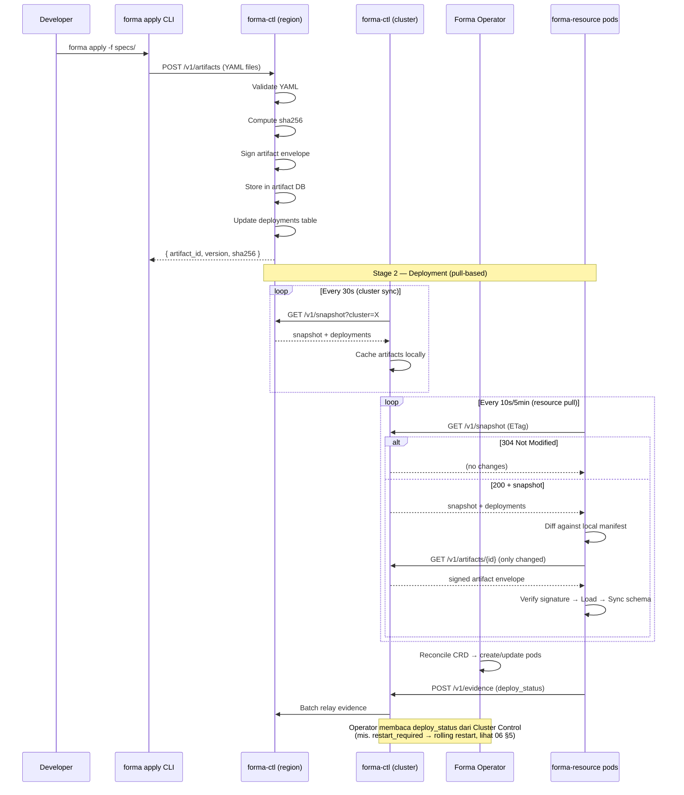

# Deployment Flow

**Version:** 1.0
**Status:** Draft
**License:** Creative Commons CC0
**Governed by:** Forma Architecture Overview · Forma Plane Protocol Spec

> Dokumen ini menjelaskan **bagaimana** YAML manifest berpindah dari laptop developer menjadi aplikasi yang berjalan di production — melalui pipeline dua-stage: registration (developer → Control Plane) dan deployment (Control Plane → Resource Plane). Detail wire protocol ada di `docs/spec/06-plane-protocol.md`.

---

## 1. Pipeline Overview



---

## 2. Stage 1 — Registration (Developer → Region Control)

`forma apply` adalah **satu-satunya** cara untuk mendaftarkan YAML manifest. Resource Plane **tidak boleh** membaca YAML langsung dari filesystem.

### 2.1 Process

1. Developer menjalankan `forma apply -f path/to/specs/` (atau `forma apply --watch` untuk hot-reload)
2. CLI membaca semua file dalam direktori — YAML, **`star` (Starlark scripts)**, **binary handler (hasil `go build`)**, **source code (PHP/Python)**, **assets (CSS/JS)** — kirim sebagai artifact payload ke Region Control
3. Region Control:
   - Parse multi-document YAML manifests
   - Validasi schema, kind, metadata, spec per kind
   - Compute **sha256** setiap file dan aggregate envelope hash
   - Sign artifact envelope dengan platform key (ed25519, atau self-signed di dev)
   - Simpan artifact di DB (`forma_control.artifacts`)
   - Update desired `deployments` state dengan artifact version + hash baru
4. Response: `{ artifact_id, version, sha256 }`

### 2.2 What Gets Registered

| File Type | Extension | Disimpan sebagai |
|---|---|---|
| YAML manifests | `.yaml`, `.yml` | File dalam artifact envelope |
| Starlark scripts | `.star` | File dalam artifact envelope |
| Go binary handler | _(no extension, executable)_ | File dalam artifact envelope |
| Source code (sidecar) | `.php`, `.py`, `.js`, `.java` | File dalam artifact envelope |
| Assets (custom UI) | `.js`, `.ts`, `.css` | File dalam artifact envelope |

### 2.3 Validation

Region Control memvalidasi:
- **Schema:** `apiVersion` dikenal, `kind` valid, `metadata` lengkap
- **Business rules:** Document field types valid, state machine transitions defined, permission references ada
- **Cross-reference:** `module` reference valid, `script_ref` menunjuk file yang ada

Gagal validasi → artifact **ditolak**, tidak disimpan.

---

## 3. Stage 2 — Deployment (Region Control → Cluster → Resource)

Deployment bersifat **pull-based**. Control Plane tidak pernah push ke Resource Plane.

### 3.1 Cluster Sync (Region → Cluster Control)

Setiap ~30 detik, Cluster Control melakukan sync dari Region Control:

1. `GET /v1/snapshot?cluster={cluster_id}` — dapatkan daftar deployments untuk cluster ini
2. Untuk setiap artifact yang hash-nya berbeda dengan cache lokal → `GET /v1/artifacts/{id}` → cache secara lokal
3. Cluster Control sekarang siap melayani Resource Plane pods dengan artifact yang sudah di-cache

### 3.2 Resource Pull (Cluster Control → Resource Pods)

Setiap 10 detik (dev) atau 5 menit (prod), Resource Plane melakukan convergence cycle:

1. `GET /v1/snapshot` ke Cluster Control dengan header `If-None-Match: {current_version}`
2. Cluster Control membandingkan versi:
   - **Sama** → `304 Not Modified` (tanpa body, overhead minimal)
   - **Berbeda** → `200` + snapshot dengan daftar `deployments`
3. Resource Plane menghitung diff terhadap local `deployment_manifest.json`:
   - Untuk setiap deployment: bandingkan `sha256(desired)` vs `sha256(local)`
   - **Hash sama** → skip (emit `deploy_status: up_to_date`)
   - **Hash berbeda** → fetch artifact dari Cluster Control, verifikasi signature, load, deploy
4. Setelah loading selesai, emit `deploy_status` evidence via Cluster Control → Region Control

### 3.3 What Happens on Deploy

Saat Resource Plane memuat artifact baru:

1. **Parse** YAML manifests dari artifact envelope
2. **Validate** ulang (defense in depth — sudah divalidasi di Stage 1, tapi verify lagi)
3. **Sync schema** — apply perubahan ke database (buat tabel/kolom baru, tambah index)
4. **Register entity** — daftarkan Document/Service ke entity registry
5. **Update permission catalog** — rebuild permission matrix
6. **Admin panel refresh** — renderer baca ulang UI manifests, tampilkan form/table/page baru di `/_admin`
7. **Emit evidence** — `deploy_status: deployed`, version, timestamp

**Zero downtime:** Artifact baru diload tanpa restart. Pod yang sedang melayani request tetap menggunakan artifact lama sampai load selesai. Setelah load selesai, request baru otomatis menggunakan artifact baru (atomic swap di registry).

---

## 4. Dev Mode vs Production

| Aspect | Development | Production |
|---|---|---|
| **Transport** | HTTP (localhost, no TLS) | gRPC + mTLS |
| **Signing** | Self-signed ed25519 | Platform key (HSM/KMS) |
| **Approval** | None (auto-approved) | Policy-based approval chain |
| **Cluster Control** | Tidak digunakan (resource langsung ke region) | Cache proxy — sync setiap 30s |
| **Pull interval** | 10 detik | 5 menit |
| **`forma apply`** | `--watch` untuk hot-reload | Run-once per deployment |
| **Evidence** | Optional (logged locally) | Mandatory + transparency log |
| **Local poll trigger** | `POST /v1/poll` (dev-only) | Tidak ada — menunggu pull cycle berikutnya |
| **Revocation propagation** | Pull berikutnya (10 detik) | **Push-hint** — snapshot yang membawa revocation memicu pull segera + pull interval diperpendek sampai revocation terkonfirmasi (wajib per `docs/spec/06-plane-protocol.md` §Revocations) |
| **Database** | SQLite | Postgres |
| **Forma Operator** | Tidak digunakan | CRD controller |

### 4.1 Dev Mode Simplification

Di development, semua plane berjalan di mesin yang sama. Pipeline strukturnya identik tapi disederhanakan:

- **Local poll trigger** (`POST /v1/poll`): setelah `forma apply --watch` mendaftarkan artifact baru, CLI mengirim HTTP call lokal ke Resource Plane untuk segera menarik snapshot. Mengurangi latency dari 10 detik menjadi ~100ms. Ini **bukan** Control→Resource push — hanya orkestrasi lokal.
- **Tidak ada Cluster Control:** Resource Plane langsung menarik dari Region Control (local host).
- **Tidak ada Operator:** Resource Plane dikelola manual oleh developer.

---

## 5. Deployment Routing — Workspace → Cluster

Saat developer mendaftarkan artifact, Region Control harus menentukan **cluster mana** yang akan menjalankan workspace.

### 5.1 Default: ClusterClass-based

1. Workspace punya `clusterClass: premium` dan `region: jakarta`
2. Region Control mencari cluster dengan label `class=premium, region=jakarta, status=active`
3. Filter cluster yang masih punya kapasitas (`currentWorkspaces < maxWorkspaces`)
4. Pilih cluster dengan beban paling rendah (atau afinitas — kalau workspace sebelumnya di cluster X, usahakan tetap di X)
5. Update `deployments` table: `workspace X → cluster Y`

### 5.2 Enterprise: Direct Cluster Assignment

Workspace dengan dedicated cluster bisa menentukan cluster spesifik:

```yaml
spec:
  region: jakarta
  cluster: jkt-enterprise-03   # bypass ClusterClass
```

---

## 6. Evidence Flow

```
Resource Pod ──► Cluster Control ──► Region Control ──► Transparency Log
    │                  │                     │
    │ deploy_status    │ batch & relay       │ append + hash
    │ health           │ setiap 60 detik     │ publish checkpoint
    │ metering         │                     │
```

| Evidence Type | Dikirim oleh | Frekuensi |
|---|---|---|
| `deploy_status` | Resource pod (setelah deploy) | On-change |
| `health` | Resource pod | 30 detik |
| `metering` | Resource pod (via Operator) | 5 menit |
| `violation` | Resource pod (policy violation) | On-event |

Cluster Control melakukan **batch relay** — mengumpulkan evidence dari semua pod dalam cluster, mengirimkannya ke Region Control dalam satu request per 60 detik. Ini mengurangi network overhead secara signifikan.

---

## 7. References

| Dokumen | Isi |
|---|---|
| `docs/spec/06-plane-protocol.md` | Wire protocol detail (endpoint, format, header) |
| `docs/architecture/01-architecture-overview.md` | Multi-region topology, control levels |
| `docs/architecture/06-k8s-operator.md` | Forma Operator, CRD reconciliation |
