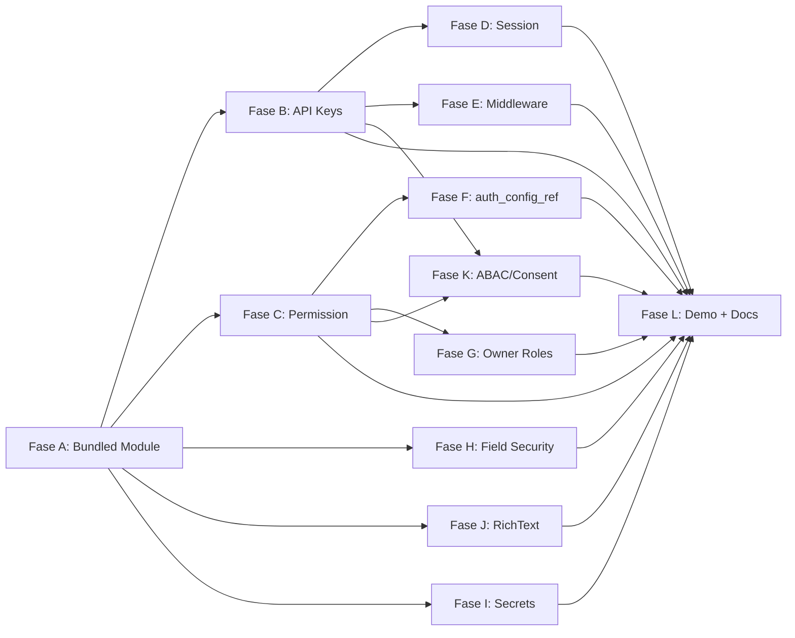

# Plan: Fase 6 Dogfooding — Auth Module & Authorization

**Status**: 🚧 In Progress (2026-08-20)
**Referensi spec**: `docs/spec/backend/01-core-basic.md` §8 (auth, dua permukaan);
`docs/spec/platform/02-workspace-app-module.md` §3 (auth per-App), §9 (`formspec.core`);
`docs/spec/platform/08-project-layout.md` §6 (module lokal vs vendor, `external/`);
`docs/plan/auth-login-token.md` (fondasi 6.1 yang sudah selesai).

## TL;DR

Selesaikan Fase 6 (6.1–6.9) dengan **dogfooding**: auth framework dibangun ulang
sebagai **1 modul FormSpec first-class** — definisi `formspec.core` dipindah dari
registrasi programatik Go ke **bundled module YAML** (`internal/auth/module/`,
di-embed + dimuat manifest loader) yang bisa di-copy/merge ke project lain
(`external/auth` atau `spec/modules/`). Enforcement engine (middleware, JWT,
permission, field security) tetap Go. Demo merge di `verticals/reference-app` +
`examples/Clinic-UI-Showcase`.

## Keputusan (klarifikasi 2026-08-20)

1. **Scope**: semua sisa 6.1–6.9.
2. **Bentuk**: refactor `formspec.core` jadi bundled module; middleware tetap Go.
3. **Merge**: copy folder via `external/` atau `spec/modules/` (bukan Fase 13 vendoring).
4. **Demo**: keduanya — `verticals/reference-app` + `examples/Clinic-UI-Showcase`.

## Batasan teknis (riset)

- `kind: Service` runtime belum ada (Fase 7.1) → login/refresh tetap HTTP handler Go.
- Yang "di-formspec-kan" = data model (entity), UI admin, scripts. Middleware tetap Go.
- Field-security structs sudah ada di Fase 1 (classification 1.4.3, required_permission
  1.4.4, exclude 1.4.5, encrypted 1.4.6, masked 1.4.7) → Fase 6.7 = enforcement.
- `uses.secrets` struct (1.4.2) + enforcement sebagian (2.6.4).
- `job`/`audit-log`/`setting` = kepemilikan sistem lain (7.13/4.7/7.2); fase ini hanya
  memakai `audit-log` untuk 6.6.4.
- `RegisterCoreEntity` (internal/entity/registry.go) menandai entity `Internal` →
  skip route/meta, akses via `GetEntityStore`. `RegisterArtifactManifest` = analog
  terdekat untuk sumber non-filesystem (tapi tidak menandai Internal).

## Fase A — Fondasi: Bundled Auth Module (refactor `formspec.core`)

> Blok semua fase berikut. Refactor murni — tidak mengubah perilaku auth yang ada.

- **A1** Scaffold `internal/auth/module/` (embed FS): `module.yaml` (name: auth) +
  entity namespace `formspec.core`: `user`, `session`, `role`, `role-assignment`
  (dipindah dari Go). Entity baru `app-membership`, `api-key`, `workspace` menyusul
  di Fase B (agar Fase A = refactor murni, terverifikasi).
- **A2** `manifest.Loader.LoadEmbedded(fsys fs.FS)` — walk `fs.WalkDir`, parse via
  `ParseBytes`, aturan skip sama dengan `Discover` (hidden/node_modules/impl).
- **A3** `entity.Registry.RegisterEmbeddedCoreModule(fsys)` — load embedded manifests,
  untuk tiap Entity: skip bila `HasEntity` (user override via external menang),
  validasi + register dengan `Internal: true`. Refactor `internal/auth/core.go`:
  hapus `coreUserSpec()`/`coreSessionSpec()`/`coreRoleSpec()`/`coreRoleAssignmentSpec()`
  (hardcode EntitySpec) → baca dari bundled module.
- **A4** `ui.Registry` muat UI manifests dari embedded FS (reuse `LoadEmbedded`).
- **A5** Keputusan desain: entity auth Internal diskip dari route — jalur admin
  (flag `UIExposed` + permission ketat, atau expose normal owner-only).
- **A6** `formspec generate auth` diperluas — scaffold seluruh module dari bundled
  module (copy dari embed, selalu sinkron), ke `external/auth` (default) /
  `spec/modules/auth` (`--to`).

## Fase B — API Keys + App-Membership + Workspace (6.4, 6.3.2, 6.3.5)

- **B1** `api_key` entity (module): `key_hash` (masked), `name`, `scope`
  (workspace|app), `app`, `expires_at`, `revoked_at`; create return-once; list
  masked; revoke; expiry (6.4.1, 6.4.2).
- **B2** Middleware `X-FormSpec-Key` di `internal/api`; surface external TIDAK
  menerima session cookie (6.4.3).
- **B3** `app-membership` entity: user per App + atribut (kode cabang) (6.3.2).
- **B4** `workspace` entity minimal + batas resource `formspec.core`
  (job/audit-log/setting milik sistem lain) (6.3.5).

## Fase C — Permission Model (6.2.1, 6.2.2, 6.2.4)

- **C1** Parse/validasi `{module}.{entity}.{action}` formal (`internal/permission`) (6.2.1).
- **C2** Wildcard `{module}.{entity}.*`, `*`, `public` (6.2.2).
- **C3** Resolusi role→perms + cache per-session (6.2.4).

## Fase D — Session Management (6.5)

- **D1** Concurrent session limit per user (6.5.3).
- **D2** Global revoke / logout all (6.5.4) — `SessionStore.DeleteForUser` sudah ada.
- **D3** Session expiry + cleanup job (6.5.5).

## Fase E — Auth Middleware Pipeline (6.6)

- **E1** Method detection: Bearer JWT vs `X-FormSpec-Key` vs session cookie
  (cookie hanya `/_ui`) (6.6.1).
- **E2** Pipeline terpadu: validate → identity → permissions → workspace ctx (6.6.2).
- **E3** Rate limit per method — token bucket in-memory pada login/refresh (6.6.3).
- **E4** Audit log tiap auth attempt (6.6.4) → tulis ke `audit-log`.

## Fase F — Auth per-App `auth_config_ref` (6.1.4)

- **F1** Wire `App.spec.auth_config_ref` → resolver strategy (basic-auth default;
  sso/social/passwordless/passkey open set) — seam `RoleResolver.SetOverride`.
- **F2** Resolusi per-App → identity/permission/workspace context.

## Fase G — Roles & Delegation (6.3.3, 6.3.4)

- **G1** 4 symmetric owner roles: Workspace/App/Module/Cloud Owner (seeded + permission).
- **G2** Admin delegation chain enforcement.

## Fase H — Field-Level Security (6.7) [paralel dgn C/D]

- **H1** `classification` label (pii|financial|internal) → log/export tagging (6.7.1).
- **H2** `required_permission` field → exclude dari response (6.7.2).
- **H3** `exclude` per-surface (6.7.3).
- **H4** `encrypted` AES-256-GCM at-rest (6.7.4).
- **H5** `masked` auto-mask (6.7.5) — sebagian ada (password_hash).
- **H6** `computed` server-derived (6.7.6) — perlu grammar compute backend.

## Fase I — `ctx.secrets` (6.8)

- **I1** `ctx.secrets.get(key)` utk Config secret:true (6.8.1) — seam Go dulu
  (Config runtime 7.2 belum).
- **I2** `uses.secrets` enforcement penuh (6.8.2) — extend 2.6.4.
- **I3** Secret tak pernah di log (6.8.3).
- **I4** Audit tiap secret read (6.8.4).

## Fase J — RichText Sanitization (6.9)

- **J1** Server-side HTML sanitize pada richtext sebelum persist (6.9.1) —
  bluemonday atau whitelist.

## Fase K — Consent Footprint + ABAC (6.2.5, 6.2.6)

- **K1** Consent footprint: aggregate `required_permission` + `uses` → output
  `formspec check` (6.2.5).
- **K2** ABAC: atribut App/user/membership; `scope_field` + atribut cabang (6.2.6)
  — butuh B3.

## Fase L — Demo Merge + Docs + Regresi

- **L1** Merge module ke `verticals/reference-app` (external/ atau spec/modules) —
  verifikasi boot + login + admin.
- **L2** Merge ke `examples/Clinic-UI-Showcase` — dua App (internal vs portal) +
  regresi e2e.
- **L3** Docs: update `docs/plan/todo.md` (tandai 6.x ✅ + timestamp), changelog per
  hari, update `02-workspace-app-module.md` §3 + `08-project-layout.md` (external/),
  `docs/implementation/`.
- **L4** `go test ./...` + `vitest` + `formspec validate` + `make lint`.

## Dependensi

## Relevant files

- `internal/auth/module/**` (baru) — bundled module manifests
- `internal/auth/core.go` — refactor hapus hardcode EntitySpec
- `internal/manifest/loader.go` — `LoadEmbedded` (fs.FS/embed)
- `internal/entity/registry.go` — `RegisterEmbeddedCoreModule` + Internal
- `internal/ui/*` — muat embedded UI
- `internal/auth/*`, `internal/api/*`, `internal/permission/*`,
  `renderers/jsonb-persist/*`, `cmd/formspec/generate_auth.go`,
  `cmd/formspec/check.go`, `resource/formspec.go`
- `verticals/reference-app/`, `examples/Clinic-UI-Showcase/` — demo

## Verification

1. `go test ./...` hijau (baseline 571 pass).
2. reference-app: boot + login admin + kelola user/role/api-key via admin UI.
3. Clinic: dua App auth berbeda + regresi e2e.
4. `formspec generate auth` → `formspec dev` jalan dgn scaffold.
5. `formspec validate` pada module auth + project hasil merge.

## Decisions

- Refactor `formspec.core` → bundled module; middleware tetap Go.
- Namespace `formspec.core` reserved; override external menang (`HasEntity`).
- Merge via copy folder (bukan Fase 13 vendoring; jalur disiapkan).
- Api key disimpan hash, tampil sekali.
- Internal entity auth tampil admin via jalur khusus + permission ketat (A5).
- `job`/`audit-log`/`setting` = kepemilikan sistem lain.
- 6.6.3 = rate limit fokus (token bucket), bukan 7.12 penuh.

## Further Considerations

1. Master key untuk encrypted field & ctx.secrets: env `FORMSPEC_MASTER_KEY`
   (rekomendasi) vs file kunci vs vault.
2. Grammar `computed` backend (6.7.6) — FormSpecExpr `compute` ada utk UI; backend
   perlu keputusan grammar.
3. 6.8.1 butuh Config kind (7.2) — pakai seam Go dulu agar fase 6 tuntas.
