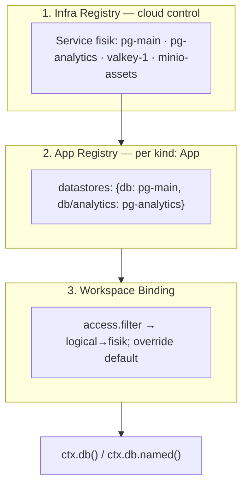

# `ctx.*` Primitives — Referensi Ringkas

Referensi cepat 9 logical primitive `ctx.*` dan 3-level registry. Kontrak
normatif: [`../spec/platform/06-datastore.md`](../spec/platform/06-datastore.md).

## 9 Primitive (Closed Set)

| #   | Primitive | Akses           | Fungsi                          | Operasi utama                                                                                                                                  |
| --- | --------- | --------------- | ------------------------------- | ---------------------------------------------------------------------------------------------------------------------------------------------- |
| 1   | `db`      | `ctx.db()`      | Query SQL mentah, module-scoped | `query(sql, args...)`                                                                                                                          |
| 2   | `cache`   | `ctx.cache()`   | KV dengan TTL                   | `get` / `set(key, val, ttl=)` / `delete`                                                                                                       |
| 3   | `lock`    | `ctx.lock()`    | Distributed lock                | `acquire(key, ttl=)` / `release(key)`                                                                                                          |
| 4   | `queue`   | `ctx.queue()`   | FIFO queue                      | `enqueue(name, payload)` / `dequeue(name)`                                                                                                     |
| 5   | `pubsub`  | `ctx.pubsub()`  | Publish/subscribe               | `publish(ch, payload)` / `subscribe(ch, cb)`                                                                                                   |
| 6   | `storage` | `ctx.storage()` | Object storage (file field)     | `upload(path, data)` / `download(path)` / `link(path, ttl=)` / `stat(path)` / `delete(path)` / `init_upload` / `put_chunk` / `complete_upload` |
| 7   | `kvstore` | `ctx.kvstore()` | KV durable tanpa TTL            | `get` / `set` / `delete`                                                                                                                       |
| 8   | `config`  | `ctx.config`    | Config non-secret               | `get(key, default=)`                                                                                                                           |
| 9   | `log`     | `ctx.log`       | Log terstruktur                 | `info(event, meta)` / `warn` / `error`                                                                                                         |

Set tertutup — tidak bisa ditambah. Kebutuhan baru (mail, scheduler,
notification) = module resmi di atas primitive yang ada.

## Named Logical Primitive

```python
rows = ctx.db.named("analytics").query("SELECT ...")
```

Alias teregistrasi di App Registry (`db/analytics: pg-analytics`), wajib
dideklarasikan di `uses.datastores` action. Unknown → `DATASTORE_NOT_FOUND`;
tidak dideklarasikan → `DATASTORE_ACCESS_DENIED`.

## 3-Level Registry



**Chain resolusi:** `action uses.datastores → module datastores → App
datastores → workspace binding → Infra Registry`. Mengarah ke bawah =
mempersempit, tidak melebar.

## Driver × Serves

| Driver               | Kompatibel `serves`                                            |
| -------------------- | -------------------------------------------------------------- |
| `sqlite`, `postgres` | `db`, `kvstore`, `config`, `log`                               |
| `valkey`, `redis`    | `cache`, `lock`, `kvstore`, `queue`, `pubsub`, `config`, `log` |
| `s3`, `minio`        | `storage`                                                      |
| `nats`               | `queue`, `pubsub`                                              |
| `memory`             | `cache`, `lock`, `queue`, `pubsub`, `kvstore`, `config`, `log` |
| `fs`                 | `storage`, `log`                                               |

## Contoh Manifest Lengkap

```yaml
# Level 1 — registrasi service (kind: Datastore, Control Plane)
apiVersion: formspec.dev/v1
kind: Datastore
metadata:
  name: pg-analytics
spec:
  serves: [db, kvstore]
  driver: postgres
  connection: { host: pg-analytics.internal, port: 5432, database: analytics }
  credential_ref: kms://prod/pg-analytics
---
# Level 2 — seleksi App
apiVersion: formspec.dev/v1
kind: App
metadata:
  name: shop
spec:
  modules: [billing]
  datastores:
    db: pg-main
    db/analytics: pg-analytics
```

Deklarasi di action:

```yaml
uses:
  datastores:
    db: pg-main # base primitive
    db/analytics: pg-analytics # named primitive
```

## Error Codes

| Kode                            | Kondisi                                   |
| ------------------------------- | ----------------------------------------- |
| `DATASTORE_NOT_FOUND`           | Service/alias tidak ditemukan             |
| `DATASTORE_ACCESS_DENIED`       | Tidak dideklarasikan di `uses.datastores` |
| `DATASTORE_PERMISSION_DENIED`   | Melampaui ceiling `access.permission`     |
| `DATASTORE_DRIVER_INCOMPATIBLE` | `serves` ≠ kemampuan driver               |
| `DATASTORE_CREDENTIAL_MISSING`  | `credential_ref` wajib tapi kosong        |
