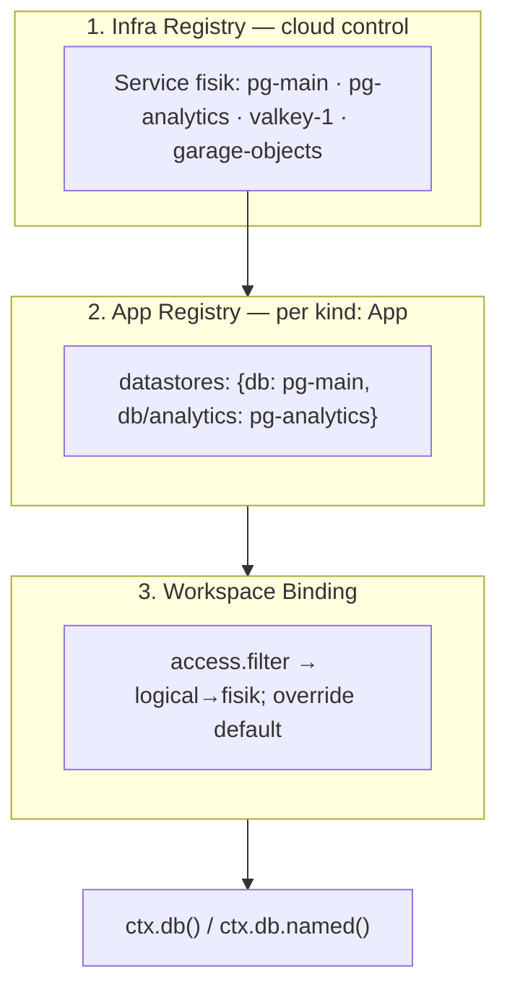

# `ctx.*` Primitives — Referensi Ringkas

Referensi cepat 9 logical primitive `ctx.*` dan 3-level registry. Kontrak
normatif: [`../spec/platform/06-datastore.md`](../spec/platform/06-datastore.md).

## 9 Primitive (Closed Set)

| #   | Primitive | Akses           | Fungsi                          | Operasi utama                                                                                                                                  |
| --- | --------- | --------------- | ------------------------------- | ---------------------------------------------------------------------------------------------------------------------------------------------- |
| 1   | `db`      | `ctx.db()`      | Query SQL mentah, module-scoped | `query(sql, args...)`                                                                                                                          |
| 2   | `cache`   | `ctx.cache()`   | KV dengan TTL                   | `get` / `set(key, val, ttl=)` / `delete`                                                                                                       |
| 3   | `lock`    | `ctx.lock()`    | Distributed lock                | `acquire(key, ttl=)` / `release(key)`                                                                                                          |
| 4   | `queue`   | `ctx.queue()`   | FIFO queue                      | `enqueue(name, payload)` / `dequeue(name)`                                                                                                     |
| 5   | `pubsub`  | `ctx.pubsub()`  | Publish/subscribe               | `publish(ch, payload)` / `subscribe(ch, cb)`                                                                                                   |
| 6   | `storage` | `ctx.storage()` | Object storage (file field)     | `upload(path, data)` / `download(path)` / `link(path, ttl=)` / `stat(path)` / `delete(path)` / `init_upload` / `put_chunk` / `complete_upload` |
| 7   | `kvstore` | `ctx.kvstore()` | KV durable tanpa TTL            | `get` / `set` / `delete`                                                                                                                       |
| 8   | `config`  | `ctx.config`    | Config non-secret               | `get(key, default=)`                                                                                                                           |
| 9   | `log`     | `ctx.log`       | Log terstruktur                 | `info(event, meta)` / `warn` / `error`                                                                                                         |

Set tertutup — tidak bisa ditambah. Kebutuhan baru (mail, scheduler,
notification) = module resmi di atas primitive yang ada.

## Helper nilai (bukan primitive)

Selain 9 primitive di atas, `ctx` menyediakan helper **nilai** — tidak menyentuh
infrastruktur, jadi tidak ada yang perlu di-provision dan tidak ada yang
diperiksa `uses.primitives`:

| Helper                      | Fungsi                                                            | Kenapa bukan primitive                            |
| --------------------------- | ----------------------------------------------------------------- | ------------------------------------------------- |
| `ctx.now()` / `ctx.today()` | waktu server (RFC3339 / `YYYY-MM-DD`)                             | hanya jam                                         |
| `ctx.next_key(field)`       | deret bernomor (counter per workspace)                            | state framework, bukan service                    |
| `ctx.random_digits(n)`      | `n` digit acak **kriptografis** (4 ≤ n ≤ 12), leading zero dijaga | hanya entropi OS                                  |
| `ctx.config.get(key)`       | config non-secret                                                 | punya gerbang sendiri (per-key `public`/`secret`) |
| `ctx.log.info/warn/error`   | log terstruktur                                                   | hanya keluaran                                    |

**`ctx.random_digits(n)` vs `ctx.next_key`** — dua-duanya menghasilkan nilai,
dan memilih yang salah adalah kesalahan yang tampak benar: `next_key` adalah
**deret**, jadi nilainya bisa ditebak. Ia tidak boleh dipakai untuk apa pun yang
harus rahasia (kode gabung sesi meja, token, OTP). `random_digits` memakai
`crypto/rand` dan **rejection sampling** — bukan `byte % 10`, yang akan
membiaskan digit 0–5 karena 256 bukan kelipatan 10, sehingga ruang pencarian
menyusut diam-diam.

Batasan 4–12 dijaga secara sengaja: nilai 1–2 digit bukan rahasia yang berarti,
dan `n` tanpa batas berarti satu manifest bisa meminta string sepanjang apa pun
per panggilan.

## Mana yang diperiksa `uses`, mana yang tidak

Di `ProdMode`/`StrictMode`, **hanya 7 primitive datastore** yang diperiksa
terhadap `uses.primitives`:

| Diperiksa `uses.primitives`                                    | Tidak diperiksa                                     |
| -------------------------------------------------------------- | --------------------------------------------------- |
| `db`, `cache`, `lock`, `queue`, `pubsub`, `storage`, `kvstore` | `config`, `log`, `now`, `today`, `next_key`, `unit` |

Yang diperiksa `uses.primitives` adalah tepat primitive yang menyentuh
**infrastruktur ber-batas** — yang perlu di-provision, diberi kredensial, atau
dibatasi per tenant. Yang tidak diperiksa tidak punya batas untuk dipagari:
`now`/`today` hanya jam, `log` hanya keluaran, dan `config` sudah punya gerbang
sendiri (per-key `public`/`secret`). Jadi pemeriksaan ini sengaja asimetris,
bukan belum lengkap.

Konsekuensi praktisnya: memakai `ctx.now()` tanpa `uses` adalah **sah** dan tidak
akan gagal; memakai `ctx.db()` tanpa `uses` **gagal** dengan `USES_VIOLATION`.
Mendeklarasikan keduanya tetap dianjurkan — `uses` adalah footprint consent yang
dibaca reviewer dan validator, bukan hanya penjaga runtime.

## Named Logical Primitive

```python
rows = ctx.db.named("analytics").query("SELECT ...")
```

Alias teregistrasi di App Registry (`db/analytics: pg-analytics`), wajib
dideklarasikan di `uses.datastores` action. Unknown → `DATASTORE_NOT_FOUND`;
tidak dideklarasikan → `DATASTORE_ACCESS_DENIED`.

## Di mana `uses` boleh ditulis

| Pemilik               | Bentuk                                        |
| --------------------- | --------------------------------------------- |
| Action entity/Service | `actions[].uses`                              |
| Hook                  | `hooks[].uses`                                |
| **Subscription**      | **`uses`** (saudara `handler`, bukan anaknya) |

Subscription adalah yang terakhir ditambahkan: sebelumnya `SubscriptionSpec`
tidak punya field itu sama sekali, sehingga sebuah handler yang menyentuh
`ctx.db` gagal `USES_VIOLATION` dengan pesan _"add uses.primitives: [db]"_ —
instruksi yang manifest-nya tidak punya tempat untuk dituruti. Ketiganya kini
bentuk yang sama.

## Dialek Starlark (script & hook)

Script (`impl: {type: script_ref, …}`) dan `hooks:` dijalankan oleh runtime
**Starlark** — mirip Python, tetapi bukan Python. Dua batasan yang paling sering
membuat script gagal di runtime:

| Batasan                                          | Salah                                                           | Benar                         |
| ------------------------------------------------ | --------------------------------------------------------------- | ----------------------------- |
| Tidak ada implicit adjacent string concatenation | `"SELECT 1 " "FROM t"` → `got string literal, want ','`         | `"SELECT 1 " + "FROM t"`      |
| Bind parameter = **satu** argumen list/tuple     | `ctx.db().query(sql, a, b)` → `got 2 arguments, want at most 1` | `ctx.db().query(sql, [a, b])` |

`formspec validate` mengompilasi setiap script yang dirujuk `impl.ref`/`hooks:`
dan melaporkan script yang gagal kompilasi maupun yang tidak ditemukan.

**Uang (`money`) di script & guard.** Field bertipe `money` bernilai objek
`{amount, currency}`, tetapi nilainya bisa dihitung **langsung** — tidak perlu
dibongkar dulu:

```python
resource.total - resource.discount                      # money - money → money
resource.quantity * resource.unit_price                 # integer × money → money
sum([line["line_total"] for line in resource.lines])    # money
amount(resource.total) / item_count                     # skalar: ekstrak dulu
resource.difference < resource.limit                    # money vs money (securrency)
```

| Aturan                                                          | Konsekuensi                                                                   |
| --------------------------------------------------------------- | ----------------------------------------------------------------------------- |
| `money ± money`                                                 | boleh; mata uang harus sama — beda → error                                    |
| `money × number`, `money / number`                              | boleh (`money / money` → rasio angka)                                         |
| `money` vs angka mentah (`resource.total > 100`)                | **error** — angkanya tidak punya satuan; pakai `amount(resource.total) > 100` |
| `sum(list)` atas money                                          | menghasilkan money (semua elemen wajib securrency)                            |
| Operand bukan angka (objek non-money, list, string non-numerik) | **error**, bukan `0`                                                          |

`amount(x)` dan `currency(x)` mengambil komponen jumlah/kode mata uang; tersedia
juga sebagai `money_amount(x)`/`money_currency(x)` untuk entity yang punya field
bernama `amount`/`currency` (nama env menang atas builtin). Aritmetikanya eksak
(bukan floating point) dan hasilnya dirender pada skala operand.

## 3-Level Registry


```mermaid
flowchart TB
    subgraph L1["1. Infra Registry — cloud control"]
        S["Service fisik: pg-main · pg-analytics · valkey-1 · garage-objects"]
    end
    subgraph L2["2. App Registry — per kind: App"]
        A["datastores: {db: pg-main, db/analytics: pg-analytics}"]
    end
    subgraph L3["3. Workspace Binding"]
        W["access.filter → logical→fisik; override default"]
    end
    S --> L2 --> L3 --> Script["ctx.db() / ctx.db.named()"]
```

**Chain resolusi:** `action uses.datastores → module datastores → App
datastores → workspace binding → Infra Registry`. Mengarah ke bawah =
mempersempit, tidak melebar.

## Driver × Serves

| Driver               | Kompatibel `serves`                                            |
| -------------------- | -------------------------------------------------------------- |
| `sqlite`, `postgres` | `db`, `kvstore`, `config`, `log`                               |
| `valkey`, `redis`    | `cache`, `lock`, `kvstore`, `queue`, `pubsub`, `config`, `log` |
| `garage`, `s3`       | `storage`                                                      |
| `minio`              | `storage`                                                      |
| `nats`               | `queue`, `pubsub`                                              |
| `memory`             | `cache`, `lock`, `queue`, `pubsub`, `kvstore`, `config`, `log` |
| `fs`                 | `storage`, `log`                                               |

## Contoh Manifest Lengkap

```yaml
# Level 1 — registrasi service (kind: Datastore, Control Plane)
apiVersion: formspec.dev/v1
kind: Datastore
metadata:
  name: pg-analytics
spec:
  serves: [db, kvstore]
  driver: postgres
  connection: { host: pg-analytics.internal, port: 5432, database: analytics }
  credential_ref: kms://prod/pg-analytics
---
# Level 2 — seleksi App
apiVersion: formspec.dev/v1
kind: App
metadata:
  name: shop
spec:
  modules: [billing]
  datastores:
    db: pg-main
    db/analytics: pg-analytics
```

Deklarasi di action:

```yaml
uses:
  datastores:
    db: pg-main # base primitive
    db/analytics: pg-analytics # named primitive
```

## Error Codes

| Kode                            | Kondisi                                   |
| ------------------------------- | ----------------------------------------- |
| `DATASTORE_NOT_FOUND`           | Service/alias tidak ditemukan             |
| `DATASTORE_ACCESS_DENIED`       | Tidak dideklarasikan di `uses.datastores` |
| `DATASTORE_PERMISSION_DENIED`   | Melampaui ceiling `access.permission`     |
| `DATASTORE_DRIVER_INCOMPATIBLE` | `serves` ≠ kemampuan driver               |
| `DATASTORE_CREDENTIAL_MISSING`  | `credential_ref` wajib tapi kosong        |
