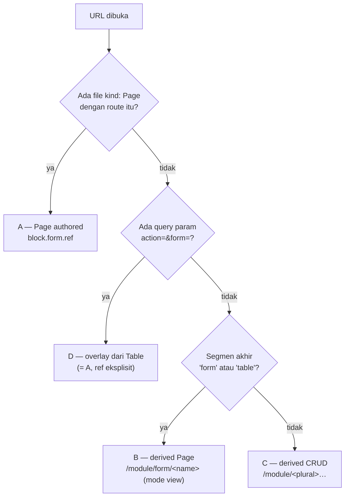

# Routing — Empat Jenis Route & Cara Resolve

**Status:** berlaku untuk `renderers/react-shadcn` (shell resmi) ·
**Kode otoritatif:** `src/shell/router.tsx`, `src/App.tsx`, `internal/ui/meta.go`,
`pkg/spec/frontend.go`

> Dokumen ini menjawab satu pertanyaan: **untuk URL tertentu, siapa yang membuat
> route itu, komponen apa yang dirender, dan bagaimana spec Form/Table-nya
> dipilih.** Sebelum ini jawabannya tersebar di empat berkas kode tanpa satu pun
> ringkasan, dan empat salinan konvensi route yang sama sudah pernah menyimpang
> satu sama lain (lihat §8).

## 1. Komposisi URL — "paling depan" bukan menu

Route FormSpec dibaca dari kiri ke kanan dalam lima lapis, dan **menu bukan
salah satunya**. Menu adalah _konsumen_ route: ia menyimpan jalan pintas ke route
yang sudah ada, dan item yang route-nya tidak ada justru dibuang (§5).

| #   | Lapis         | Contoh (kafe)                                | Ditetapkan oleh                       |
| --- | ------------- | -------------------------------------------- | ------------------------------------- |
| 1   | Workspace     | `kafe`                                       | slug workspace (`--workspace-id`)     |
| 2   | Mount prefix  | `app/pos`                                    | `App.spec.root_url`                   |
| 3   | Segmen route  | `cafe-master/promos`                         | `spec.route` Page, atau konvensi (§2) |
| 4   | Param         | `:id`                                        | pola route dinamis                    |
| 5   | Query overlay | `?action=create&form=promo-form&mode=drawer` | aksi UI (jalur D)                     |

Khusus `_admin`, lapis 2 diganti literal `_admin` dan seluruh bundle tidak
di-scope App (`?admin=true`).

### Cara prefix dipasang, dan satu jebakannya

`buildRoutes({ basePath })` menerima `basePath` = **surface path penuh**
(`/{ws}/_admin` atau `/{ws}{root_url}`), lalu menempelkan segmen route di
belakangnya. Tetapi `<Routes>` bersarang di `App.tsx` hanya menerima sisa setelah
`mountPrefix` — dan `mountPrefix` adalah `/{ws}/app` **bukan** `root_url`:

```tsx
// App.tsx
const surfacePath = `/${workspace}${bundle?.app.root_url ?? "/app"}` // /kafe/app/pos
const mountPrefix = `/${workspace}/app` // /kafe/app
```

Akibatnya, untuk `root_url` yang bukan `/{ws}/app`, path relatif yang benar-benar
dicocokkan memasukkan segmen `app/<nama-app>`:

| URL nyata                                  | `basePath` (buildRoutes) | path relatif yang dicocokkan |
| ------------------------------------------ | ------------------------ | ---------------------------- |
| `/kafe/app/pos/cafe-master/promos`         | `/kafe/app/pos`          | `app/pos/cafe-master/promos` |
| `/kafe/cafe-master/promos` (`root_url: /`) | `/kafe`                  | `cafe-master/promos`         |

Ini pernah menjadi bug "double `/app`" (`docs_internal/plan/todo_fix_clinic.md`
§2) — komentar di `App.tsx` mencatatnya supaya path relatif **selalu** dihitung
dengan membuang `mountPrefix`, bukan `surfacePath`.

### Resolusi App pada URL tak ber-App

`RootSurface` (`App.tsx`) melayani `/{ws}/*` dan memilih App lewat
`detectApp()` (`stores/meta.ts`) — **prefix `root_url` terpanjang** yang cocok,
dengan `root_url: "/"` sebagai kecocokan terakhir. Kalau tidak ada App yang
mengklaim path itu, pengguna diarahkan ke `_admin`. Ini penting untuk workspace
dengan banyak App (kafe: `kafe-pos` `/app/pos`, `kafe-kds` `/app/kds`,
`kafe-qr` `/`).

## 2. Empat jenis route

Hanya **satu** yang ditulis tangan; tiga lainnya dihasilkan. Jalur D bukan jenis
route kelima — ia adalah jalur A (atau C) plus query string.

### A. Authored Page — `kind: Page`

| Aspek             | Nilai                                                           |
| ----------------- | --------------------------------------------------------------- |
| Dibuat oleh       | penulis manifest (`spec.route`)                                 |
| Didaftarkan di    | `router.tsx` blok `// 1. Page routes`                           |
| Path              | `basePath + spec.route`                                         |
| Komponen          | `PageRenderer`                                                  |
| Form dipilih oleh | `block.form.ref` → `getForm(name)` → `resolveForm(explicitRef)` |
| Mode default      | `block.form.mode ?? "view"`                                     |
| Gerbang           | `page.spec.permissions` (bundle, server) + guard sesi `public`  |

Contoh kafe: `/pos` (`pos-workbench.yaml`, blok table + form split), `/menu/:session_id`.

### B. Derived Page untuk Form/Table — dibuat server

| Aspek             | Nilai                                                           |
| ----------------- | --------------------------------------------------------------- |
| Dibuat oleh       | **server** — `makeDerivedPage` (`internal/ui/meta.go`)          |
| Didaftarkan di    | `router.tsx` lewat `bundle.pages` (tidak bisa dibedakan dari A) |
| Nama entry        | `<nama-form>-page`                                              |
| Path              | `/<module>/form/<nama>` atau `/<module>/table/<nama>`           |
| Form dipilih oleh | `block.form.ref` = nama Form itu (satu-satunya)                 |
| Mode              | **selalu `view`** — block-nya dibuat tanpa `mode`               |

Dua gerbang yang membuat jalur B **tidak selalu ada**, dan keduanya harus
diingat saat menautkannya:

1. `spec.public: false` pada Form → derived Page dilewati.
2. Form sudah direferensikan `block.form.ref` di Page lain → ditandai
   `covered` → derived Page tidak dibuat.

### C. Derived entity CRUD — dibuat klien

| Aspek             | Nilai                                                                       |
| ----------------- | --------------------------------------------------------------------------- |
| Dibuat oleh       | `buildRoutes` (`router.tsx` blok `// 2.`)                                   |
| Path              | `basePath + /<module>/<plural>` + `[/new \| /:id \| /:id/edit]`             |
| Komponen          | `TableRenderer` (list), `DetailPage` (`:id`), `FormRenderer` (`new`/`edit`) |
| Form dipilih oleh | **konvensi** `resolveForm` — tanpa `formRef`                                |
| Gerbang           | `entity.authorized_actions` per route (`allowsRoute`)                       |

Karena tidak ada `formRef`, `FormRenderer` jatuh ke konvensi nama dan akhirnya
bisa menderivasi sendiri (§4). Route `/new` dan `/:id` **selalu didaftarkan**
sebagai route — bila aksinya tidak diizinkan, isinya `RouteNotFound`, supaya
`/new` tidak tertelan `:id`.

### D. Overlay — bukan route, melainkan query string

| Aspek             | Nilai                                                                                    |
| ----------------- | ---------------------------------------------------------------------------------------- |
| Dipicu oleh       | klik New/Edit di `TableRenderer` → `setSearchParams`                                     |
| Kontrak query     | `?action=create\|edit` + `form=<nama>` **atau** `entity=<module.name>` + `id=` + `mode=` |
| Dibaca oleh       | `OverlayHost` (`shell/OverlayHost.tsx`)                                                  |
| Form dipilih oleh | `getForm(formName)`; fallback `resolveForm` bila hanya `entity=`                         |
| Mode              | dari URL (`action==="edit" ? "edit" : "create"`), container dari `spec.render.mode`      |

Cara `TableRenderer` memilih Form yang dikirim inilah satu-satunya pemilihan
yang **tidak deterministik** hari ini:

```ts
// kinds/table/TableRenderer.tsx — match PERTAMA
return metaBundle.forms.find((f) => { ...same module+entity... })
```

Bundle `forms` diurutkan alfabetis (`sortedKeys`, `internal/ui/meta.go`), jadi
dengan >1 Form untuk satu entity, yang menang adalah yang namanya lebih dulu —
bukan yang paling cocok. Kafe punya contoh nyata: entity `order` punya
`order-form-pos` dan `order-form-qr`, sehingga tombol New di `/cafe-order/orders`
memakai `order-form-pos` (layout mode _edit_) walau sedang membuat record baru.

## 3. Cara membedakan A, B, C, D

Empat sinyal, dari yang paling murah:

| Sinyal                                       | A                            | B                           | C                                | D                                 |
| -------------------------------------------- | ---------------------------- | --------------------------- | -------------------------------- | --------------------------------- |
| Pola URL                                     | route authored               | `/<module>/form\|table/<n>` | `/<module>/<plural>[/new\|/:id]` | sama seperti A/C **+ `?action=`** |
| Ada file `kind: Page` dengan `route:` itu?   | **ya**                       | tidak                       | tidak                            | ya/tidak (induknya)               |
| Muncul di `bundle.pages` sebagai `<n>-page`? | tidak (nama authored)        | **ya**                      | tidak                            | —                                 |
| `FormRenderer` menerima `formRef`?           | ya (kalau block pakai `ref`) | ya                          | **tidak**                        | ya (dari `?form=`)                |



### Contoh kafe untuk entity `promo`

| URL                                                    | Jalur | Form dipakai                            | Mode     |
| ------------------------------------------------------ | ----- | --------------------------------------- | -------- |
| `/kafe/app/pos/cafe-master/promos`                     | C     | — (Table)                               | —        |
| `.../promos?action=create&form=promo-form&mode=drawer` | D     | `promo-form` (`?form=`)                 | create   |
| `.../promos/new`                                       | C     | `promo-form` (konvensi `{entity}-form`) | create   |
| `.../promos/123/edit`                                  | C     | `promo-form` (konvensi `{entity}-form`) | edit     |
| `.../cafe-master/form/promo-form`                      | B     | `promo-form` (satu-satunya)             | **view** |

## 4. Cara resolve

Dua sumbu terpisah yang mudah dicampur.

### Resolve route → komponen

`buildRoutes` membangun tabel route per surface; `allowsRoute(entity, action)`
membaca `entity.authorized_actions` yang **di-resolve server** dengan checker
yang sama yang memutuskan entity ikut bundle. Jadi klien tidak menebak dari
`lifecycle`. Tanpa `authorized_actions` (server lama) semua route terdaftar dan
datanya yang menolak.

### Resolve Form → spec

`resolveForm` (`engine/derive.ts`) berurutan:

1. `explicitRef` (dari `form.ref` / `?form=`) — **menang mutlak**, apa pun modenya.
2. `{entity}-{mode}` — `promo-create` / `promo-edit` / `promo-view`.
3. `{entity}-form` — generik untuk semua mode.
4. `deriveForm(entity, mode)` — hasil turunan dari schema entity.

Dua hal yang paling sering salah dibaca:

- **`spec.mode` pada Form TIDAK memilih mode runtime.** `FormRenderer` menerima
  `mode` dari pemanggilnya (route: `create`/`edit`; block: `block.form.mode`,
  default `view`). `promo-form` yang menulis `mode: edit` tetap dipakai untuk
  create. Nilai itu dipakai **server-side**: permission Page turunan
  (`formActionPerm`, `internal/ui/meta.go`) dan footprint grant
  (`internal/auth/materialize.go`).
- **>1 Form untuk satu entity hanya deterministik lewat `form.ref` atau
  konvensi nama.** Pola yang benar sudah ada di repo: `visit-create` +
  `visit-edit` (`examples/Clinic-UI-Showcase`) — dua Form, dibedakan mode oleh
  konvensi. Tidak ada field semacam `default_form` di `TableSpec`, jadi "Form
  mana yang dibuka tombol New" **tidak bisa dinyatakan di manifest** untuk jalur
  D — ia mengikuti urutan alfabetis.

### Resolve menu `view` → route

`ResolveViewRoute` (`internal/ui/registry.go`) memetakan nama View ke route:

| Kind                                                                                                                       | Route                    |
| -------------------------------------------------------------------------------------------------------------------------- | ------------------------ |
| Page                                                                                                                       | `spec.route`-nya sendiri |
| Form                                                                                                                       | `/<module>/form/<nama>`  |
| Table                                                                                                                      | `/<module>/table/<nama>` |
| Dashboard / Widget / Report / Wizard / Kanban / Timeline / Calendar / Listing / Print / ApprovalInbox / NotificationCenter | `/<prefix>/<nama>`       |

## 5. Lapisan menu

Menu adalah **indeks**, bukan pangkal route. Tiga fakta yang menjelaskan
hubungannya:

1. **`Module.spec.menu` = saran; `App.spec.menu` = otoritatif.** Adopt node
   (`type: module`, hanya level 1) menyisipkan menu modul di posisi itu;
   `stampModule` mengisi `module` pada tiap leaf karena item modul ditulis
   module-relative. Maksimum 3 level.
2. **Leaf wajib `label` + `module` + tepat satu dari `view`/`route`**
   (`internal/app/resolve.go`). `view` di-resolve ke route saat App di-resolve;
   `route` adalah escape hatch untuk URL mentah.
3. **`filterMenu` berjalan terakhir di `BuildBundle`,** setelah entity, page,
   dashboard, dan widget final. Ia membuang item yang route-nya tidak dilayani
   bundle **atau** yang `permissions`-nya tidak dipegang pemanggil (§6).

**Konsekuensinya: route yang tidak ada di menu tetap hidup, dan route yang tidak
ada tidak bisa diselamatkan menu.** `DefaultRedirect` menghantar pengguna ke
`firstMenuRoute` pada surface App, atau entity non-summary pertama pada
`_admin`.

### Tiga perubahan perilaku terbaru di lapisan ini

| Perubahan                                         | Alasan                                                                                                                                                                          |
| ------------------------------------------------- | ------------------------------------------------------------------------------------------------------------------------------------------------------------------------------- |
| `permissions:` pada item menu disaring **server** | RBAC yang diperiksa klien bisa di-bypass dan bisa menyimpang diam-diam dari server. Field-nya sebelumnya bahkan tidak ada di `pkg/spec`, padahal klien memeriksanya — cek mati. |
| `when:` dievaluasi **klien**                      | Bergantung waktu (`today()`); bundle di-ETag-hash, jadi filter waktu di server akan membatalkan cache terus-menerus.                                                            |
| `Listing` bisa jadi target `view`                 | `ResolveViewRoute` tidak punya cabangnya sementara `viewKinds` (validator) mengizinkannya — validate hijau, App gagal resolve (§8).                                             |

## 6. Visibilitas menu: dua sumbu, lima lapis

| #   | Lapis                                        | Sisi   | Bypass-able | Menahan apa                                                                  |
| --- | -------------------------------------------- | ------ | ----------- | ---------------------------------------------------------------------------- |
| 1   | Entity visibility (`BuildBundle`)            | server | ❌          | entity tanpa `list`/`view` tidak masuk bundle → route tak pernah didaftarkan |
| 2   | `filterMenu` — route harus ada di bundle     | server | ❌          | tautan ke route yang tidak dilayani                                          |
| 3   | `MenuItem.permissions` (any-of)              | server | ❌          | RBAC eksplisit per item                                                      |
| 4   | `required_permission` per action + row scope | server | ❌          | setiap panggilan data                                                        |
| 5   | `MenuItem.when`                              | klien  | ✅ memang   | kenyamanan UX saja                                                           |

> **`when` bukan gerbang otorisasi.** Menyembunyikan item menu tidak memberi atau
> menolak akses apa pun: route tetap ada, dan datanya tetap dijaga lapis 1–4.
> Yang "didapat" dengan memaksa `when` bernilai true adalah melihat sebuah
> tautan — sama seperti mengetik URL-nya langsung. Karena itu:
>
> - **RBAC → `permissions:`** (digerbangi server).
> - **Kondisi bisnis/waktu → `when:`** (klien).
>
> Kesalahan yang pernah terjadi di repo ini: `when: "user.has('clinic.settings.update')"`
> — bentuk yang (a) tidak bisa dievaluasi evaluator mana pun, dan (b) melanggar
> `08-formspec-expr.md` §3 yang melarang identitas/permission di FormSpecExpr.
> Item itu tampil untuk semua orang sambil terlihat dijaga. `formspec check`
> kini menolaknya (§7).

### `when` gagal dievaluasi → item **ditampilkan**

Fail-open, disengaja. Menyembunyikan navigasi karena bug renderer tidak bisa
dibedakan dari "item ini memang tidak ada", dan karena `when` bukan batas
keamanan, menampilkannya tidak membocorkan apa pun. Kegagalannya dilaporkan ke
console supaya tetap terlihat. Gate deploy-time (§7) membuat jalur ini seharusnya
tidak tercapai dari spec yang tervalidasi.

## 7. Gate deploy-time

`formspec check` memeriksa setiap FormSpecExpr, termasuk yang baru:

| Tempat                                                         | Diperiksa                                                |
| -------------------------------------------------------------- | -------------------------------------------------------- |
| Form: `visible_when`/`readonly_when`/`required_when`/`compute` | referensi field + grammar + callable                     |
| Wizard step field (sama)                                       | idem                                                     |
| Kanban `drag_guard`                                            | idem                                                     |
| **Menu `when`** (App & Module)                                 | grammar + callable (tidak ada schema entity untuk dicek) |

**Himpunan callable tertutup:** `len`, `sum`, `amount`, `currency`, `today`.
Nama lain — termasuk `user.has(...)`, `session.x()`, dan salah ketik seperti
`leng(...)` — adalah **error deploy-time**, bukan warning runtime. Ini menutup
kelas bug di mana ekspresi yang tidak bisa dievaluasi klien lolos validasi lalu
mati saat runtime ("unknown function: undefined"), padahal §4 spec menjanjikan
ekspresi yang lolos apply dapat dievaluasi.

`guard: {expression}` pada state machine **tidak** memakai himpunan ini: itu
Starlark sungguhan (`internal/starlark.EvaluateGuard`) dengan builtin tambahan
(`sum_line`), kontrak berbeda.

## 8. Divergensi yang tercatat

Empat salinan konvensi route harus sepakat:

| #   | Salinan                            | Berkas                              |
| --- | ---------------------------------- | ----------------------------------- |
| 1   | `ResolveViewRoute`                 | `internal/ui/registry.go`           |
| 2   | `routeExists` / `navigationPrefix` | `internal/ui/meta.go`               |
| 3   | `buildRoutes`                      | `src/shell/router.tsx`              |
| 4   | `viewKinds`                        | `cmd/formspec/validate_dangling.go` |

**Kegagalan pertama yang nyata:** `Listing` ada di #2, #3, #4 tetapi **hilang di
#1**. Akibatnya `formspec validate` menerima `view: product-catalog`, lalu
`app.Resolve` mengembalikan "view not found" dan **App gagal resolve
seluruhnya**. Contoh `examples/storefront` lolos hanya karena memakai escape
hatch `route: /listing/product-catalog`. Kini ditutup, dan
`internal/ui/registry_test.go` mem-pin tabel lengkapnya — termasuk test paritas
lintas-lapis yang menyalin daftar `viewKinds` dengan sengaja, agar kegagalan
berikutnya muncul di test, bukan di produksi.

Dua dokumen juga sempat bertentangan tentang Form/Table sebagai target `view`:
`docs/spec/platform/02-workspace-app-module.md` §4 menyebut keduanya **bukan**
target yang sah, sedangkan `docs/kind/curation/App.md` menyebut **semua** kind
visual sah. Kode mengikuti yang kedua (dan `internal/auth/materialize.go`
bergantung padanya lewat `{entity}-page`). Sudah diperbaiki di spec; dipin oleh
test.

### Sisa yang belum ditutup

1. **`routeExists` bertanya ke daftar Form, bukan ke `bundle.pages`.**
   Ketika derived Page disuppress (§2 jalur B), item menu ber-`view: <form>`
   tetap lolos filter sementara route-nya tidak terdaftar → 404. Todo 5.22.6.
2. **`_admin` buta `permissions`/`when`.** Bundle `?admin=true` memakai
   checker always-true dan menu `_admin` dibangun klien dari `bundle.entities`
   (`deriveMenuItems`), bukan dari `App.spec.menu`. Pemegang `_admin.access`
   melihat semua entity di sidebar; klik-nya lalu 403 dari endpoint data. UX
   buruk, bukan kebocoran. Todo 5.22.7.
3. **`MenuItem.when` tidak berlaku di `_admin`** (konsekuensi butir 2).
4. **Pemilihan Form jalur D tidak deterministik** saat >1 Form untuk satu entity
   (§2 jalur D). Tidak ada field manifest untuk menyatakannya; solusi hari ini
   hanya penamaan/`form.ref` eksplisit.

## 9. Resep diagnosis — "URL ini jalur apa?"

1. **Lihat URL.** Ada `?action=`? → jalur D. Segmen akhir `form`/`table`? →
   jalur B. Berakhir `/<plural>` atau `…/new` atau `…/:id/edit`? → jalur C.
   Selain itu → jalur A.
2. **Konfirmasi dengan manifest.**
   `grep -rn "route: <path-relatif>" examples/<app>/spec` — ada hasil berarti
   jalur A (file `kind: Page`), tidak ada berarti B atau C.
3. **Periksa bundle.**
   ```bash
   curl -s "$BASE/kafe/_ui/_meta/ui?app=kafe-pos" -H "Authorization: Bearer $TOKEN" \
     | jq '{pages: [.data.pages[]|{name, route: .spec.route}], forms: [.data.forms[].name], entities: [.data.entities[]|.module+"/"+.name]}'
   ```
   Page bernama `<sesuatu>-page` dengan route `/…/form/…` = jalur B. Catatan:
   App publik tanpa token hanya memberi bundle kosong — perlu kredensial.
4. **Periksa argumen form.** Form yang tampil sebagai halaman penuh tanpa
   `?form=` (jalur C) memakai konvensi `resolveForm`; kalau tidak ada Form
   authored yang cocok konvensi, yang dirender adalah hasil turunan — dan itu
   bukan bug, melainkan fallback yang tak kelihatan.

### Gejala → penyebab

| Gejala                                                              | Kemungkinan penyebab                                                                    |
| ------------------------------------------------------------------- | --------------------------------------------------------------------------------------- |
| Tombol New memakai layout Form "edit"                               | >1 Form untuk entity yang sama; jalur D mengambil match pertama alfabetis               |
| Form authored tidak dipakai di `…/new`                              | namanya tidak mengikuti konvensi `{entity}-create`/`-edit`/`-form`                      |
| Halaman penuh terbuka mode **view** padahal Form punya `mode: edit` | jalur B — derived Page dibuat tanpa `mode`                                              |
| Item menu menuju 404                                                | derived Page disuppress (`public: false` / `covered`) — sisa §8 butir 1                 |
| `view: <listing>` membuat App gagal mount                           | sudah ditutup; bila muncul lagi, periksa keempat salinan konvensi §8                    |
| `when` tidak menyembunyikan apa pun                                 | ekspresi tidak bisa dievaluasi (fail-open) → lihat console; `formspec check` menolaknya |

## 10. Cross-ref

- [`01-architecture.md`](01-architecture.md) §3–§4 — bootstrap & konsumsi Spec Resolution API
- [`02-derivation-engine.md`](02-derivation-engine.md) §3–§4 — presedensi authored > derived
- [`../spec/frontend/04-spec-resolution-api.md`](../../spec/frontend/04-spec-resolution-api.md) — kontrak `_meta/ui` & permission filtering
- [`../spec/frontend/06-page-kinds.md`](../../spec/frontend/06-page-kinds.md) §1–§2 — Page & Form
- [`../spec/frontend/08-formspec-expr.md`](../../spec/frontend/08-formspec-expr.md) — grammar & konteks evaluasi
- [`../spec/platform/02-workspace-app-module.md`](../../spec/platform/02-workspace-app-module.md) §4 — kontrak menu
- Plan: `docs_internal/plan/routing-docs-and-menu-visibility.md`
