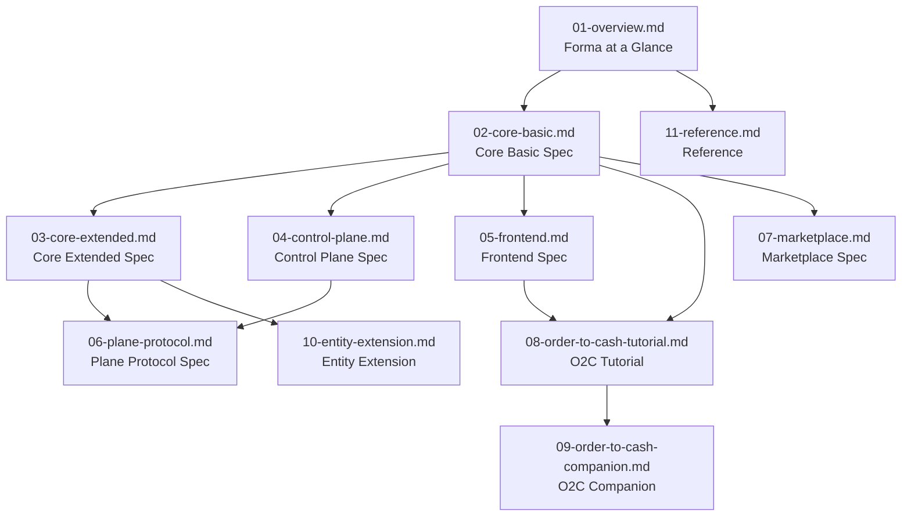

# Forma Framework — Specification

**Version:** 1.0 (Draft)
**License:** Creative Commons CC0

> Forma is a complete ecosystem for building business applications in Go. This folder contains the **open specification** — the contract that any conforming implementation must fulfill.

---

## Document Map

---

## Reading Paths

### 🏗️ App Developer — Building a Business Application

| Order | Document | What you'll learn |
|---|---|---|
| 1 | [`01-overview.md`](./01-overview.md) | What Forma is, core principles, architecture |
| 2 | [`02-core-basic.md`](./02-core-basic.md) | The manifest format, Entity, Service, actions, events, state machines, security |
| 3 | [`08-order-to-cash-tutorial.md`](./08-order-to-cash-tutorial.md) | Step-by-step: build a real Order-to-Cash app |
| 4 | [`03-core-extended.md`](./03-core-extended.md) | Workflow, Webhooks, Mockups, advanced validation, hooks |
| 5 | [`05-frontend.md`](./05-frontend.md) | UI kinds: Page, Form, Table, Dashboard — how to build the UI |
| 6 | [`10-entity-extension.md`](./10-entity-extension.md) | How to extend entities from marketplace modules |

### 📦 Module Vendor — Selling on the Marketplace

| Order | Document | What you'll learn |
|---|---|---|
| 1 | [`01-overview.md`](./01-overview.md) | What Forma is, ecosystem, licensing, business model |
| 2 | [`02-core-basic.md`](./02-core-basic.md) | Module packaging, `kind: Module`, permission footprint, consent |
| 3 | [`07-marketplace.md`](./07-marketplace.md) | Pricing models, Verified Badge, metering, revenue sharing, license tokens |
| 4 | [`04-control-plane.md`](./04-control-plane.md) | Signing artifacts, trust tiers, publishing to the registry |
| 5 | [`10-entity-extension.md`](./10-entity-extension.md) | Designing modules that support extension by consumers |

### 🖥️ Platform Operator — Managing Forma Infrastructure

| Order | Document | What you'll learn |
|---|---|---|
| 1 | [`01-overview.md`](./01-overview.md) | Architecture, two planes, personas, deployment tiers |
| 2 | [`04-control-plane.md`](./04-control-plane.md) | Governance, Policy (OPA/Rego), keys, contracts, transparency log, emergency controls |
| 3 | [`06-plane-protocol.md`](./06-plane-protocol.md) | Wire contract between planes, mTLS, snapshots, evidence, outage semantics |
| 4 | [`07-marketplace.md`](./07-marketplace.md) | Operating the marketplace, settlement, platform fees |

### 💰 Investor — Business Model & Monetization

| Order | Document | What you'll learn |
|---|---|---|
| 1 | [`01-overview.md`](./01-overview.md) | §13 Licensing & Business Model, §14 Development Roadmap |
| 2 | [`07-marketplace.md`](./07-marketplace.md) | Full economic model: pricing, metering, ledger, revenue sharing |
| 3 | [`09-order-to-cash-companion.md`](./09-order-to-cash-companion.md) | §1–§3: "Without Forma vs With Forma" — the value proposition in concrete terms |

---

## Document Summary

| # | Document | Description |
|---|---|---|
| 01 | **Overview** | What Forma is, why it exists, architecture, principles, personas, ecosystem, roadmap |
| 02 | **Core Basic** | Minimum spec: Entity, Service, App, Module, Config, Migration, Subscription; fields, actions, events, state machines, security, tenancy, primitives |
| 03 | **Core Extended** | Advanced spec: Workflow, Api, Webhook, Mockup, KindDefinition, hooks, validation 4–6, storage, streaming, query builder, rate limiting |
| 04 | **Control Plane** | Governance spec: Environment, Policy (OPA/Rego), keys & delegation, artifact lifecycle, contracts, transparency log, REPL governance |
| 05 | **Frontend** | UI spec: Page, Form, Table, Dashboard, Widget, Report, Menu, Print, Theme; FormaExpr, component contract, realtime convention |
| 06 | **Plane Protocol** | Wire contract between Control Plane and Resource Plane: mTLS, snapshots, evidence, outage semantics |
| 07 | **Marketplace** | Economic layer: pricing vocabulary, Verified Badge, verifiable metering, ledger, revenue sharing, license tokens |
| 08 | **O2C Tutorial** | Step-by-step: build an Order-to-Cash app from scratch with Forma |
| 09 | **O2C Companion** | Technical deep-dive: "without Forma vs with Forma" comparison, test-drive findings |
| 10 | **Entity Extension** | How to add custom fields to marketplace module entities without forking |
| 11 | **Reference** | Glossary, all 48 design decisions (D1–D48), Laravel → Forma feature map, Concern → Kind catalog, admin layers |

---

## Conventions

- **All documents are normative** where they state MUST/SHOULD/MAY
- **Cross-references** use relative links to other documents in this folder
- **Examples** in spec documents are illustrative; runnable examples live in the [`examples/`](../../reff_docs/examples/) folder
- **Original source documents** are preserved in [`reff_docs/`](../../reff_docs/) as historical reference
- **Implementation documentation** (`/docs/impl/`) will be added separately — this folder is the spec only

---

## Version

| Version | Date | Notes |
|---|---|---|
| 1.0-draft | 2026-07-05 | Initial restructured release — all 11 documents extracted and reorganized from the original 8 documents in `/reff_docs` |
