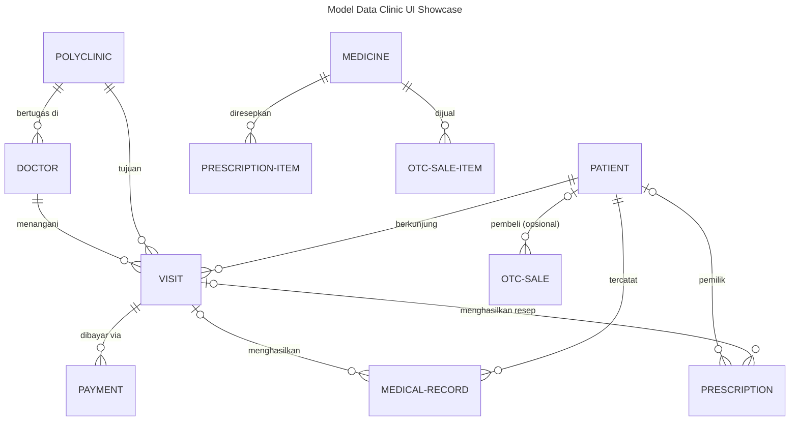
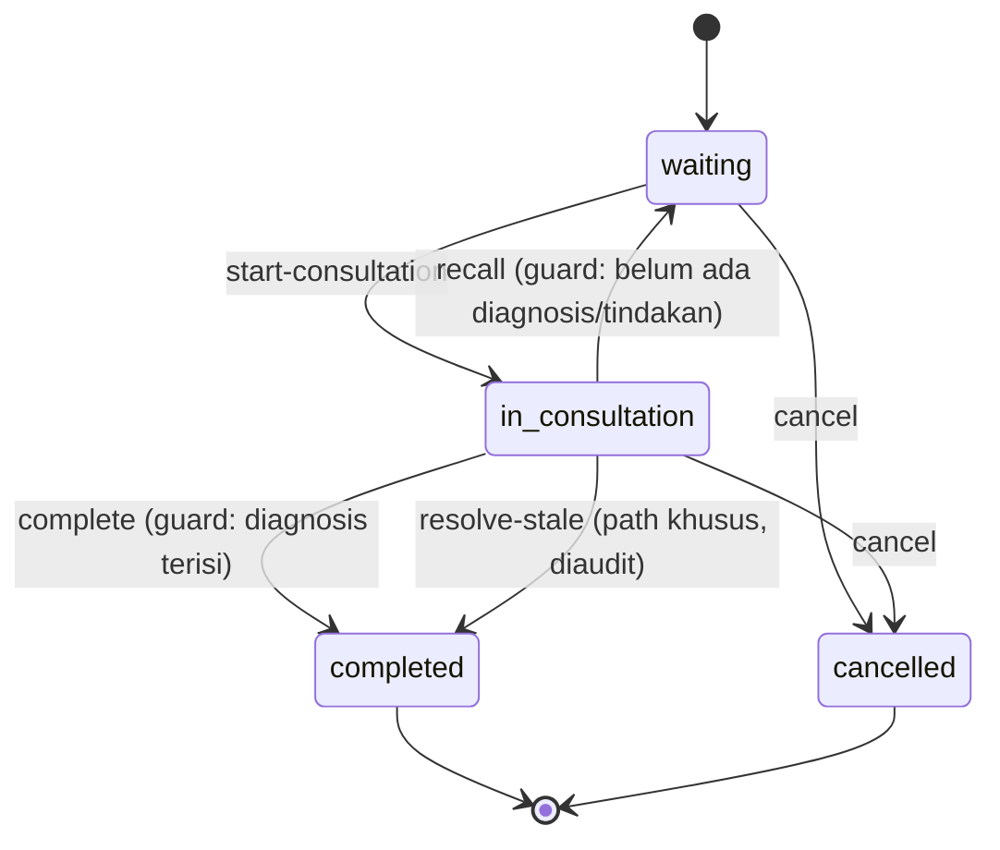
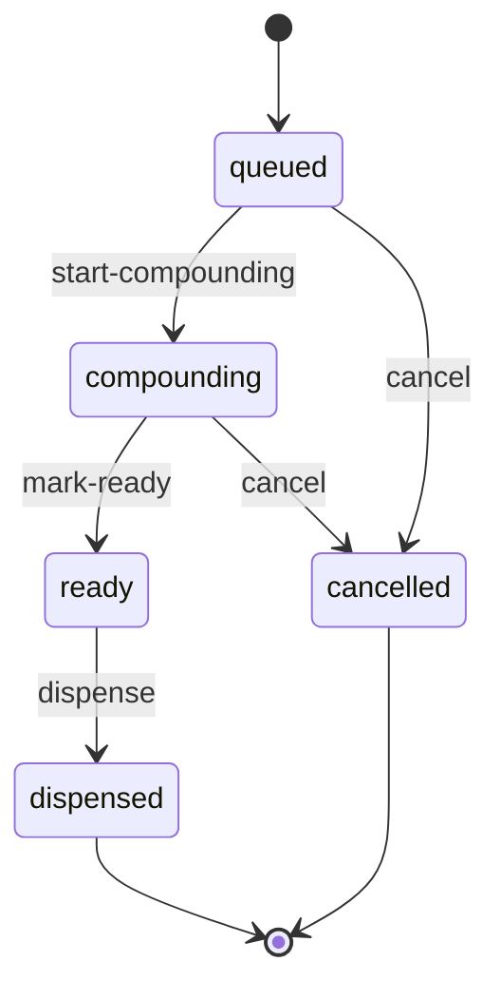

# Model Data — Clinic UI Showcase

Sebelas entity tersebar di dua module (`clinic`, `pharmacy`). Berikut
diagram ER-nya:

> Tipe `child` (jsonb) tidak menjadi entity: `visit.treatments`,
> `prescription.items`, `otc-sale.items`.

## Rincian Entity

### clinic — master

#### `polyclinic` — Poliklinik

Master kecil (4 field), **100% derived UI** (D17) — heuristik form modal.

| Field    | Type                      | Ket.            |
| -------- | ------------------------- | --------------- |
| `name`   | string (required)         | Nama poliklinik |
| `code`   | string (unique, required) | Maks 8 karakter |
| `floor`  | integer                   | Lantai 1–20     |
| `active` | boolean (default true)    | Status aktif    |

#### `doctor` — Dokter

Master sedang (8 field), tanpa manifest UI → derived form **drawer**;
relation `belongs_to` → relation-picker derived.

| Field              | Type                             | Ket.                                                      |
| ------------------ | -------------------------------- | --------------------------------------------------------- |
| `name`             | string (required)                | Nama dokter                                               |
| `polyclinic_id`    | relation → polyclinic (required) | Poliklinik                                                |
| `specialty`        | enum                             | `umum` / `gigi` / `anak` / `penyakit-dalam` / `kandungan` |
| `license_number`   | string (unique, required)        | Nomor STR                                                 |
| `phone`            | string                           | Pattern telepon                                           |
| `consultation_fee` | decimal (required, positive)     | Tarif konsultasi                                          |
| `joined_at`        | date (past)                      | Tanggal bergabung                                         |
| `active`           | boolean (default true)           | Status aktif                                              |

#### `patient` — Pasien

**Coverage semua tipe field** (string/enum/date/boolean/json/email/pattern)
untuk field-widget library; hanya detail page-nya yang di-override.

| Field             | Type                      | Ket.                               |
| ----------------- | ------------------------- | ---------------------------------- |
| `nik`             | string (unique, required) | Pattern NIK 16 digit               |
| `name`            | string (required)         | Display field                      |
| `birth_date`      | date (required, past)     | Tanggal lahir                      |
| `gender`          | enum (required)           | `male` / `female`                  |
| `blood_type`      | enum                      | `A` / `B` / `AB` / `O` / `unknown` |
| `phone` / `email` | string                    | Pattern telepon / email            |
| `address`         | string                    | Maks 500                           |
| `allergies`       | json                      | Daftar alergi — widget JSON editor |
| `is_bpjs`         | boolean (default false)   | Peserta BPJS                       |
| `notes`           | string                    | Catatan                            |

### clinic — transaction

#### `visit` — Kunjungan

Dokumen transaksi flagship: state machine + child table + natural key +
aksi ber-script + event realtime. UI-nya di-override penuh (table, form,
kanban, print).

| Field                                        | Type                                    | Ket.                                                      |
| -------------------------------------------- | --------------------------------------- | --------------------------------------------------------- |
| `transaction_date`                           | date (required, index)                  | Tanggal kunjungan (backdate max 3 hari)                   |
| `queue_number`                               | string (natural key, immutable, unique) | `Q{prefix-config}{ymd}-{seq:03d}`, reset harian           |
| `queue_position`                             | integer                                 | Posisi drag-to-reorder di Kanban                          |
| `patient_id` / `polyclinic_id` / `doctor_id` | relation (required)                     | Pasien, poliklinik, dokter                                |
| `complaint`                                  | string                                  | Keluhan (maks 1000)                                       |
| `diagnosis`                                  | string                                  | Diagnosis (maks 2000)                                     |
| `status`                                     | enum                                    | `waiting` / `in_consultation` / `completed` / `cancelled` |
| `is_stale` / `stale_label`                   | boolean / string (computed)             | Badge kunjungan menggantung                               |
| `treatments`                                 | child (jsonb)                           | Tindakan: treatment_name, quantity, price                 |
| `total`                                      | decimal                                 | Total (min 0 — visit tanpa tindakan boleh 0)              |
| `started_at` / `completed_at`                | datetime                                | Timestamp proses                                          |

**State machine** (`status`):

**Aksi** (semua `audit: true` + `required_permission`):
`start-consultation`, `complete` (emit `completed`),
`resolve-stale` (emit `completed-overdue`, melewati backdate policy),
`cancel`, `recall`. `submit` disabled (pola 2-step + auto-save);
`delete` disabled.

**Event**: `completed` & `completed-overdue` → `audit_log` + `websocket`.

#### `payment` — Pembayaran

High-volume quick entry kasir — pola **1-step `create-submit`**.

| Field              | Type                                    | Ket.                                     |
| ------------------ | --------------------------------------- | ---------------------------------------- |
| `transaction_date` | date (required, index)                  | Tanggal bayar                            |
| `number`           | string (natural key, immutable, unique) | `PAY-{ym}-{seq:05d}`, reset bulanan      |
| `visit_id`         | relation → visit (required)             | Kunjungan                                |
| `amount`           | decimal (required, positive)            | Nominal                                  |
| `method`           | enum (default cash)                     | `cash` / `qris` / `card` / `transfer`    |
| `reference`        | string                                  | Wajib non-cash (`required_when` di form) |
| `paid_at`          | datetime                                | Waktu bayar                              |

`create-submit` dengan hint `ui:` (button_label "Terima & Simpan",
style primary); `delete` disabled.

#### `medical-record` — Rekam Medis

**Append-only** — `update` & `delete` disabled; dirender sebagai Timeline
(date grouping).

| Field                 | Type                          | Ket.                                              |
| --------------------- | ----------------------------- | ------------------------------------------------- |
| `patient_id`          | relation → patient (required) | Pasien                                            |
| `visit_id`            | relation → visit (opsional)   | Kunjungan sumber                                  |
| `transaction_date`    | datetime (required, index)    | Waktu catatan                                     |
| `visit_type`          | enum                          | `consultation` / `emergency` / `followup` / `lab` |
| `doctor_id`           | relation → doctor (required)  | Dokter                                            |
| `diagnosis_and_notes` | string (required)             | Isi rekam medis (maks 5000)                       |

### clinic — reference & summary

#### `setting` — Pengaturan Sistem

Configuration Page pattern — struktur dikunci developer, nilai diubah
admin. Satu row per grup setting (`key: "clinic"`, `key: "billing"`),
di-edit lewat Page tabs (`system-settings.yaml`) + Form `mode: edit`.

| Field                               | Type                                   | Ket.                                                       |
| ----------------------------------- | -------------------------------------- | ---------------------------------------------------------- |
| `key`                               | string (natural key, strategy: custom) | Grup setting — `exclude: [ui]`                             |
| `clinic_name` / `address` / `phone` | string                                 | Identitas klinik                                           |
| `queue_prefix`                      | string (maks 4)                        | Prefix nomor antrian (dibaca `Config clinic.queue_prefix`) |
| `tax_percent`                       | decimal                                | 0–100                                                      |
| `enable_whatsapp`                   | boolean                                | —                                                          |
| `whatsapp_number`                   | string                                 | Wajib bila `enable_whatsapp` (`required_when`)             |
| `receipt_footer`                    | string                                 | Footer struk                                               |

#### `daily-visit-summary` — Agregat Harian

`characteristic: summary` — read-only via API (hanya list+find), tanpa
menu derived. Projection engine belum ada; widget dashboard membaca entity
live `clinic/visit`.

| Field                             | Type                   | Ket.             |
| --------------------------------- | ---------------------- | ---------------- |
| `date`                            | date (required, index) | Tanggal          |
| `polyclinic_id`                   | relation → polyclinic  | Poliklinik       |
| `visit_count` / `completed_count` | integer                | Jumlah kunjungan |
| `revenue`                         | decimal                | Pendapatan       |

### pharmacy

#### `medicine` — Obat

Master derived UI di **module kedua** — menguji sidebar module-grouping.

| Field         | Type                         | Ket.                                                      |
| ------------- | ---------------------------- | --------------------------------------------------------- |
| `sku`         | string (unique, required)    | Kode obat                                                 |
| `name`        | string (required)            | Nama obat                                                 |
| `unit`        | enum (required)              | `tablet` / `capsule` / `syrup` / `ointment` / `injection` |
| `stock`       | integer (default 0, min 0)   | Stok                                                      |
| `price`       | decimal (required, positive) | Harga satuan                                              |
| `expiry_date` | date (future)                | Tanggal kedaluwarsa                                       |

#### `prescription` — Resep

Antrian peracikan — state machine 4 kolom untuk Kanban farmasi; relation
**lintas module** ke `clinic.visit`. Resep bisa internal (visit_id) atau
external (prescriber_name) — visit_id sengaja tidak required.

| Field              | Type                                    | Ket.                                                           |
| ------------------ | --------------------------------------- | -------------------------------------------------------------- |
| `transaction_date` | date (required, index)                  | Tanggal resep                                                  |
| `number`           | string (natural key, immutable, unique) | `RX-{ymd}-{seq:03d}`, reset harian                             |
| `visit_id`         | relation → clinic.visit                 | Diisi bila source=internal                                     |
| `patient_id`       | relation → clinic.patient               | Pasien terdaftar (opsional)                                    |
| `source`           | enum (default internal, index)          | `internal` / `external`                                        |
| `prescriber_name`  | string                                  | Dokter luar (untuk source=external)                            |
| `patient_name`     | string (required)                       | Denormalisasi untuk kartu kanban (auto-fill via hook)          |
| `priority`         | enum (default normal, index)            | `normal` / `urgent`                                            |
| `status`           | enum                                    | `queued` / `compounding` / `ready` / `dispensed` / `cancelled` |
| `items`            | child (jsonb)                           | medicine_id (exists: medicine), quantity, dosage_instructions  |
| `notes`            | string                                  | Catatan                                                        |

**State machine** (`status`):

**Aksi**: `start-compounding`, `mark-ready`, `dispense` (kurangi stok,
uses `medicine.find` + `medicine.update`), `cancel` — semua `audit: true` +
`required_permission`.

**Hook** `before/create` (`derive-patient-name.star`): cross-module
`resource.fetch("clinic.patient", ...)` untuk auto-fill `patient_name`
(dideklarasikan via `uses.resources: [clinic.patient]`).

**Event**: `created` → `audit_log` + `websocket`.

#### `otc-sale` — Penjualan Bebas (OTC)

Penjualan instan tanpa resep — entity **terpisah** dari prescription
(sengaja: memaksa OTC lewat state machine resep akan mengotori board
antrian farmasi).

| Field              | Type                                    | Ket.                                                 |
| ------------------ | --------------------------------------- | ---------------------------------------------------- |
| `transaction_date` | date (required, index)                  | Tanggal jual                                         |
| `number`           | string (natural key, immutable, unique) | `OTC-{ymd}-{seq:03d}`, reset harian                  |
| `patient_id`       | relation → clinic.patient               | Opsional — pembeli walk-in                           |
| `buyer_name`       | string                                  | Nama pembeli anonim (opsional)                       |
| `status`           | enum                                    | `pending` / `completed` / `cancelled`                |
| `items`            | child (jsonb)                           | medicine_id (exists: medicine), quantity, unit_price |
| `total`            | decimal (positive)                      | Total                                                |
| `notes`            | string                                  | Catatan                                              |

**State machine** (`status`): `pending → completed` via `sell`
(guard: minimal satu item) atau `pending → cancelled` via `cancel`.

**Hook** `before/create` (`stock-guard.star`, priority 5): `fail()`
membatalkan create bila stok tidak mencukupi — sebelum baris pernah dibuat.

**Aksi**: `sell` (kurangi stok + hitung total, emit `completed`),
`cancel`; `delete` disabled.

## Natural Key & Uniqueness

| Entity         | Natural key    | Format                                         | Reset   |
| -------------- | -------------- | ---------------------------------------------- | ------- |
| `visit`        | `queue_number` | `{prefix}{ymd}-{seq:03d}` (prefix dari Config) | daily   |
| `payment`      | `number`       | `PAY-{ym}-{seq:05d}`                           | monthly |
| `prescription` | `number`       | `RX-{ymd}-{seq:03d}`                           | daily   |
| `otc-sale`     | `number`       | `OTC-{ymd}-{seq:03d}`                          | daily   |
| `setting`      | `key`          | strategy: custom (grup setting)                | —       |

Natural key dijaga `unique: true` + `immutable: true`, digenerate engine —
bukan primary key.

## Script Starlark

| Script                                                                         | Entity       | Fungsi                                     |
| ------------------------------------------------------------------------------ | ------------ | ------------------------------------------ |
| `start-consultation.star`                                                      | visit        | Panggil pasien masuk                       |
| `complete.star`                                                                | visit        | Selesaikan konsultasi                      |
| `resolve-stale.star`                                                           | visit        | Selesaikan kunjungan stale (diaudit)       |
| `recall.star`                                                                  | visit        | Tarik kembali ke antrian                   |
| `cancel.star`                                                                  | visit        | Batalkan kunjungan                         |
| `derive-patient-name.star`                                                     | prescription | Hook before/create — auto-fill nama pasien |
| `start-compounding.star` / `mark-ready.star` / `dispense.star` / `cancel.star` | prescription | Alur peracikan                             |
| `sell.star` / `stock-guard.star` / `cancel.star`                               | otc-sale     | Penjualan + guard stok                     |
