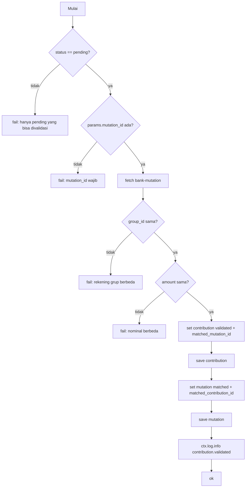
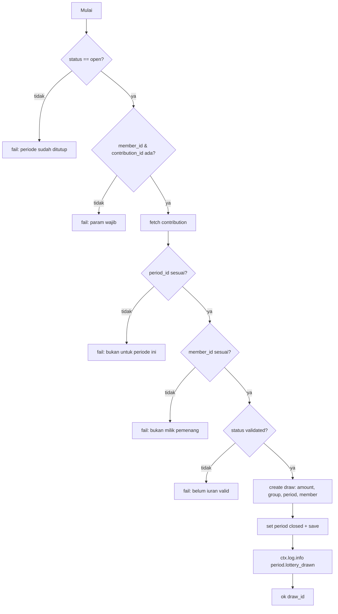

# Automation — Script Starlark

Aksi custom pada entity diimplementasikan sebagai script **Starlark**
(`impl: { type: script_ref, ref: <name> }`). Script disimpan di
`<entity-dir>/scripts/<name>.star`.

## Kontrak Script

Setiap script mendefinisikan satu entrypoint:

```python
def execute(resource, params, ctx):
    ...
```

### `resource` — record yang sedang di-aksi

| API | Deskripsi |
|-----|-----------|
| `resource.id` | Primary key (UUID v7) |
| `resource.field.<name>` | Baca field record |
| `resource.set(<name>, <value>)` | Ubah field (belum disimpan) |
| `resource.save()` | Simpan perubahan |
| `resource.fetch(<entity>, <id>)` | Baca record entity lain (kembalikan object resource) |
| `resource.create(<entity>, <data>)` | Buat record entity lain (langsung persist, return resource) |
| `resource.call(<target>, <action>, <params>)` | Panggil aksi entity lain |

> Nama entity bisa bare name (modul sama) atau dot notation lintas modul,
> mis. `resource.fetch("arisan-master.arisan-group", id)`.

### `params` — parameter dari request

Dikirim sebagai JSON body pada POST aksi. Contoh: `{"mutation_id": "..."}`.

### `ctx` — konteks

| API | Deskripsi |
|-----|-----------|
| `ctx.today()` | Tanggal hari ini `YYYY-MM-DD` |
| `ctx.now()` | Timestamp sekarang |
| `ctx.log.info(<event>, <meta>)` | Tulis event ke log (meta berupa dict) |

### Return helper

| Helper | Efek |
|--------|------|
| `ok(<data>)` | Sukses — `<data>` dikembalikan sebagai `{"data": ...}` |
| `fail(<message>)` | Gagal — pesan dikembalikan sebagai error |

### Batasan engine (build saat ini)

- **Tidak ada** `resource.new()`.
- **Query builder (`<Entity>.query()`) dan `ctx.db`/`ctx.cache`/`ctx.lock`/
  `ctx.queue`/`ctx.pubsub` adalah stub** — belum diimplementasikan.
- `resource.save()` memerlukan record yang sudah ada (untuk before-create hook
  gunakan `set()` saja).
- ⚠️ **Bug SQLite**: `resource.fetch()` pada entity berelasi di dalam aksi
  custom bisa deadlock di SQLite (sudah dipatch lokal).
  Lihat [`engine-sqlite-deadlock.md`](./engine-sqlite-deadlock.md).

## Script 1 — `validate` (entity `contribution`)

Lokasi: `spec/modules/arisan-field/transaction/contribution/scripts/validate.star`

**Tujuan**: mencocokkan iuran `pending` dengan mutasi bank yang cocok
(nominal + grup), lalu menandai keduanya.

**Alur**:



**Request contoh**:

```bash
curl -X POST \
  "http://localhost:18080/default/api/v1/arisan-field/contributions/<id>/validate" \
  -H "Content-Type: application/json" \
  -d '{"mutation_id":"<mutation-id>"}'
```

**Response sukses**:

```json
{ "data": { "status": "validated", "mutation_id": "<mutation-id>" } }
```

**Efek**: contribution `pending → validated`, bank-mutation `unmatched → matched`,
event `contribution.validated` ter-log.

## Script 2 — `run-lottery` (entity `arisan-period`)

Lokasi: `spec/modules/arisan-field/transaction/arisan-period/scripts/run-lottery.star`

**Tujuan**: mencatat penarikan untuk pemenang undian yang memiliki iuran valid
di periode tersebut, lalu menutup periode.

**Alur**:



**Request contoh**:

```bash
curl -X POST \
  "http://localhost:18080/default/api/v1/arisan-field/arisan-periods/<id>/run-lottery" \
  -H "Content-Type: application/json" \
  -d '{"member_id":"<member-id>","contribution_id":"<contribution-id>"}'
```

**Response sukses**:

```json
{ "data": { "draw_id": "<draw-id>" } }
```

**Efek**: draw dibuat (`status=drawn`), periode `open → closed`, event
`period.lottery_drawn` ter-log.

> **Guard ganda**: state machine `open→closed via run-lottery` menolak
> `run-lottery` pada periode yang sudah ditutup **sebelum** script dijalankan
> (HTTP 422 `INVALID_TRANSITION`), selain cek `status == "open"` di dalam script.

## REST API — Ringkasan

Semua endpoint di-prefix workspace: `/default/api/v1/...`

| Method | Path | Deskripsi |
|--------|------|-----------|
| GET | `/{module}/{plural}` | List |
| GET | `/{module}/{plural}/{id}` | Find (relasi ter-resolve) |
| POST | `/{module}/{plural}` | Create |
| PATCH/PUT | `/{module}/{plural}/{id}` | Update |
| DELETE | `/{module}/{plural}/{id}` | Delete |
| POST | `/{module}/{plural}/{id}/{action}` | Aksi custom (validate, run-lottery, ...) |

Contoh plural: `arisan-field/contributions`, `arisan-field/arisan-periods`,
`arisan-master/arisan-groups`, `arisan-field/bank-mutations`.
