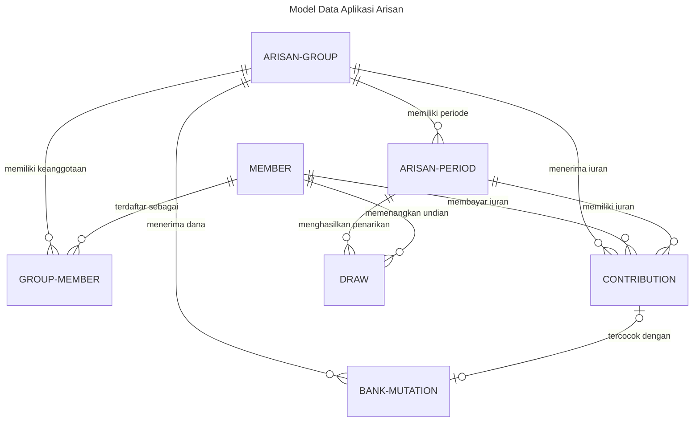
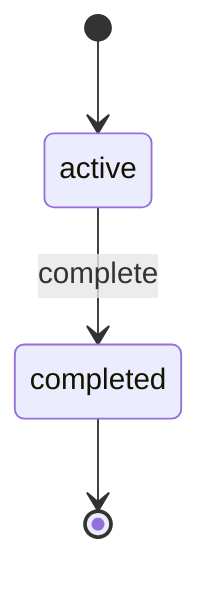
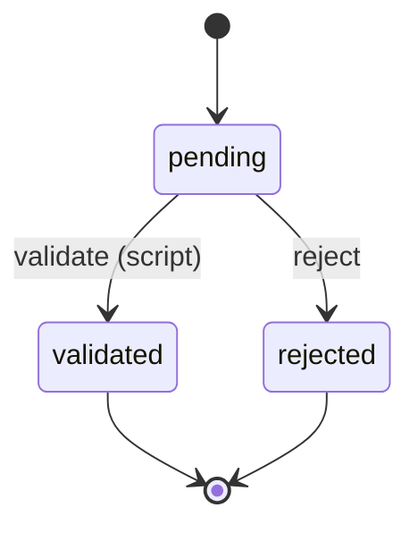
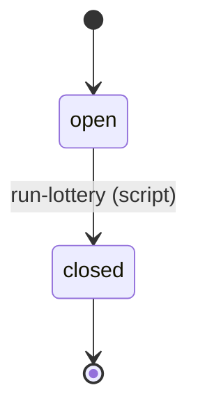
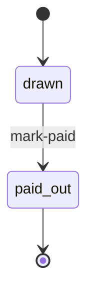

# Model Data — Aplikasi Arisan

Tujuh entity tersebar di tiga modul. Berikut diagram ER-nya:

## Rincian Entity

### arisan-master (master data)

#### `arisan-group` — Grup Arisan
Kumpulan anggota dengan iuran bulanan tetap selama satu siklus.

| Field | Type | Ket. |
|-------|------|------|
| `code` | string (unique, required) | Natural key, mis. `AR-001` |
| `name` | string (required) | Nama grup |
| `monthly_amount` | money (required) | Iuran per anggota per bulan |
| `term_months` | integer (required) | Panjang siklus (bulan) |
| `start_date` | date | Tanggal mulai |
| `bank_account_name` / `bank_account_number` | string | Rekening grup |
| `status` | enum | `active` (default) / `completed` |

**State machine** (`status`):

**Aksi**: `complete` (audit, `required_permission`).

---

#### `member` — Anggota
Data anggota; terdaftar sekali, bisa ikut banyak grup.

| Field | Type | Ket. |
|-------|------|------|
| `code` | string (unique, required) | Natural key, mis. `M-001` |
| `name` | string (required) | Nama anggota |
| `phone` / `email` / `address` | string / string / text | Kontak |
| `join_date` | date | Tanggal bergabung |

`soft_deactivate.enabled: true` — anggota bisa di-nonaktifkan tanpa dihapus.

---

#### `group-member` — Keanggotaan
Tautan anggota ↔ grup.

| Field | Type | Ket. |
|-------|------|------|
| `group_id` | relation → `arisan-group` (required) | Grup |
| `member_id` | relation → `member` (required) | Anggota |
| `join_date` | date | Tanggal bergabung |
| `status` | enum | `active` (default) / `inactive` |

**Uniqueness**: `unique (group_id, member_id)`.

---

### arisan-field (transaksi)

#### `bank-mutation` — Mutasi Bank
Rekaman pergerakan dana rekening grup untuk dicocokkan dengan iuran.

| Field | Type | Ket. |
|-------|------|------|
| `transaction_date` | date (required, index) | Tanggal transaksi |
| `group_id` | relation → `arisan-group` (required) | Rekening grup |
| `amount` | money (required) | Nominal kredit (dana masuk) |
| `description` | string | Keterangan transfer (dicocokkan dgn `payment_ref`) |
| `balance` | money | Saldo |
| `direction` | enum | `debit` / `kredit` (default) |
| `bank_ref` / `channel` / `counter` | string / string / integer | Metadata bank |
| `import_batch` / `raw_line` | string / text | Sumber import |
| `status` | enum | `unmatched` (default) / `matched` / `ignored` |
| `matched_contribution_id` | relation → `contribution` | Iuran tercocok |

**Indeks**: `(group_id, amount, transaction_date)`.

---

#### `contribution` — Iuran
Pembayaran bulanan anggota; divalidasi terhadap mutasi bank.

| Field | Type | Ket. |
|-------|------|------|
| `transaction_date` | date (required, index) | Tanggal transaksi |
| `group_id` | relation → `arisan-group` (required) | Grup |
| `member_id` | relation → `member` (required) | Anggota |
| `period_id` | relation → `arisan-period` (required) | Periode |
| `amount` | money (required) | Nominal iuran |
| `payment_ref` | string | Ref transfer, mis. `AR-001-M-001-202608` |
| `payment_date` | date | Tanggal bayar |
| `matched_mutation_id` | relation → `bank-mutation` | Mutasi tercocok |
| `status` | enum | `pending` (default) / `validated` / `rejected` |

**State machine** (`status`):

**Aksi**:
- `validate` — script_ref `validate`, `uses: [bank-mutation.find, bank-mutation.update]`,
  `emits: validated`, audit, permission `arisan-field.contribution.validate`.
- `reject` — `emits: rejected`, audit, permission `arisan-field.contribution.reject`.

**Event**: `validated`, `rejected` (async → channel `audit_log`).

**Expose REST**: hanya `list, find, create` (update/delete tidak diekspos —
status diubah lewat aksi).

---

#### `arisan-period` — Periode
Satu bulan dalam satu siklus grup; tempat undian penarikan.

| Field | Type | Ket. |
|-------|------|------|
| `transaction_date` | date (required, index) | Tanggal mulai periode |
| `group_id` | relation → `arisan-group` (required) | Grup |
| `period_no` | integer (required) | Nomor urut periode (1..term_months) |
| `label` | string | Mis. `2026-08` |
| `status` | enum | `open` (default) / `closed` |

**Uniqueness**: `unique (group_id, period_no)`.

**State machine** (`status`):

**Aksi**: `run-lottery` — script_ref `run-lottery`, `uses: [contribution.find, draw.create]`,
`emits: drawn`, audit, permission `arisan-field.arisan-period.run-lottery`.
**Event**: `drawn` (async → channel `audit_log`).

---

#### `draw` — Penarikan
Pencatatan pemenang undian arisan per periode.

| Field | Type | Ket. |
|-------|------|------|
| `transaction_date` | date (required, index) | Tanggal penarikan |
| `group_id` | relation → `arisan-group` (required) | Grup |
| `period_id` | relation → `arisan-period` (required) | Periode |
| `member_id` | relation → `member` (required) | Pemenang |
| `amount` | money (required) | Total pot diterima |
| `status` | enum | `drawn` (default) / `paid_out` |

**Uniqueness**: `unique (period_id)` — satu penarikan per periode.

**State machine** (`status`):

**Aksi**: `mark-paid` (audit, permission `arisan-field.draw.mark-paid`).

### arisan-report (laporan)

- **Dashboard** `arisan-summary-dashboard` — 4 widget metric:
  `active-groups` (grup aktif), `open-periods` (periode terbuka),
  `paid-count` (iuran valid), `pending-count` (iuran menunggu).
- **Report** `payment-recap-report` — rekap iuran per grup/periode/status,
  parameter `group_id`/`period_id`/`status`, grouping by `status`,
  total sum `amount`, export PDF/CSV/XLSX.

## Ringkasan Relasi

| Sumber | Ke | Kardinalitas | Makna |
|--------|----|--------------|-------|
| `arisan-group` | `group-member` | 1:N | satu grup banyak keanggotaan |
| `member` | `group-member` | 1:N | satu anggota banyak keanggotaan |
| `arisan-group` | `arisan-period` | 1:N | satu grup banyak periode |
| `arisan-group` | `bank-mutation` | 1:N | satu grup banyak mutasi |
| `arisan-group` | `contribution` | 1:N | satu grup banyak iuran |
| `member` | `contribution` | 1:N | satu anggota banyak iuran |
| `arisan-period` | `contribution` | 1:N | satu periode banyak iuran |
| `arisan-period` | `draw` | 1:N | satu periode satu penarikan |
| `member` | `draw` | 1:N | satu anggota bisa menang berkali-kali |
| `contribution` | `bank-mutation` | 1:0..1 | pencocokan timbal balik (`matched_*`) |
