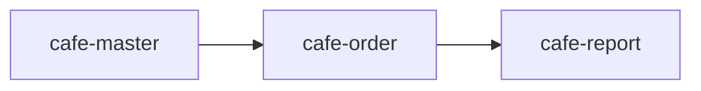

# Arsitektur — Aplikasi Kafe

## Modul

| Modul | Karakteristik | Isi | Dependensi |
|---|---|---|---|
| `cafe-master` | Master data | menu-item, table, member, employee | — |
| `cafe-order` | Transaksi | order (dengan child items), payment | cafe-master |
| `cafe-report` | UI/Report | dashboard, widgets, report | cafe-order |

## Keputusan Desain

### Karakteristik Entity

- **master** — data stabil yang jarang berubah: `menu-item`, `table`,
  `member`, `employee`.
- **transaction** — append-heavy dan ber-temporal: `order` (punya
  `transaction_date`), `payment`.
- **summary / reference** — tidak dipakai pada contoh ini (bisa ditambah
  nanti, misal saldo harian sebagai `summary`).

### Alur Lifecycle

`order` dan `payment` memakai `plain_crud` dengan state machine custom:

- `order`: `open → paid` (via `settle`), `open → cancelled` (via `cancel`)
- `payment`: `pending → paid` (via `confirm`), `pending → refunded` (via `refund`)

Action `submit` di-disable karena tidak memakai lifecycle `doc_status`.

### Item Pesanan sebagai Child

- `order.items` adalah **inline child collection** (`storage: jsonb`) — pola
  yang tepat untuk line items yang hidup-mati bersama pesanan.
- Referensi ke menu item memakai `type: relation` di dalam child.

### UI Override

- Hampir semua entity tidak butuh UI override — Table/Form/Page di-derive
  engine.
- `cafe-report` mendeklarasikan Dashboard + Widget + Report secara eksplisit
  karena itu tampilan kustom (bukan derive dari entity).

## Dependensi Modul

## Yang Perlu Di-Override UI

- Dashboard ringkasan (`cafe-summary-dashboard`) + widget metric.
- Report rekap penjualan (`sales-recap-report`).
