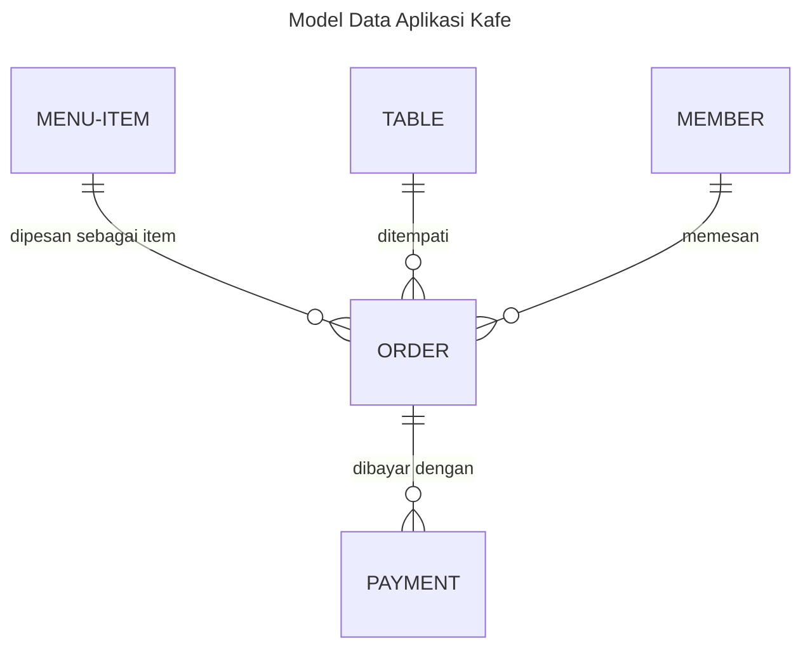
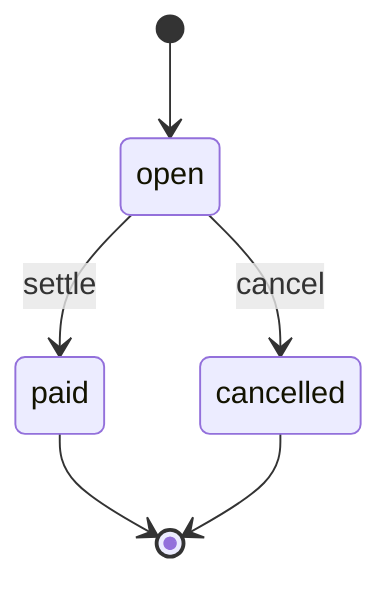
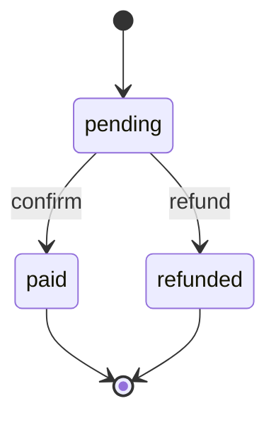

# Model Data — Aplikasi Kafe

Enam entity tersebar di dua modul data + satu modul laporan. Berikut diagram
ER-nya:

## Rincian Entity

### cafe-master (master data)

#### `menu-item` — Item Menu
Produk yang dijual kafe, lengkap dengan harga dan ketersediaan.

| Field | Type | Ket. |
|-------|------|------|
| `code` | string (unique, required) | Natural key, mis. `M-001` |
| `name` | string (required) | Nama item |
| `category` | enum (required) | `food` / `drink` / `dessert` |
| `price` | money (required) | Harga jual |
| `is_available` | boolean (default true) | Tersedia dijual |
| `description` | text | Deskripsi |

#### `table` — Meja
Meja fisik kafe dengan kapasitas dan status.

| Field | Type | Ket. |
|-------|------|------|
| `code` | string (unique, required) | Natural key, mis. `T-01` |
| `name` | string (required) | Nama/label meja |
| `capacity` | integer (required) | Kapasitas orang |
| `status` | enum (default available) | `available` / `occupied` / `reserved` |

#### `member` — Anggota
Pelanggan terdaftar.

| Field | Type | Ket. |
|-------|------|------|
| `code` | string (unique, required) | Natural key, mis. `C-001` |
| `name` | string (required) | Nama |
| `phone` / `email` | string | Kontak |
| `join_date` | date | Tanggal bergabung |

#### `employee` — Karyawan
Staf kafe (kasir, barista, waiter, manager).

| Field | Type | Ket. |
|-------|------|------|
| `code` | string (unique, required) | Natural key, mis. `E-001` |
| `name` | string (required) | Nama |
| `role` | enum (required) | `cashier` / `barista` / `waiter` / `manager` |
| `phone` | string | Telepon |
| `is_active` | boolean (default true) | Status aktif |

### cafe-order (transaksi)

#### `order` — Pesanan
Transaksi utama; berisi daftar item (child) dan total.

| Field | Type | Ket. |
|-------|------|------|
| `transaction_date` | date (required, index) | Tanggal pesanan |
| `order_number` | string (unique, required) | Mis. `ORD-20260811-001` |
| `table_id` | relation → table | Meja |
| `member_id` | relation → member | Anggota (opsional) |
| `items` | child (jsonb) | Daftar item: menu_item_id, quantity, unit_price, line_total |
| `total_amount` | money (required) | Total pesanan |
| `status` | enum (default open) | `open` / `paid` / `cancelled` |
| `note` | text | Catatan |

**State machine** (`status`):

**Aksi**: `settle` (tandai lunas), `cancel` (batalkan) — keduanya `audit` +
`required_permission`.

#### `payment` — Pembayaran
Rekaman pembayaran untuk sebuah pesanan.

| Field | Type | Ket. |
|-------|------|------|
| `transaction_date` | date (required, index) | Tanggal bayar |
| `payment_number` | string (unique, required) | Mis. `PAY-20260811-001` |
| `order_id` | relation → order (required) | Pesanan |
| `amount` | money (required) | Nominal |
| `method` | enum (required) | `cash` / `qris` / `debit` / `credit` / `ewallet` |
| `reference` | string | Ref pembayaran eksternal |
| `status` | enum (default pending) | `pending` / `paid` / `refunded` |

**State machine** (`status`):

**Aksi**: `confirm`, `refund` — keduanya `audit` + `required_permission`.

### cafe-report (laporan)

- **Dashboard** `cafe-summary-dashboard` — 4 widget metric.
- **Widget**: `open-orders`, `paid-orders`, `pending-payments`,
  `available-tables`.
- **Report** `sales-recap-report` — rekap penjualan per status & tanggal,
  dengan ekspor pdf/csv/xlsx.

## Indeks & Uniqueness

| Entity | Constraint |
|---|---|
| menu-item | unique `code` |
| table | unique `code` |
| member | unique `code` |
| employee | unique `code` |
| order | unique `order_number`; index `transaction_date` |
| payment | unique `payment_number`; index `transaction_date` |
