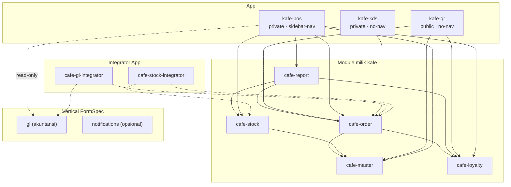

# Arsitektur — Aplikasi Kafe

**Status:** Proposal (Fase 2) · **Menunggu persetujuan**

Dokumen ini memetakan kebutuhan bisnis di `overview.md` ke konstruksi FormSpec:
batas modul, karakteristik entity, alur status, dan keputusan desain. Detail
field hidup di YAML (`spec/`), bukan di sini.

---

## 0. Keputusan Strategi: Mode Spec Ideal

### Pertanyaan

> Apakah sebaiknya kita pakai asumsi semua gap sudah diselesaikan, sehingga
> hasil akhirnya adalah **spec ideal** yang saat ini mungkin belum bisa jalan?

### Jawaban: **Ya — dengan satu syarat penting**

Tulis spec ideal. Tapi **idealismenya harus terbaca mesin, bukan tersembunyi**.

**Alasan menerima spec ideal:**

1. Tujuan project ini adalah test case yang **mendorong FormSpec maju**, bukan
   mendokumentasikan kemampuan FormSpec hari ini. Kalau spec dibatasi
   kemampuan sekarang, output-nya hanya mengulang keterbatasan — dan justru
   fitur yang paling dibutuhkan kafe (QR, cart, money, multi-outlet, struk
   thermal) tidak akan pernah muncul di spec.
2. Spec ideal berfungsi sebagai **acceptance test untuk pekerjaan engine**.
   Setiap `# GAP-nn:` adalah satu baris kebutuhan yang bisa ditutup, dan ketika
   tertutup, spec langsung berjalan tanpa ditulis ulang.
3. Menulis spec "versi yang bisa jalan sekarang" untuk kasus kafe akan
   menghasilkan desain **buruk** yang menutupi masalah (mis. menaruh
   cart di form admin). Buruk untuk dokumentasi, dan menyesatkan.

**Syaratnya — jangan buang jaring pengaman validasi:**

> Risiko terbesar spec ideal adalah **kita tidak lagi bisa membedakan
> "fitur belum ada" dari "saya salah tulis YAML".** Itu justru pola kegagalan
> yang baru saja kita dokumentasikan di `gaps_found/` (spec mendahului engine,
> gagal senyap).

Karena itu mekanismenya ditetapkan sekarang:

| Aturan | Detail |
| --- | --- |
| **1. Satu pohon spec** | Hanya `spec/`. Tidak ada fork `spec-ideal/` yang bisa melenceng dari `spec/`. |
| **2. Tandai eksplisit** | Setiap konstruksi yang bergantung gap diberi komentar `# GAP-nn: <fitur>` tepat di barisnya. Bisa di-`grep` untuk melihat seluruh permukaan gap. |
| **3. Baseline validasi** | `gaps_found/validate-baseline.md` mencatat problem `formspec validate` yang **diharapkan** (beserta GAP id). Dengan begitu validate tetap bermakna: problem **di luar baseline = bug nyata**. |
| **4. Traceability dua arah** | Gap → manifest yang bergantung. `gaps_found/` jadi daftar pekerjaan engine, bukan sekadar catatan. |
| **5. Dua status per fitur** | Di dokumen ini, setiap fitur diberi **Status**: `dapat dijalankan` / `ideal-only (GAP-nn)`. |
| **6. Tidak ada gap yang disembunyikan** | Kalau ada konstruksi ideal tanpa GAP id, itu bug dokumen. |

**Alternatif yang ditolak:**

- ❌ *Spec ideal tanpa validasi sama sekali* — kehilangan satu-satunya gerbang
  otomatis, dan kesalahan ketik akan menyamar sebagai "gap".
- ❌ *Dua pohon spec (nyata + ideal)* — duplikasi, dan cepat melenceng.
- ❌ *Spec konservatif (hanya yang bisa jalan)* — output tidak berguna sebagai
  test case, dan mendesain kafe di sekitar keterbatasan menghasilkan desain
  yang salah.

> **Catatan penerapan:** Fase 2 (dokumen ini) tidak punya gerbang validasi —
> dokumen memang ideal secara alami. Mekanisme di atas mulai berlaku di Fase 3
> (Draft). Rencana validasi ada di §9.

---

## 1. Bentuk Aplikasi (App Shape)

### Usulan: **3 App** dalam satu workspace

| App | `access` | `app_renderer` | `root_url` | Perangkat | Isi |
| --- | --- | --- | --- | --- | --- |
| `kafe-qr` | `public` | `no-nav` | `/` | HP pelanggan (via QR meja) | Menu, keranjang, pesan, bayar, status, struk digital |
| `kafe-pos` | `private` | `sidebar-nav` | `/app/pos` | Komputer/tablet kasir & supervisor & pemilik | Master, POS, stok, kas, laporan, pengaturan |
| `kafe-kds` | `private` | `no-nav` | `/app/kds` | Tablet dapur, tempel di dinding | Antrean pesanan (Kanban), layar penuh |

**Alasan memisahkan `kafe-kds` dari `kafe-pos`:**

- Chrome bersifat **per-App**, bukan per-halaman. Tablet dapur tidak boleh
  punya sidebar navigasi 10 menu — itu ruang layar yang hilang dan jalan
  keliru ke halaman yang salah.
- FormSpec sendiri menempatkan **"Kiosk/POS private full-screen"** sebagai
  skenario sah untuk `no-nav` + `private` (`docs/spec/frontend/05-app-kinds.md`
  §5), dan `chrome: { auth: button }` untuk kiosk yang tetap butuh logout.
- Di `kafe-pos`, layar dapur juga tetap bisa dibuka (untuk manajer) — App
  ketiga bukan pembatas, hanya permukaan khusus perangkat.
- Security boundary: `kafe-kds` hanya meng-mount module pesanan. Tablet dapur
  yang bocor/salah taruh tidak membuka master data, harga, atau laporan.

> **Perlu keputusan Anda.** Di Discovery Anda memilih *"Dua aplikasi: publik +
> privat"*. Layar dapur memaksa pertanyaan lanjutan: (a) pisah jadi App ketiga
> (usulan saya), atau (b) cukup satu halaman `no-nav` yang dibuka dari App
> privat — yang secara teknis tidak bisa menghilangkan sidebar karena chrome
> melekat pada App.

**Alternatif yang ditolak:** satu App publik + satu App privat (hapus `kafe-kds`)
— layar dapur akan tampil dengan sidebar, tidak layak untuk tablet dinding.

### Modul yang di-mount per App

| App | Module |
| --- | --- |
| `kafe-qr` | `cafe-master` *(sebagian)*, `cafe-order` *(sebagian)*, `cafe-loyalty` *(sebagian)* |
| `kafe-pos` | `cafe-master`, `cafe-order`, `cafe-stock`, `cafe-loyalty`, `cafe-report`, `gl` *(read-only)* |
| `kafe-kds` | `cafe-order` *(hanya entity `order`)* |

> ⚠️ **Mount sebagian module belum didukung** — App meng-mount **seluruh** module
> (`spec.modules`), dan App publik memberi anonim `list`/`find`/`create` untuk
> **semua entity** di module yang di-mount (**GAP-06**). Karena itu "sebagian"
> di tabel atas adalah **status ideal**, bukan yang bisa ditulis hari ini.
> Lihat §7 dan `gaps_found/03-pos-dan-public-ordering.md`.

---

## 2. Modul & Batas Konteks

### Modul baru milik kafe (`spec/modules/`)

| Module | Konteks | Kinds | Isi |
| --- | --- | --- | --- |
| `cafe-master` | Data acuan yang jarang berubah | Module, Entity, Config | `branch`, `menu-category`, `menu-item`, `menu-item-price`, `dining-table`, `member`, `employee`, `promo` + `Config` pengaturan kafe |
| `cafe-stock` | Bahan baku, resep, produksi | Module, Entity, Service | `ingredient`, `recipe`, `supplier`, `purchase-order`, `stock-movement`, `stock-level`, `stock-opname`, `waste-entry`, `menu-cost` |
| `cafe-order` | Transaksi penjualan & kas | Module, Entity, Workflow, Migration | `table-session`, `order`, `payment`, `shift`, `cash-movement` |
| `cafe-loyalty` | Kesetiaan pelanggan | Module, Entity | `point-entry`, `member-point` |
| `cafe-report` | Pelaporan & dashboard | Module, Dashboard, Widget, Report | 1 dashboard, 4 widget, 6 report |

### App pihak ketiga yang dipakai (vertical FormSpec)

| Vertical | Keputusan | Alasan |
| --- | --- | --- |
| **`gl`** (akuntansi) | **Diadopsi** | Sudah lengkap: `account` [reference] chart of accounts, `journal-entry` [transaction] double-entry, `gl-balance` [summary], script post/reverse. Membangun ulang akuntansi = salah. |
| `notifications` | **Diadopsi (opsional)** | Notifikasi WhatsApp saat pesanan siap/lunas. Bisa ditunda. |
| `inventory` | **Tidak diadopsi** | Bahan kafe butuh satuan gram/ml, ledakan resep, dan biaya per porsi — tidak ada resep/BOM di sana, dan vertical ini tidak punya metode valuasi (**GAP-13**). Kafe mengelola stok bahannya sendiri di `cafe-stock`. |
| `company` | **Tidak diadopsi (untuk sekarang)** | `company.branch` adalah master cabang yang tepat, tapi mengadopsinya menambah satu App lagi ke komposisi lintas-App — sementara komposisi multi-App belum disajikan end-to-end (**GAP-15**). Kafe mendefinisikan `branch` sendiri dengan **nama field konvensi** supaya bisa pindah mulus nanti (D10). |
| `purchase` | **Belum ada** | Tidak tersedia di FormSpec (**GAP-14**). Pembelian dimodelkan sendiri di `cafe-stock`. |

### Dua integrator App

Mengikuti pola FormSpec sendiri (`sales-inventory-integrator`,
`sales-gl-integrator`) — reaksi lintas-vertical tidak ditanam di dalam modul
pemiliknya.

| App | Listen | Call |
| --- | --- | --- |
| `cafe-gl-integrator` | `cafe-order.order.paid`, `cafe-order.payment.settled`, `cafe-stock.purchase-order.received` | `gl.journal-entry` (penjualan + pajak + HPP, kas/bank) |
| `cafe-stock-integrator` | `cafe-order.order.paid`, `cafe-order.order.cancelled` | `cafe-stock.stock-movement` (ledakan resep → pemakaian bahan) |

> ⚠️ **GAP-15** — integrator App terpisah adalah bentuk **ideal**. Komposisi
> multi-App belum bisa dilayani end-to-end hari ini (`SyncAgent` belum
> tersambung ke router; *"a real multi-App workspace can accept manifests per
> App but can't yet serve them together end-to-end"*). Alternatif sementara:
> `kind: Subscription` di dalam `cafe-order` — lebih jelek (tertanam di satu
> sisi, tidak bisa diganti vendor), tapi berjalan.

### Diagram Dependensi



---

## 3. Karakteristik Entity

| Entity | Module | Characteristic | Lifecycle | Alasan |
| --- | --- | --- | --- | --- |
| `branch` | cafe-master | `master` | plain_crud | Cabang kafe (outlet) — data stabil, punya tarif pajak & service charge sendiri, `parent_id` untuk hierarki |
| `menu-category` | cafe-master | `master` | plain_crud | Kategori menu; stabil |
| `menu-item` | cafe-master | `master` | plain_crud | Produk jual; jarang berubah, di-reference transaksi |
| `menu-item-price` | cafe-master | `master` | plain_crud | Harga per cabang — dipisah supaya satu menu bisa beda harga per cabang |
| `dining-table` | cafe-master | `master` | plain_crud | Meja + token QR |
| `member` | cafe-master | `master` | plain_crud + soft_deactivate | Pelanggan terdaftar; nomor HP unik |
| `employee` | cafe-master | `master` | plain_crud + soft_deactivate | Staf; terikat outlet |
| `promo` | cafe-master | `master` | plain_crud | **Aturan** promo (bukan pemakaian) — disimpan, dievaluasi saat pesan |
| `ingredient` | cafe-stock | `master` | plain_crud | Bahan baku; biaya per satuan |
| `recipe` | cafe-stock | `master` | plain_crud | Resep per menu (1:1) + child baris bahan |
| `supplier` | cafe-stock | `master` | plain_crud | Pemasok bahan |
| `purchase-order` | cafe-stock | `transaction` | state machine | Pembelian bahan dari supplier |
| `stock-movement` | cafe-stock | `transaction` | plain_crud | Append-only ledger pergerakan bahan (**inti HPP**) |
| `stock-level` | cafe-stock | `summary` | — | Proyeksi: jumlah + biaya rata-rata bergerak per (cabang, bahan) |
| `menu-cost` | cafe-stock | `summary` | — | Proyeksi: biaya per porsi & margin per menu |
| `stock-opname` | cafe-stock | `transaction` | state machine | Hitung fisik bahan |
| `waste-entry` | cafe-stock | `transaction` | plain_crud | Bahan terbuang/rusak |
| `table-session` | cafe-order | `transaction` | state machine | Satu kunjungan pelanggan di satu meja (induk pesanan QR) |
| `order` | cafe-order | `transaction` | state machine | Pesanan — inti transaksi |
| `payment` | cafe-order | `transaction` | state machine | Pembayaran per pesanan (bisa >1 baris) |
| `shift` | cafe-order | `transaction` | state machine | Shift kasir + rekonsiliasi kas |
| `cash-movement` | cafe-order | `transaction` | plain_crud | Kas masuk/keluar di luar penjualan |
| `point-entry` | cafe-loyalty | `transaction` | plain_crud | Ledger poin (earn/redeem/expire/adjust) |
| `member-point` | cafe-loyalty | `summary` | — | Saldo poin per member |

**Total: 24 entity** di 5 module. `cafe-report` tanpa entity (hanya UI).

### Entity yang **tidak** dibuat (dan alasannya)

| Tidak dibuat | Alasan |
| --- | --- |
| `kitchen-ticket` | Dapur membaca `order` yang sudah lunas lewat Kanban pada `order.status`. Entity terpisah = duplikasi status. |
| `promo-usage` | Pemakaian promo dicatat sebagai snapshot di `order` (`promo_id`, `discount_amount`). Kuota per member dihitung dari `order`. |
| `table-qr` | QR adalah atribut meja (`dining-table.qr_token`), bukan entity. |
| `goods-receipt` | Penerimaan barang = transisi `purchase-order` ke `received` + script yang membuat `stock-movement` masuk. Bukan entity baru. |
| `receipt` | Struk adalah `kind: Print` atas `order` + `payment`, bukan entity. |
| `journal-entry` | Milik vertical `gl` — jangan duplikasi akuntansi. |
| `discount-rule` | Batas diskon manual adalah pengaturan (`kind: Config`), bukan entity. |

---

## 4. Keputusan Desain Kunci

### D1 — Harga per cabang dipisah ke entity sendiri

`menu-item` tidak menyimpan harga. `menu-item-price` menyimpan
`(branch_id, menu_item_id, price)` unik.

*Alasan:* kebutuhan "harga boleh berbeda antar cabang" + permintaan
"menyalin harga ke semua cabang". Kalau harga ditempel di `menu-item`, satu
menu harus diduplikasi per cabang — nama, foto, dan resep ikut terduplikasi.

*Alternatif ditolak:* `menu-item.branch_id` (harga menempel pada produk) —
memaksa duplikasi produk, dan resep jadi tidak tunggal.

### D2 — Harga dibekukan (snapshot) ke baris pesanan

`order_line` menyimpan `name_snapshot` dan `unit_price_snapshot`, bukan hanya
`menu_item_id`.

*Alasan:* FormSpec sudah mewajibkan ini — `docs/spec/backend/02-core-extended.md`
§1.1: *field master yang memengaruhi perhitungan finansial **wajib** disalin
(snapshot) ke transaksi, tidak boleh live-join*. Kalau harga naik besok, struk
kemarin tidak boleh ikut berubah.

*Cara:* `relation` `belongs_to` dengan blok `snapshot:` (+ `child` untuk baris).
**Sudah tersedia di FormSpec.**

### D3 — HPP memakai biaya rata-rata bergerak, dihitung di Starlark

Ini keputusan terpenting untuk laporan "menu terlaris & profitabilitas".

- `stock-movement` menyimpan `unit_cost` (biaya per satuan **saat** pergerakan).
- `stock-level` [summary] menyimpan `quantity_on_hand` + `moving_avg_cost`,
  diperbarui oleh script: saat masuk, biaya rata-rata baru = (qty lama × biaya
  lama + qty masuk × biaya masuk) ÷ total qty.
- Saat penjualan, `stock-movement` keluar memakai `unit_cost` = biaya rata-rata
  saat itu → **beku**.
- `menu-cost` [summary] menjumlahkan biaya resep × biaya rata-rata bahan →
  biaya per porsi, lalu margin = harga jual − biaya.

*Alasan:* FormSpec **tidak punya metode valuasi bawaan** (**GAP-13** —
*"simpler today, no valuation method yet"*). Tapi valuasi rata-rata bergerak
adalah aritmetika sederhana dan bisnisnya cocok dikerjakan di script Starlark
di atas entity `summary` — jadi **kita tidak perlu menunggu engine**.

*Keterbatasan yang diterima (dicatat, bukan disembunyikan):* ini **bukan**
FIFO/LIFO. Untuk kafe (bahan cepat habis, harga supplier relatif stabil)
rata-rata bergerak adalah standar industri yang wajar. Kalau nanti butuh FIFO
per lapisan, itu pekerjaan engine (**GAP-13**).

*Alternatif ditolak:* menunggu valuasi bawaan engine (memblokir seluruh laporan
margin), atau mengabaikan HPP (laporan "profitabilitas" jadi bohong).

### D4 — Pemesanan QR memakai `table-session`

`table-session` [transaction] adalah satu kunjungan pelanggan di satu meja.
`order` menggantung padanya.

*Alasan:* menyelesaikan tiga masalah sekaligus:
1. **Aturan bisnis #4** — "satu pelanggan boleh pesan lebih dari sekali dalam
   satu kunjungan" → banyak `order` dalam satu `table-session`.
2. **Meja jadi kosong** saat sesi ditutup → status meja bisa diturunkan dari
   sesi aktif, tanpa field status di master (yang akan jadi sumber basi).
3. **Guest token** — `table-session.guest_token` (acak) adalah kunci akses
   pelanggan untuk melihat pesanannya sendiri dan struk digitalnya.

> ⚠️ **GAP-06** — ini justru *workaround* untuk keterbatasan mesin. Hari ini
> App publik memberi anonim `list` pada seluruh entity di module yang
> di-mount, jadi tanpa token sesi, pelanggan bisa membaca pesanan meja lain.
> Idealnya FormSpec menyediakan allowlist publik **per-entity** + scoping
> per-record. Sampai itu ada, `guest_token` adalah pengaman aplikasi.

### D5 — Void/pembatalan lewat Workflow, bukan tombol kasir

Transisi ke `cancelled` dari status setelah bayar dijaga `kind: Workflow`
(approval supervisor), bukan hanya permission.

*Alasan:* kebutuhan "approval void oleh supervisor". Kasir **bisa memicu**,
tapi tidak bisa **menyetujui**. `kind: ApprovalInbox` menjadi antrean
supervisor.

*Catatan:* update setelah submit selalu ditolak FormSpec — jadi pembatalan
harus berupa **custom action**, bukan edit field. Ini sudah selaras.

### D6 — Satu shift terbuka per kasir per outlet ditegakkan `Migration`

`shift` butuh **partial unique index** (`WHERE status = 'open'`) — di luar
yang bisa dinyatakan `IndexDecl` biasa. Pakai `kind: Migration`.

*Alasan:* aturan bisnis #10. Kalau hanya dicek di script, dua permintaan
bersamaan bisa membuat dua shift terbuka.

### D7 — Batas diskon manual ada di `Config`, bukan di kode

`kind: Config` (`cafe-config`) menyimpan: tarif pajak default, service charge
default, laju perolehan poin, nilai tukar poin, batas diskon manual tanpa
approval, dan header/footer struk.

*Alasan:* keputusan user — "harus bisa diatur bebas dari admin panel". Nilai
yang sering berubah tidak boleh memaksa ubah spec + redeploy.

### D8 — Pajak & service charge dihitung, ditampilkan terpisah

Pesanan menyimpan `subtotal`, `discount_amount`, `points_value`,
`service_charge_amount`, `tax_amount`, `total_amount` sebagai field terpisah
(dihitung `compute` / script, bukan disimpan sebagai satu angka).

*Alasan:* keputusan user — pajak diatur dari konfigurasi, bukan ditanam di
harga. Struk butuh rincian terpisah untuk kepatuhan.

### D9 — `cafe-stock` memakai nama "bahan", bukan "produk"

`ingredient` (bahan baku, satuan gram/ml/pcs) dipisah tegas dari `menu-item`
(produk jual). Resep menjembatani keduanya.

*Alasan:* penjualan 1 Latte mengurangi susu + kopi + cup, bukan "1 Latte".
Menganggap keduanya sama adalah sumber utama laporan margin yang salah.

### D10 — Cabang memakai konvensi `branch_id`, scope ditandai deklaratif

Entity cabang dinamai **`branch`** dan field `branch_id` — bukan `outlet` /
`outlet_id` — mengikuti konvensi FormSpec (*"always that name, always
`belongs_to company.branch`"*). Label UI tetap "Outlet"; konvensi menyangkut
**nama mesin**, bukan bahasa bisnis.

*Alasan:* `scope_field` pada `natural_key_rule` membaca field **berdasarkan
nama**. Kalau fieldnya `outlet_id`, penomoran per cabang tetap jalan — tapi
begitu FormSpec membangkitkan mekanisme scope framework (`TenantDecl` yang
kini dorman), aplikasi ini **tidak ikut kebagian**. Memakai nama konvensi
sekarang berarti spec ini tidak perlu ditulis ulang nanti.

**Posisi soal `branch_id` sebagai atribut resmi:**

| | `tenant_id` | `branch_id` |
| --- | --- | --- |
| Sifat | Batas **isolasi** (storage boundary) | Kebijakan **visibilitas** (policy) |
| Nilainya | **Sama untuk semua** — setiap baris milik satu tenant | **Berbeda per pengguna** — kasir 1 cabang, pemilik semua |
| Universal | Ya, **setiap** baris | **Tidak** — banyak entity tidak punya |
| Kalau salah | Kebocoran antar-tenant (fatal) | Salah filter (mengganggu, bisa diperbaiki) |
| Perlakuan wajar | **Default-on** (fail-safe) | **Opt-in eksplisit** |

Karena itu kami **menolak `branch_id` sebagai kolom auto-inject universal** dan
memilih **deklarasi `scope` opt-in**:

```yaml
spec:
  version: v1
  scope: { dimension: branch, field: branch_id, required: true }
```

Kenapa bukan auto-inject — `branch` tidak universal:

| Kasus | Kenapa satu `branch_id` tidak cukup |
| --- | --- |
| Entity `branch` itu sendiri | Self-reference |
| Data acuan global (COA, tarif pajak) | Tidak milik cabang mana pun |
| Entity platform (`formspec.core.user`, role) | Bukan domain cabang |
| Transfer antar cabang | Butuh **dua**: `from_branch_id` + `to_branch_id` |
| Member/supplier/promo lintas cabang | Satu FK tidak bisa bilang "berlaku di 3 cabang" |
| Karyawan bertugas di 2 cabang | Many-to-many |
| Ringkasan konsolidasi | Sengaja **melampaui** cabang |

Kolom nullable memaksa pertanyaan ambigu: `NULL` = "terlihat semua orang" atau
"tidak terlihat siapa pun"? Keduanya buruk, dan yang kedua membuat laporan
konsolidasi hilang diam-diam — pola **gagal senyap** yang sama dengan
`gaps_found/`. `tenant_id` tidak pernah ambigu seperti ini.

**Temuan penting soal `TenantDecl`.** Bentuk ini **sudah ada di FormSpec dan
dorman** — `pkg/spec/entity.go` punya `TenantDecl{Isolated bool}` pada
`EntitySpec.Tenant`, dan dokumen arsitektur FormSpec sendiri menunjuk ke sana:

> *"a future framework-level mechanism has one consistent field to adopt —
> most naturally by finally wiring up the dormant `TenantDecl`, rather than
> inventing a second, parallel mechanism."*

Bedanya dengan usulan di atas: `TenantDecl.Isolated` hanyalah **flag boolean**
("entity ini terisolasi atau tidak"), bukan **deskriptor dimensi** (field mana
yang membawa scope). Jadi "membangkitkan `TenantDecl`" berarti **memperluas +
menyambungkan**, bukan sekadar menyambungkan.

**Prasyarat yang sebenarnya bukan kolomnya.** `branch_id` + filter otomatis
tanpa jawaban "pengguna X ditugaskan di cabang mana" tidak ada gunanya. Karena
itu urutannya: **(a)** metadata scope deklaratif (murah, langsung berguna,
tidak mengunci desain) → **(b)** penugasan pengguna↔cabang + enforcement
server-side (inilah yang benar-benar memberi isolasi).

*Alternatif ditolak:* `branch_id` auto-inject universal (memaksa kolom tanpa
makna di entity global + memaksa `NULL` ambigu); atau tidak mendeklarasikan
apa pun (kehilangan kesempatan menjadikan spec ini acceptance test untuk
mekanisme scope).

**Jejak gap:** GAP-08. Rekomendasi bentuk ideal ada di
`gaps_found/04-multi-outlet.md`.

---

## 5. UI: Derived vs Override

### Biarkan derived (tidak menulis manifest UI)

`branch`, `menu-category`, `menu-item-price`, `dining-table`, `member`,
`employee`, `supplier`, `ingredient`, `cash-movement`, `point-entry`.

### Perlu override

| Kind | Nama | Mengapa |
| --- | --- | --- |
| `Form` | `menu-item-form` | Foto + pengelompokan section + `visible_when` (harga & resep hanya relevan setelah produk dibuat) |
| `Form` | `promo-form` | Field bergantung `type` (persentase vs nominal vs beli-2-gratis-1) → `visible_when` |
| `Form` | `order-form-pos` | **GAP-05** — idealnya blok cart; hari ini `ChildTable` di dalam Form |
| `Form` | `payment-form` | Numpad uang + hitung kembalian → **GAP-01** (`money` tanpa widget) |
| `Form` | `stock-opname-form` | Input hitung fisik berdampingan sistem (child table) |
| `Table` | `order-table-pos` | Kolom status meja, filter shift, aksi cepat (bayar, void) |
| `Table` | `stock-level-table` | Peringatan stok kritis (baris merah) |
| `Kanban` | `order-board-kds` | Layar dapur. `status_field: status`, `realtime: true`, `drag_guard` dari state machine |
| `Kanban` | `order-board-table` | Papan status meja untuk pelayan |
| `Page` | `qr-order-page` | **GAP-03, GAP-05** — katalog bergambar + keranjang untuk pelanggan |
| `Page` | `table-qr-page` | **GAP-03** — pratinjau & cetak QR per meja |
| `Page` | `order-status-page` | Status pesanan pelanggan (diakses via `guest_token`) |
| `Page` | `pos-workbench` | **`layout.mode: split`** master-detail: daftar pesanan + detail |
| `Print` | `receipt-thermal` | Struk 58mm → **GAP-10** (`thermal` belum ada kode) |
| `Print` | `receipt-digital` | Struk halaman pelanggan (`html`) |
| `Print` | `table-tent-card` | Kartu QR meja → **GAP-03** |
| `Wizard` | `close-shift-wizard` | Tutup shift: hitung fisik → selisih → konfirmasi |
| `Wizard` | `stock-opname-wizard` | Opname bertahap |
| `Workflow` | `order-void-approval` | Approval supervisor untuk void (D5) |
| `ApprovalInbox` | `supervisor-inbox` | Antrean approval |
| `Dashboard` | `owner-overview` | Omzet, menu terlaris, stok kritis, selisih kas |
| `Report` | 6 report | Lihat `domain-model.md` |
| `Migration` | `shift-open-unique` | Partial unique index (D6) |
| `Config` | `cafe-config` | Pengaturan kafe (D7) |
| `Theme` | `kafe-theme` | Warna & tipografi brand |

**Catatan:** foto menu di Table/Listing butuh **GAP-04** (render `file` sebagai
gambar). Tanpa itu, katalog publik tidak bisa menampilkan foto.

---

## 6. Aturan Bisnis → Titik Penegakan

Bagian ini membuktikan setiap aturan bisnis punya tempat di spec — bukan hanya
niat.

| # | Aturan | Ditegakkan di | Status |
| --- | --- | --- | --- |
| 1 | Pesanan masuk dapur hanya setelah lunas | State machine `order`: hanya `paid` → `in_kitchen`; Kanban KDS hanya memuat `paid`+ | dapat dijalankan |
| 2 | QR unik per meja | `dining-table.qr_token` `unique` + `natural_key_rule` acak | **GAP-03** (generator QR) |
| 3 | Pelanggan tidak wajib punya akun | `order.member_id` opsional; poin hanya bila member ada | dapat dijalankan |
| 4 | Boleh pesan >1× per kunjungan | `order` banyak ke satu `table-session` | dapat dijalankan |
| 5 | Pesanan tidak berubah setelah bayar | FormSpec: update setelah submit selalu ditolak; penambahan = `order` baru | dapat dijalankan |
| 6 | Harga beda antar outlet | `menu-item-price` (D1) + `menu-item-price.price` snapshot ke baris | dapat dijalankan |
| 7 | Maks 1 promo otomatis + 1 penukaran poin | Script evaluasi promo: pilih satu kandidat terbaik; `points_value` field terpisah | dapat dijalankan |
| 8 | Diskon manual di luar batas perlu supervisor | Guard action + `Workflow` + batas dari `Config` | dapat dijalankan |
| 9 | Stok per cabang | Semua entity stok memuat `branch_id`; `stock-level` unik per (cabang, bahan) | **GAP-08** (tidak ada row-scope otomatis) |
| 10 | Satu shift terbuka per kasir per outlet | `Migration` partial unique index (D6) | dapat dijalankan |
| 11 | Void setelah shift tutup ditolak | Guard pada `cancel`: shift terkait harus `open` | dapat dijalankan |
| 12 | Poin diberi setelah lunas | `point-entry` dibuat oleh action `settle` / Subscription pada `order.paid` | dapat dijalankan |
| 13 | Nomor HP member unik | `member.phone` `unique` | dapat dijalankan |
| 14 | Data penjualan tidak dihapus permanen | `delete` disabled pada `order`/`payment`/`stock-movement`; koreksi = void | dapat dijalankan |
| 15 | Pajak & service charge dari konfigurasi | `Config` (D7) + field terpisah (D8) | dapat dijalankan |

---

## 7. Peta Dampak Gap

Ringkas: bagian arsitektur mana yang bergantung pada gap mana. Kolom *Jika gap
tidak diperbaiki* adalah **rencana cadangan** supaya spec tetap bisa dicoba.

| GAP | Bagian terdampak | Jika gap tidak diperbaiki |
| --- | --- | --- |
| **GAP-01** `money` tanpa widget | `payment-form`, `order` total, `close-shift-wizard`, semua field uang | **Tidak ada cadangan yang layak.** Kasir mengetik angka di input teks. Terima sebagai keterbatasan UX sampai diperbaiki. |
| **GAP-02** bentuk nilai `money` | Tampilan uang di Table/Report/ChildTable | Uji runtime dulu; kalau benar JSON mentah, laporkan sebagai bug ke FormSpec |
| **GAP-03** QR code | `table-qr-page`, `table-tent-card`, `dining-table.qr_token` | Sementara: simpan URL meja sebagai `string`, cetak manual. Tidak ada QR di spec yang bisa jalan |
| **GAP-04** gambar tidak dirender | Katalog publik, `menu-item.photo` di Table/Listing | Turunkan ke `FileInput` saja (foto hanya terlihat di form edit) |
| **GAP-05** tidak ada blok cart | `qr-order-page`, `order-form-pos` | Pakai `Form` + `ChildTable` (form admin, bukan UX pemesanan) |
| **GAP-06** akses publik per-module | `kafe-qr` (mount sebagian), privasi pesanan/member | `guest_token` (D4) + **jangan** taruh `member`/`employee` di module yang di-mount publik |
| **GAP-07** `exclude: [public_api]` | Field sensitif (`member.phone`, `order.note`) | Pisahkan field sensitif ke entity/module terpisah |
| **GAP-08** tidak ada row-scope cabang | Aturan #9, isolasi kasir per cabang | `fixed_filters` (UI-level, **bukan** otorisasi) + filter wajib di script. Bentuk ideal: D10 |
| **GAP-09** `scope_field` di `ctx.next_key` | Nomor pesanan per cabang (`scope_field: branch_id`) | **Pakai jalur otomatis** (`natural_key_rule`), jangan `ctx.next_key` dari script |
| **GAP-10** `thermal` belum ada | `receipt-thermal` | Pakai `format: html` + print browser; atau simpan struk digital saja |
| **GAP-11** relasi lintas kategori | `payment`/`journal-entry` bila diberi `category: financial` | **Jangan** set `persist.category` berbeda antar entity yang saling berelasi |
| **GAP-12** resolusi tabel target naif | Semua relasi lintas module | Waspadai plural tidak beraturan (`menu-item`); uji `find` relasi |
| **GAP-13** tanpa valuasi bawaan | — | **Tidak menghambat** — D3 menaruh valuasi di Starlark |
| **GAP-14** tanpa vertical `purchase` | `purchase-order`, `supplier` | Dimodelkan sendiri di `cafe-stock` |
| **GAP-15** komposisi multi-App | `cafe-gl-integrator`, adopsi `gl` | `kind: Subscription` di dalam `cafe-order` |
| **GAP-16** `widget.ref` nama polos | `owner-overview` | Beri prefix unik per module pada nama widget (mis. `order-omzet-hari-ini`) |
| **GAP-17** realtime terbatas | KDS (Kanban ✅), Timeline, Listing publik | KDS **aman** (Kanban realtime). Status pesanan pelanggan butuh reload manual |

**Cara membaca:** hanya **GAP-01** yang tidak punya cadangan layak. Itu
menegaskan prioritas: widget `money` adalah satu-satunya gap yang benar-benar
menghalangi aplikasi ini, bahkan dalam mode spec ideal.

---

## 8. Checklist Keputusan (Fase 2)

- [x] Batas modul ditetapkan & beralasan — 5 module kafe + `gl`
- [x] **Bentuk App diputuskan** — 3 App (`kafe-qr` public/no-nav, `kafe-pos` private/sidebar-nav, `kafe-kds` private/no-nav)
- [x] Semua entity punya characteristic
- [x] Semua state machine digambar (`domain-model.md`)
- [x] Dependensi module dipetakan (§2)
- [x] Keputusan UI override ditetapkan (§5)
- [x] Keputusan strategi spec ideal (§0)
- [x] Peta dampak gap (§7)
- [ ] **Persetujuan Anda** — sebelum Fase 3 (Draft YAML)

## 9. Rencana Validasi (Fase 3)

1. Tulis manifest, jalankan `formspec validate --spec spec` setelah setiap tulis.
2. Semua problem yang muncul **diklasifikasikan**: bug penulisan vs **gap yang
   diharapkan**. Gap diharapkan dicatat di `gaps_found/validate-baseline.md`
   dengan GAP id.
3. Target: **setiap problem punya GAP id, dan setiap GAP id punya problem.**
   Problem tanpa GAP id = bug nyata → perbaiki YAML.
4. Tandai setiap konstruksi gap dengan komentar `# GAP-nn: <fitur>` agar bisa
   di-`grep`.
