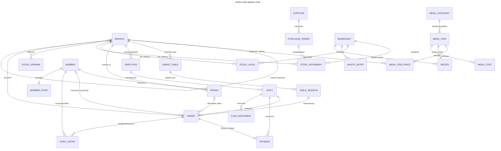
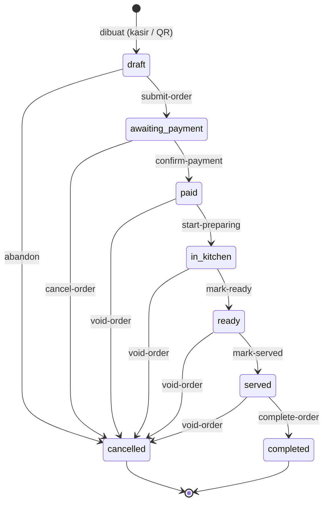
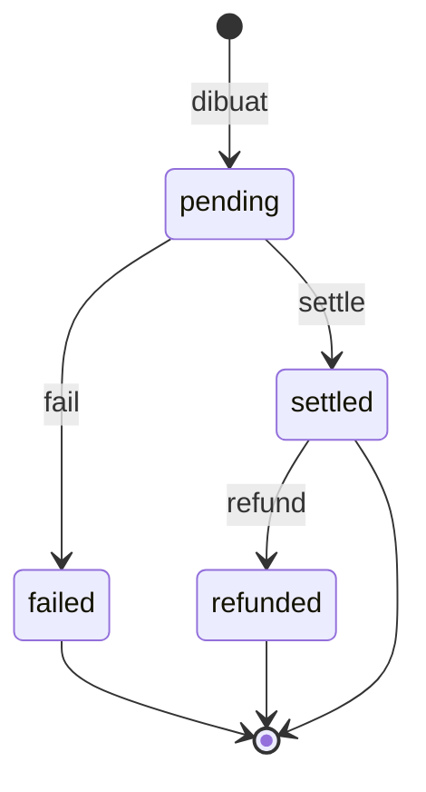
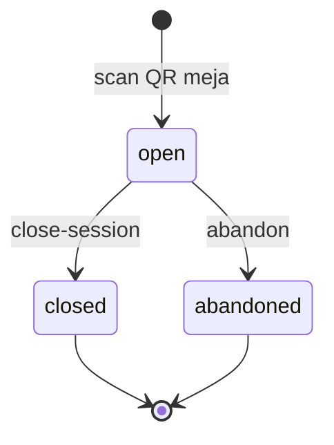
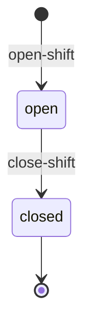
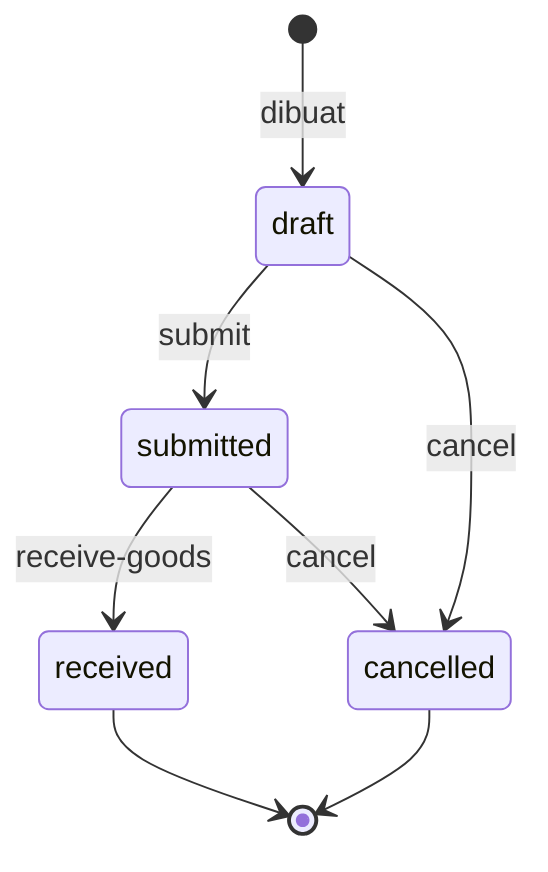
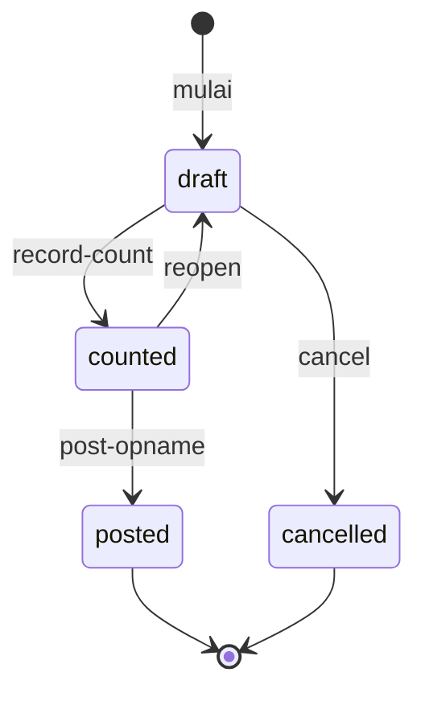

# Model Data — Aplikasi Kafe

**Status:** Proposal (Fase 2) · **Menunggu persetujuan**

Dokumen ini menggambarkan model data pada tingkat **desain**: hubungan antar
entity, alur status, dan penjaminan keunikan. **Detail field lengkap hidup di
YAML** (`spec/`), bukan di sini — sesuai prinsip "docs ≠ spec".

24 entity di 5 module. Notasi: `[master]`, `[transaction]`, `[reference]`,
`[summary]`.

---

## 1. Diagram ER



> Catatan: baris `MEMBER ||--o{ PROMO` hanya menggambarkan bahwa promo dapat
> dibatasi per member (`max_uses_per_member`) — bukan relasi kepemilikan.
> `RECIPE` menggantung pada `MENU_ITEM` (1:1) dan memuat baris bahan sebagai
> `child` (`recipe-line`), bukan entity terpisah.

---

## 2. Rincian Entity

### Module `cafe-master` — data acuan

#### `branch` [master]

Cabang kafe (outlet). Sumber tarif pajak & service charge, serta header struk.

> **Konvensi penamaan.** FormSpec menetapkan konvensi **"always that name, always
> `belongs_to company.branch`"** untuk field `branch_id`. Karena itu entity ini
> dinamai `branch` dan fieldnya `branch_id` — walau di UI dilabeli "Outlet".
> Dengan begitu aplikasi ini **siap menerima mekanisme scope framework** begitu
> `TenantDecl` dibangkitkan, tanpa penulisan ulang spec (lihat D10).

| Field | Type | Keterangan |
| --- | --- | --- |
| `code` | string (required, unique, natural_key) | Kode cabang, mis. `KFE-JKT-01` |
| `name` | string (required) | Nama cabang |
| `parent_id` | relation → `branch` | Hierarki opsional (region → cabang) |
| `address` | text | Alamat |
| `phone` | string | Telepon |
| `timezone` | string | IANA tz, mis. `Asia/Jakarta` |
| `tax_percent` | decimal | PB1, mis. 10 |
| `service_charge_percent` | decimal | Mis. 5 |
| `apply_service_charge` | boolean | Saklar per cabang |
| `receipt_header` / `receipt_footer` | text | Teks struk |
| `is_active` | boolean | Soft deactivate |

> **GAP-08** — tidak ada mekanisme framework untuk mengunci data per cabang.
> `branch_id` adalah relasi biasa; isolasi bergantung pada disiplin spec
> (§6) dan `fixed_filters` (UI-level). Bentuk ideal: deklarasi `scope` yang
> membuat engine tahu entity ini ter-scope cabang (lihat D10 dan
> `gaps_found/04-multi-outlet.md`).

#### `menu-category` [master]

`name`, `sort_order`, `is_active`. Kategori bersifat global (bukan per outlet).

#### `menu-item` [master]

Produk jual. **Tidak menyimpan harga** (lihat `menu-item-price`).

| Field | Type | Keterangan |
| --- | --- | --- |
| `code` | string (required, unique, natural_key) | Mis. `LAT-001` |
| `name` | string (required) | Nama menu |
| `menu_category_id` | relation → `menu-category` (required) | Kategori |
| `description` | text | Deskripsi |
| `photo` | file | Foto menu — `storage.allowed_types: [jpg, png, webp]`, `transform: [thumbnail]` |
| `prep_station` | enum `bar` · `kitchen` · `both` | Stasiun penyiapan (dasar routing KDS) |
| `is_available` | boolean | Habis / sedang tidak tersedia (saklar cepat kasir) |
| `is_taxable` | boolean | Ikut kena pajak |
| `sort_order` | integer | Urutan tampil |

> **GAP-04** — `photo` bisa diunggah hari ini, tapi **tidak dirender sebagai
> gambar** di Table/Listing/Detail. Untuk katalog publik ini penghambat.

#### `menu-item-price` [master]

Harga per cabang. Unik pada `(branch_id, menu_item_id)`.

| Field | Type | Keterangan |
| --- | --- | --- |
| `branch_id` | relation → `branch` (required) | Cabang |
| `menu_item_id` | relation → `menu-item` (required) | Menu |
| `price` | money (required) | Harga jual di cabang itu |
| `is_active` | boolean | Menonaktifkan harga tanpa menghapus |

> **GAP-01/GAP-02** — `money` tanpa widget input, dan pemformatan nilai
> `{amount, currency}` perlu diverifikasi di runtime.

#### `dining-table` [master]

Meja + token QR. Unik pada `(branch_id, code)`; `qr_token` unik.

| Field | Type | Keterangan |
| --- | --- | --- |
| `branch_id` | relation → `branch` (required) | Cabang |
| `code` | string (required) | Mis. `A-01` |
| `area` | enum `indoor` · `outdoor` · `smoking` · `vip` | Area |
| `seats` | integer | Kapasitas |
| `qr_token` | string (required, unique) | Token acak — dasar URL QR meja |
| `is_active` | boolean | Meja dipakai/tidak |

#### `member` [master] — soft deactivate

| Field | Type | Keterangan |
| --- | --- | --- |
| `name` | string (required) | Nama pelanggan |
| `phone` | string (required, unique) | Nomor HP — **kunci identitas member** |
| `email` | string | Opsional |
| `birth_date` | date | Untuk promo ulang tahun |
| `joined_at` | datetime | Tanggal bergabung |
| `is_active` | boolean | Soft deactivate |

> **GAP-06/GAP-07** — `phone`/`email` adalah data pribadi. Jangan letakkan
> `member` di module yang di-mount App publik sampai allowlist per-entity dan
> `exclude: [public_api]` berfungsi.

#### `employee` [master] — soft deactivate

| Field | Type | Keterangan |
| --- | --- | --- |
| `name` | string (required) | Nama |
| `phone` | string | Telepon |
| `branch_id` | relation → `branch` (required) | Cabang tugas |
| `position` | enum `kasir` · `barista` · `dapur` · `pelayan` · `supervisor` · `manajer` | Posisi |
| `username` | string (unique) | Penaut ke pengguna FormSpec (`formspec.core.user`) |
| `is_active` | boolean | Soft deactivate |

#### `promo` [master]

**Aturan** promo — disimpan, dievaluasi saat pemesanan. Bukan catatan pemakaian.

| Field | Type | Keterangan |
| --- | --- | --- |
| `code` | string (required, unique, natural_key) | Mis. `HAPPY-HOUR-20` |
| `name` | string (required) | Nama promo |
| `type` | enum `percentage` · `fixed` · `buy_x_get_y` | Jenis |
| `value` | money | Nominal (untuk `fixed`) |
| `percent` | decimal | Persentase (untuk `percentage`) |
| `buy_qty` / `get_qty` | integer | Untuk `buy_x_get_y` |
| `applies_to` | enum `order` · `menu_item` · `category` | Cakupan |
| `menu_item_id` / `menu_category_id` | relation | Target bila cakupan spesifik |
| `branch_id` | relation → `branch` | Kosong = semua cabang |
| `min_purchase` | money | Minimum belanja |
| `start_date` / `end_date` | date | Periode |
| `days_of_week` | json | Mis. `[1,2,3,4,5]` |
| `time_from` / `time_to` | time | Jam berlaku (happy hour) |
| `max_uses_per_member` | integer | Batas per member |
| `priority` | integer | Pemilihan bila beberapa promo cocok |
| `is_active` | boolean | Saklar |

> Form override wajib: field bergantung `type` dan `applies_to` → `visible_when`.

### Module `cafe-stock` — bahan, resep, pembelian

#### `ingredient` [master]

Bahan baku. Satuan gram/ml/pcs.

| Field | Type | Keterangan |
| --- | --- | --- |
| `code` | string (required, unique, natural_key) | Mis. `BHN-SUSU-01` |
| `name` | string (required) | Nama bahan |
| `unit` | enum `gram` · `ml` · `pcs` | Satuan dasar |
| `cost_per_unit` | money | Biaya acuan (dipakai bila belum ada pergerakan) |
| `min_stock` | decimal | Ambang peringatan stok kritis |
| `shelf_life_days` | integer | Umur simpan |
| `is_active` | boolean | Soft deactivate |

#### `recipe` [master]

Resep per menu — 1:1 dengan `menu-item`. Baris bahan sebagai `child`
(`storage: jsonb`, `sequence_field: line_no`).

| Field | Type | Keterangan |
| --- | --- | --- |
| `menu_item_id` | relation → `menu-item` (required, unique) | Menu |
| `yield_quantity` | decimal | Jumlah porsi hasil resep |
| `instructions` | text | Langkah pembuatan |
| `is_active` | boolean | Saklar |

**`child` `lines`:**

| Sub-field | Type | Keterangan |
| --- | --- | --- |
| `line_no` | integer | Urutan (auto) |
| `ingredient_id` | relation → `ingredient` (required) | Bahan |
| `quantity` | decimal (required) | Jumlah per resep |
| `unit` | enum | Satuan (boleh beda dari satuan dasar → butuh konversi) |
| `note` | string | Catatan |

#### `supplier` [master]

`code` (unique, natural_key), `name`, `phone`, `address`, `payment_term`,
`is_active`.

#### `purchase-order` [transaction] — state machine

Pembelian bahan. Penerimaan barang adalah **transisi**, bukan entity terpisah.

| Field | Type | Keterangan |
| --- | --- | --- |
| `number` | string (required, unique, natural_key) | `PO-{year}-{seq:05d}` |
| `branch_id` | relation → `branch` (required) | Cabang penerima |
| `supplier_id` | relation → `supplier` (required) | Pemasok |
| `transaction_date` | date (required) | Tanggal PO |
| `expected_date` | date | Perkiraan tiba |
| `status` | enum | Lihat state machine |
| `total_amount` | money | Total (compute) |
| `note` | text | Catatan |

**`child` `lines`:** `ingredient_id`, `quantity`, `unit_cost` (money),
`subtotal` (compute), `received_quantity`.

#### `stock-movement` [transaction] — **inti HPP**

Ledger pergerakan bahan. Append-only, tidak pernah dihapus.

| Field | Type | Keterangan |
| --- | --- | --- |
| `branch_id` | relation → `branch` (required) | Cabang |
| `transaction_date` | date (required, index) | Tanggal |
| `ingredient_id` | relation → `ingredient` (required) | Bahan |
| `direction` | enum `in` · `out` · `adjust` | Arah |
| `quantity` | decimal (required) | Jumlah |
| `unit_cost` | money (required) | **Biaya per satuan saat pergerakan** (dibekukan) |
| `total_cost` | money | compute: `quantity × unit_cost` |
| `source` | enum `purchase` · `sale` · `waste` · `opname` · `manual` | Asal |
| `source_ref` | string | ID pesanan / PO / opname |
| `note` | string | Catatan |

> Perhatikan: pembelian (masuk) memakai harga beli; penjualan (keluar) memakai
> **biaya rata-rata bergerak** saat itu (D3). Penjualan yang keluar **tidak
> boleh** memakai `ingredient.cost_per_unit` (acuan statis).

#### `stock-level` [summary]

Proyeksi saldo & biaya rata-rata. Unik pada `(branch_id, ingredient_id)`.

| Field | Type | Keterangan |
| --- | --- | --- |
| `branch_id` | relation → `branch` (required) | Cabang |
| `ingredient_id` | relation → `ingredient` (required) | Bahan |
| `quantity_on_hand` | decimal | Saldo |
| `moving_avg_cost` | money | Biaya rata-rata bergerak |
| `stock_value` | money | compute: `quantity_on_hand × moving_avg_cost` |
| `last_movement_at` | datetime | Pergerakan terakhir |
| `is_below_min` | boolean | Peringatan stok kritis |

> **Karena `summary` tidak menerima create/update lewat API**, entity ini murni
> ditulis oleh script. Ini justru yang memaksa valuasi berjalan konsisten.

#### `menu-cost` [summary]

Biaya & margin per menu per outlet — **dasar laporan profitabilitas**.

| Field | Type | Keterangan |
| --- | --- | --- |
| `branch_id` | relation → `branch` (required) | Cabang |
| `menu_item_id` | relation → `menu-item` (required) | Menu |
| `cost_per_portion` | money | Σ (qty resep × `moving_avg_cost` bahan) ÷ yield |
| `sale_price` | money | Dari `menu-item-price` |
| `gross_margin` | money | `sale_price − cost_per_portion` |
| `gross_margin_percent` | decimal | Margin (%) |
| `calculated_at` | datetime | Kapan dihitung |

> **GAP-13** — ini pengganti metode valuasi bawaan. FormSpec tidak punya
> FIFO/moving-average; kita menghitungnya di Starlark.

#### `stock-opname` [transaction] — state machine

Hitung fisik bahan. Unik: satu opname `posted` per `(branch_id, transaction_date)`.

| Field | Type | Keterangan |
| --- | --- | --- |
| `branch_id` | relation → `branch` (required) | Cabang |
| `transaction_date` | date (required) | Tanggal hitung |
| `status` | enum `draft` · `counted` · `posted` · `cancelled` | Status |
| `counted_by` | relation → `employee` | Penghitung |
| `note` | text | Catatan |

**`child` `lines`:** `ingredient_id`, `system_qty` (dari `stock-level` saat
draft dibuat), `counted_qty`, `difference` (compute), `reason`.

#### `waste-entry` [transaction]

`branch_id`, `transaction_date`, `ingredient_id`, `quantity`, `unit_cost`
(snapshot biaya rata-rata), `reason` (enum `spoilage` · `spill` · `expired` ·
`staff` · `other`), `employee_id`, `note`.

### Module `cafe-order` — penjualan & kas

#### `table-session` [transaction] — state machine

Satu kunjungan pelanggan di satu meja. **Induk pesanan QR** dan pemegang token
akses pelanggan.

| Field | Type | Keterangan |
| --- | --- | --- |
| `branch_id` | relation → `branch` (required) | Cabang |
| `dining_table_id` | relation → `dining-table` (required) | Meja |
| `guest_token` | string (required, unique) | Token akses pelanggan (**GAP-06**) |
| `guest_name` | string | Nama pelanggan (opsional) |
| `member_id` | relation → `member` | Bila pelanggan memasukkan nomor HP |
| `opened_at` | datetime (required) | Mulai duduk |
| `closed_at` | datetime | Selesai |
| `status` | enum `open` · `closed` · `abandoned` | Status |
| `guest_count` | integer | Jumlah orang |

#### `order` [transaction] — state machine

Inti transaksi.

| Field | Type | Keterangan |
| --- | --- | --- |
| `number` | string (required, unique, natural_key) | `ORD-{seq:05d}` — **scope per cabang** (`scope_field: branch_id`) |
| `branch_id` | relation → `branch` (required) | Cabang |
| `transaction_date` | datetime (required, index) | Waktu pesan |
| `channel` | enum `qr_table` · `cashier` · `takeaway` | Kanal |
| `table_session_id` | relation → `table-session` | Wajib bila `qr_table` |
| `dining_table_id` | relation → `dining-table` | Denormalisasi untuk tampilan cepat |
| `member_id` | relation → `member` | Opsional |
| `shift_id` | relation → `shift` | Shift yang melayani |
| `cashier_id` | relation → `employee` | Kasir |
| `status` | enum | Lihat state machine |
| `subtotal` | money | Jumlah baris |
| `promo_id` | relation → `promo` | Promo yang diterapkan |
| `discount_amount` | money | Diskon promo + manual |
| `manual_discount_amount` | money | Diskon manual |
| `manual_discount_reason` | string | Alasan (wajib bila > batas) |
| `points_redeemed` | integer | Poin ditukar |
| `points_value` | money | Nilai rupiah poin |
| `service_charge_amount` | money | compute dari `branch.service_charge_percent` |
| `tax_amount` | money | compute dari `branch.tax_percent` |
| `total_amount` | money | Total akhir |
| `paid_amount` | money | Total dibayar |
| `change_amount` | money | Kembalian |
| `guest_note` | text | Catatan pelanggan |
| `void_reason` | string | Alasan void |
| `void_approved_by` | relation → `employee` | Supervisor penyetuju |

**`child` `lines`:** `line_no`, `menu_item_id`, `name_snapshot` (string),
`unit_price_snapshot` (money), `quantity` (integer), `prep_station` (enum),
`discount_amount` (money), `line_total` (money, compute), `note`, `line_status`
(enum `queued` · `preparing` · `ready` · `served`).

> `name_snapshot` + `unit_price_snapshot` = denormalisasi finansial (D2).
> `line_status` memungkinkan dapur menyelesaikan per item, bukan hanya per
> pesanan — penting kalau satu pesanan berisi kopi (bar) dan makanan (dapur).

#### `payment` [transaction] — state machine

Satu pesanan bisa punya beberapa pembayaran (bayar sebagian / metode gabungan).

| Field | Type | Keterangan |
| --- | --- | --- |
| `order_id` | relation → `order` (required) | Pesanan |
| `transaction_date` | datetime (required, index) | Waktu bayar |
| `method` | enum `cash` · `card` · `qris` · `ewallet` · `points` | Metode |
| `amount` | money (required) | Jumlah dibayar |
| `tendered` | money | Uang diterima (tunai) |
| `change` | money | Kembalian (tunai) |
| `reference_no` | string | Nomor referensi EDC/QRIS |
| `status` | enum `pending` · `settled` · `failed` · `refunded` | Status |
| `shift_id` | relation → `shift` | Shift penerima |
| `cashier_id` | relation → `employee` | Kasir penerima |
| `refund_reason` | string | Alasan refund |

#### `shift` [transaction] — state machine

| Field | Type | Keterangan |
| --- | --- | --- |
| `branch_id` | relation → `branch` (required) | Cabang |
| `cashier_id` | relation → `employee` (required) | Kasir |
| `transaction_date` | date (required) | Tanggal |
| `opened_at` | datetime (required) | Buka |
| `closed_at` | datetime | Tutup |
| `opening_cash` | money (required) | Kas awal |
| `expected_cash` | money | compute: kas awal + tunai masuk − kas keluar |
| `counted_cash` | money | Hasil hitung fisik |
| `difference` | money | compute: `counted_cash − expected_cash` |
| `status` | enum `open` · `closed` | Status |
| `supervisor_id` | relation → `employee` | Penyetuju tutup |
| `note` | text | Catatan selisih |

> **GAP-01** — `opening_cash`, `counted_cash`, `difference` semuanya `money`.
> Tanpa widget uang, form tutup shift adalah input teks. Ini titik paling
> terasa dari gap tersebut.

#### `cash-movement` [transaction]

`shift_id` (required), `branch_id`, `transaction_date`, `type` (enum `in` ·
`out`), `amount` (money), `reason` (enum `drop_to_safe` · `buy_supplies` ·
`petty_cash` · `bank_deposit` · `other`), `employee_id`, `note`.

### Module `cafe-loyalty` — kesetiaan pelanggan

#### `point-entry` [transaction]

Ledger poin. Append-only.

| Field | Type | Keterangan |
| --- | --- | --- |
| `member_id` | relation → `member` (required, index) | Member |
| `transaction_date` | datetime (required, index) | Waktu |
| `type` | enum `earn` · `redeem` · `expire` · `adjust` | Jenis |
| `points` | integer (required) | Positif/negatif |
| `order_id` | relation → `order` | Sumber (bila dari pembelian) |
| `balance_after` | integer | Saldo setelah entri |
| `note` | string | Catatan |

#### `member-point` [summary]

Unik pada `member_id`.

`member_id`, `points_balance`, `lifetime_points`, `last_activity_at`,
`tier` (enum `basic` · `silver` · `gold`, dihitung dari `lifetime_points`).

### Module `cafe-report` — tanpa entity

| Kind | Nama | Isi |
| --- | --- | --- |
| `Dashboard` | `owner-overview` | Omzet hari ini, menu terlaris, stok kritis, selisih kas |
| `Widget` | `omzet-hari-ini` (metric) | Sum `order.total_amount` hari ini, per outlet |
| `Widget` | `pesanan-menunggu-bayar` (metric) | Count `order` status `awaiting_payment` |
| `Widget` | `stok-kritis` (table) | `stock-level` di mana `is_below_min` |
| `Widget` | `omzet-7-hari` (chart) | Tren omzet 7 hari per hari |
| `Report` | `sales-by-period` | Omzet per periode/jam/outlet/metode bayar. Params: rentang tanggal, outlet, metode |
| `Report` | `menu-profitability` | Terjual, omzet, biaya bahan, margin per menu. Params: rentang tanggal, outlet, kategori |
| `Report` | `stock-usage` | Pemakaian bahan, stok tersisa, selisih opname. Params: rentang tanggal, outlet |
| `Report` | `shift-recap` | Kas awal, penjualan per metode, kas masuk/keluar, selisih. Params: rentang tanggal, outlet, kasir |
| `Report` | `loyalty-summary` | Member baru vs kembali, poin terkumpul/terpakai, member teratas. Params: rentang tanggal |
| `Report` | `purchase-by-supplier` | Pembelian per supplier, harga bahan, total. Params: rentang tanggal, outlet, supplier |

---

## 3. State Machine

### `order`



| Action | Dari → Ke | Permission | Guard / Catatan |
| --- | --- | --- | --- |
| `submit-order` | `draft` → `awaiting_payment` | `cafe-order.orders.update` | Hitung subtotal, pajak, service charge, promo |
| `abandon` | `draft` → `cancelled` | `cafe-order.orders.update` | Keranjang ditinggalkan |
| `confirm-payment` | `awaiting_payment` → `paid` | `cafe-order.orders.confirm-payment` | Kasir terima tunai **atau** webhook gateway. **Di sini pesanan masuk dapur.** |
| `cancel-order` | `awaiting_payment` → `cancelled` | `cafe-order.orders.cancel-order` | **Guard:** shift pelayanan masih `open` (aturan #11) |
| `start-preparing` | `paid` → `in_kitchen` | `cafe-order.orders.start-preparing` | Dapur/bar |
| `mark-ready` | `in_kitchen` → `ready` | `cafe-order.orders.mark-ready` | Dapur/bar |
| `mark-served` | `ready` → `served` | `cafe-order.orders.mark-served` | Pelayan mengantar |
| `complete-order` | `served` → `completed` | `cafe-order.orders.complete-order` | Penutup |
| **`void-order`** | `paid`/`in_kitchen`/`ready`/`served` → `cancelled` | `cafe-order.orders.void-order` | **`kind: Workflow` — approval supervisor** (D5) |

**Aturan penting:** `update` biasa hanya berlaku di `draft`. Setelah
`awaiting_payment`, FormSpec menolak update — semua perubahan lewat action di
atas. Ini sesuai aturan bisnis #5.

### `payment`



| Action | Dari → Ke | Catatan |
| --- | --- | --- |
| `settle` | `pending` → `settled` | Tunai: isi `tendered` → hitung `change`. Men-settle semua pembayaran → `order.confirm-payment` |
| `fail` | `pending` → `failed` | Mis. QRIS kedaluwarsa |
| `refund` | `settled` → `refunded` | **Perlu approval supervisor** |

### `table-session`



`close-session` **guard:** semua `order` dalam sesi tidak ada yang berstatus
`draft` atau `awaiting_payment`.

### `shift`



`close-shift` lewat `kind: Wizard` `close-shift-wizard` (hitung fisik →
tampilkan selisih → konfirmasi). **Satu shift `open` per `(cabang, kasir)`**
ditegakkan partial unique index (D6).

### `purchase-order`



`receive-goods` menghasilkan `stock-movement` (`direction: in`,
`source: purchase`) lewat script — inilah cara stok bertambah.

### `stock-opname`



`post-opname` **guard:** semua baris punya `counted_qty`; menghasilkan
`stock-movement` (`direction: adjust`) sebesar `difference`.

### Entity tanpa state machine

`branch`, `menu-category`, `menu-item`, `menu-item-price`, `dining-table`,
`member`, `employee`, `promo`, `ingredient`, `recipe`, `supplier`,
`waste-entry`, `cash-movement`, `point-entry` → `plain_crud`.
`stock-level`, `menu-cost`, `member-point` → `summary` (tanpa CUD).

---

## 4. Indeks & Keunikan

| Entity | Constraint | Jenis | Catatan |
| --- | --- | --- | --- |
| `branch` | `code` | unique | natural_key |
| `menu-category` | `name` | unique | |
| `menu-item` | `code` | unique | natural_key |
| `menu-item-price` | `(branch_id, menu_item_id)` | unique | Satu harga per menu per cabang |
| `dining-table` | `(branch_id, code)` | unique | |
| `dining-table` | `qr_token` | unique | Keamanan: token tidak boleh tabrakan |
| `member` | `phone` | unique | Aturan #13 |
| `employee` | `username` | unique | |
| `promo` | `code` | unique | |
| `ingredient` | `code` | unique | |
| `recipe` | `menu_item_id` | unique | 1 menu = 1 resep |
| `stock-level` | `(branch_id, ingredient_id)` | unique | |
| `menu-cost` | `(branch_id, menu_item_id)` | unique | |
| `stock-movement` | `(branch_id, transaction_date)` | index | Query laporan pemakaian |
| `stock-movement` | `source_ref` | index | Telusur pesanan → pemakaian |
| `stock-opname` | `(branch_id, transaction_date)` | unique | Satu opname posted per hari |
| `order` | `number` | unique | natural_key, scope `branch_id` |
| `order` | `(branch_id, transaction_date)` | index | Laporan penjualan |
| `order` | `status` | index | Kanban & dashboard |
| `order` | `(table_session_id, status)` | index | Sesi meja aktif |
| `payment` | `order_id` | index | |
| `payment` | `transaction_date` | index | |
| `shift` | `(branch_id, cashier_id)` **WHERE `status = 'open'`** | **unique (partial)** | **Butuh `kind: Migration`** (D6) |
| `shift` | `(branch_id, transaction_date)` | index | |
| `point-entry` | `(member_id, transaction_date)` | index | |
| `member-point` | `member_id` | unique | |

> **GAP-12** — relasi lintas module memakai resolusi tabel naif (`+s`). Untuk
> `menu-item`, `menu-item-price`, `menu-cost` yang pluralnya tidak beraturan,
> uji balik lewat `find` dan tampilan relasi.

---

## 5. Alur Bisnis → Entity yang Terlibat

### QR order pelanggan

```
Pelanggan scan QR meja
   └─ dining-table.qr_token → buka kafe-qr
        └─ table-session (open, guest_token dibuat)          [GAP-06]
             ├─ Pelanggan pilih menu → baca menu-item + menu-item-price
             ├─ Keranjang (jumlah, catatan)                   [GAP-05]
             └─ order (draft) → submit-order → awaiting_payment
                  ├─ Bayar online  → payment (settled) → order confirm-payment → paid
                  └─ Bayar di kasir → payment (settled) oleh kasir → paid
                       └─ paid → muncul di KDS (Kanban)         [GAP-17 ✅ Kanban realtime]
                            └─ start-preparing → in_kitchen → ready → served → completed
```

### Stok & HPP (otomatis, tanpa langkah manual)

```
Purchase: purchase-order.receive-goods
   └─ stock-movement (in, unit_cost = harga beli)
        └─ script → stock-level.moving_avg_cost dihitung ulang
             └─ script → menu-cost: cost_per_portion & gross_margin

Penjualan: order.confirm-payment (paid)
   └─ cafe-stock-integrator: ledakan recipe × quantity
        └─ stock-movement (out, unit_cost = moving_avg_cost saat itu)  [dibekukan]
             └─ stock-level berkurang → is_below_min diperbarui
                  └─ order.lines.line_total & HPP pesanan tersedia
```

### Tutup shift

```
shift (open) → kas+penjualan tunai+non-tunai terkumpul
   └─ close-shift-wizard (Wizard)
        ├─ tampilkan expected_cash (compute)
        ├─ kasir input counted_cash                          [GAP-01: money]
        ├─ difference (compute) → wajib catatan bila ≠ 0
        └─ close-shift → status closed + supervisor_id
             └─ pengaruh ke cash-movement berikutnya (aturan #11)
```

---

## 6. Aturan Bisnis di Tingkat Data

| Aturan | Ditegakkan lewat |
| --- | --- |
| Pesanan masuk dapur hanya setelah lunas | Transisi `paid → in_kitchen`; Kanban KDS difilter ke status ≥ `paid` |
| QR unik per meja | `dining-table.qr_token` unique |
| Pelanggan tidak wajib punya akun | `order.member_id` opsional; poin hanya dibuat bila ada member |
| Boleh pesan berkali-kali dalam satu kunjungan | `order` banyak → satu `table-session` |
| Tidak berubah setelah bayar | Framework: update setelah submit ditolak; perubahan = action |
| Harga beda antar cabang | `menu-item-price` per `(cabang, menu)`; harga dibekukan ke `order_line` |
| Maks 1 promo + 1 penukaran poin | Script memilih satu promo terbaik (`priority`); `points_value` field sendiri |
| Diskon manual di luar batas perlu supervisor | Guard action + `Workflow`; batas dari `Config` |
| Stok per cabang | Semua entity stok ber-`branch_id`; `stock-level` unik per (cabang, bahan) |
| Satu shift terbuka per kasir per outlet | Partial unique index (`Migration`) |
| Void setelah shift tutup ditolak | Guard `cancel-order`: `shift.status = open` |
| Poin diberi setelah lunas | `point-entry` dibuat pada transisi ke `paid` |
| Nomor HP member unik | `member.phone` unique |
| Data penjualan tidak dihapus | `delete` disabled pada `order`, `payment`, `stock-movement`, `point-entry` |
| Pajak & service charge dari konfigurasi | `Config` + field terpisah di `order` |

---

## 7. Ringkasan Gap yang Menyentuh Model Data

| GAP | Titik sentuh di model |
| --- | --- |
| GAP-01 | `menu-item-price.price`, semua field uang di `order`, `payment`, `shift` |
| GAP-02 | Tampilan uang di `stock-level`, `menu-cost`, laporan |
| GAP-03 | `dining-table.qr_token` → halaman QR & kartu meja |
| GAP-04 | `menu-item.photo` tidak tampil di katalog/Table |
| GAP-05 | `order` draft dari pelanggan (butuh keranjang) |
| GAP-06 | `table-session.guest_token` adalah pengaman pengganti |
| GAP-07 | `member.phone`, `member.email`, `order.guest_note` |
| GAP-08 | `branch_id` di 13 entity — tanpa row-scope otomatis |
| GAP-09 | `order.number` per cabang (`scope_field: branch_id`) — jangan pakai `ctx.next_key` |
| GAP-10 | Struk dari `order` + `payment` |
| GAP-11 | Jangan set `persist.category` berbeda antara `order` ↔ `payment` ↔ `journal-entry` |
| GAP-12 | Relasi ke `menu-item` (plural tidak beraturan) |
| GAP-13 | `moving_avg_cost` & `menu-cost` dihitung di Starlark |
| GAP-14 | `supplier` & `purchase-order` dimodelkan sendiri |
| GAP-15 | `cafe-gl-integrator` / `cafe-stock-integrator` |
| GAP-16 | Nama widget dashboard diberi prefix unik per module |
| GAP-17 | `order` Kanban KDS ✅; status pelanggan perlu reload |
